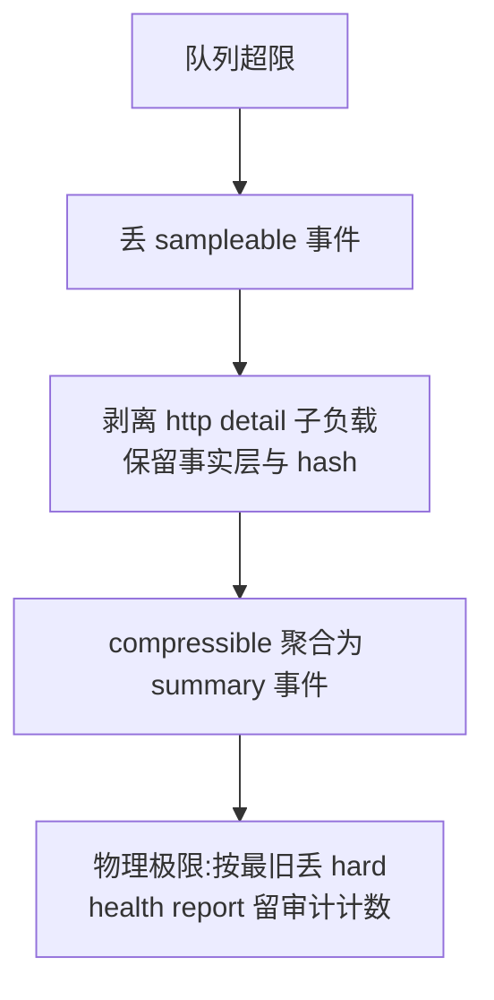

# SDK 证据保全与 HTTP 采集深化

## 背景与已确认决策

原始数据评估结论:production 默认策略下成功 HTTP 被 `sampled_out` 丢弃超过一半(9 入库/11 丢弃),且自监控事件占入库总量约 17%(每丢一条发一条 `sdk.queue.drop`、每次成功 flush 发一条 `sdk.output.flush`),"为省流量丢证据"实际是负收益。

已确认的设计决策:

- retention 作为正式概念进 docs→core,**不上 wire**,用 core 注册表映射(按 event name/signalType)。
- hard 名单:全部 error、`http.client` 主事件、`track`、`interaction.measure`、cold/hot start end、`ui.jank.sequence`、`memory.pressure`、`memory.leak.suspect`、`sdk.init`、`sdk.health.report`。hard 准入规则:事件速率结构性有界。
- 自监控改为"计数器 + 60s 周期摘要 `sdk.health.report` + 边沿触发",进后台/退出时强制补发;摘要外的 `sdk.*` 不进 hard。
- HTTP 详情(query/headers/body)默认**不脱敏、保真采集**,提供可选 redactor(默认关闭);成功/失败响应体统一采集,production 默认开、可配置关。
- body 截断上限:localLive 64KB / production 16KB,截断时保留原始长度 + 全文 hash 用于一致性核对。
- HTTP 事件拆两层:事实层(attributes + url/error 摘要)hard;详情层(`payload.http.detail`)compressible,压力下降级动作是"剥离详情",事件本身不丢。
- SSE/WebSocket 不在本轮,记入 backlog。

## 执行顺序(遵循 SKILL.md:docs → core → sdk → platform)

### R1 自监控重设计

Docs:
- `docs/event_model.md` / `docs/signal_collection.md`:注册 `sdk.health.report`(窗口计数器字段:enqueued/sent/dropped-by-reason/retry/flush 成败/队列水位)、明确 `sdk.output.flush` 只在失败时产生、新增 offline 队列降级边沿事件语义、新增 `retry_exhausted` drop reason。

Core([packages/flutter_monitor_core/lib/src/constants/event_names.dart](packages/flutter_monitor_core/lib/src/constants/event_names.dart)、[protocol_values.dart](packages/flutter_monitor_core/lib/src/constants/protocol_values.dart)、`field_paths.dart`、`field_registry.dart`、`event_summarizer.dart` + tests):
- 新增 `sdkHealthReport` 事件名、`SdkDropReasons.retryExhausted`、health 计数器 FieldPaths 与注册。

SDK:
- [event_pipeline.dart](packages/flutter_monitor_sdk/lib/src/pipeline/event_pipeline.dart):删除 `_emitDropSelfMonitoring` 逐条发事件,改为向新的 health 聚合器累计计数。
- [reliable_http_output.dart](packages/flutter_monitor_sdk/lib/src/delivery/reliable_http_output.dart):成功 flush 不再发事件(计入计数器);重试耗尽改用 `retry_exhausted`;丢弃判定从整批 `_maxAttemptCount` 改为按事件 `attemptCount`,避免新事件被旧事件连坐。
- [sqlite_offline_event_queue.dart](packages/flutter_monitor_sdk/lib/src/delivery/sqlite_offline_event_queue.dart):init 失败静默降级内存队列处(第 52-55 行)补边沿自监控事件。
- 新增 `SdkHealthMonitor`(delivery 层):60s 窗口聚合,interval/background/exit 时产出 `sdk.health.report`;队列首次满/恢复等边沿事件。

Platform:
- Workbench overview 的 SDK 可靠性展示改为消费 `sdk.health.report`(`platform/web/src/features/overview`,必要时调 monitor-service query)。

### R2 retention 进 core

Docs:
- `docs/event_model.md`:新增 retention 注册表章节(hard/compressible/sampleable 语义、hard 准入规则、"hard = 最后丢弃 + 丢弃必留审计计数"的诚实边界)。

Core:
- 新增 `EventRetention` 枚举 + `RetentionRegistry`(name/signalType → retention 映射,沉淀方式对齐 `EventSummarizer`)+ tests。

SDK:
- [pipeline_control.dart](packages/flutter_monitor_sdk/lib/src/pipeline/pipeline_control.dart):`_mustKeep` 白名单替换为查询 `RetentionRegistry`;hard 永不采样。
- [monitor_config.dart](packages/flutter_monitor_sdk/lib/src/core/monitor_config.dart):`successfulHttpSampleRate` 默认 0.2 → 1.0;采样/限流定位改为降级开关(注释与文档说明,为 Phase 6 remote config 预留)。
- [queued_monitor_event.dart](packages/flutter_monitor_sdk/lib/src/delivery/queued_monitor_event.dart) + 队列实现:SQLite 队列表加本地 `retention` 列,淘汰顺序改为 sampleable → compressible → hard,同级按 createdAt。

### R3 HTTP 详情采集

Docs:
- `docs/event_model.md`:HTTP 字段重写——`payload.url` 去 query、新增结构化 `payload.http.query`、`payload.http.detail.*`(request/response headers/body、truncated、original_length、body hash)、`http.request_id` 提升为 queryable attribute;隐私表中 query/body 从 forbidden 改为"内部保真采集、可选 redactor"口径;`docs/signal_collection.md` 同步。

Core:
- FieldPaths/PayloadKeys 新增、field_registry 隐私等级改写、default_limits 增加 body 上限常量、summarizer 兼容。

SDK:
- [monitor_config.dart](packages/flutter_monitor_sdk/lib/src/core/monitor_config.dart):新增 `MonitorHttpConfig`(captureQuery/captureRequestBody/captureResponseBody 默认开、maxBodyBytes 按模式 64KB/16KB、可选 `redactor` 默认 null)。
- [reporter.dart](packages/flutter_monitor_sdk/lib/src/core/reporter.dart) `recordHttpClient`:接收 headers/body 参数,组装 detail 子负载,截断 + hash,`payload.url` 去 query。
- [performance_monitor.dart](packages/flutter_monitor_sdk/lib/src/modules/performance_monitor.dart) Dio interceptor:采集 `options.data`、`response.data`、双向 headers、`x-request-id`。
- [monitored_http_client.dart](packages/flutter_monitor_sdk/lib/src/utils/monitored_http_client.dart):请求体可直接取;响应体需 tee 包装 `StreamedResponse` 流(只缓冲前 N 字节,不破坏业务消费)。
- example 更新展示新配置。

### R4 压力下的压缩(依赖 R2 分级 + R3 detail 结构)

Docs + Core:
- 注册 `http.client.summary`、`business.action.summary` 聚合事件及字段(count、duration p50/p95/max、字节合计、exemplar eventIds)。

SDK:
- 队列 `trimToLimits` 改为降级阶梯:丢 sampleable → 剥离 `payload.http.detail`(置 `detail_dropped: true`,保留 hash)→ compressible 聚合为 summary → 最后才按最旧丢 hard 且计入 health report 审计。
- track 超 `maxTrackEventsPerMinute` 从丢弃改为聚合进 `business.action.summary`。

### Backlog 登记

- `docs/plan.md` 待办清单新增:SSE/WebSocket 长链接建模(注明现状:Dio stream 响应耗时语义为"到响应头",WebSocket 无覆盖);remote config 接管采样/限流/body 开关归 Phase 6。

## 验证

每阶段按 SKILL.md:`fvm dart test packages/flutter_monitor_core/test`、`fvm flutter test packages/flutter_monitor_sdk/test`、`pnpm --dir platform typecheck && build`;R1/R3 完成后用 example + `GET /api/monitor/v1/recent` 验证 raw envelope:自监控占比显著下降、HTTP 全量保留、detail 字段完整、截断/hash 行为正确。