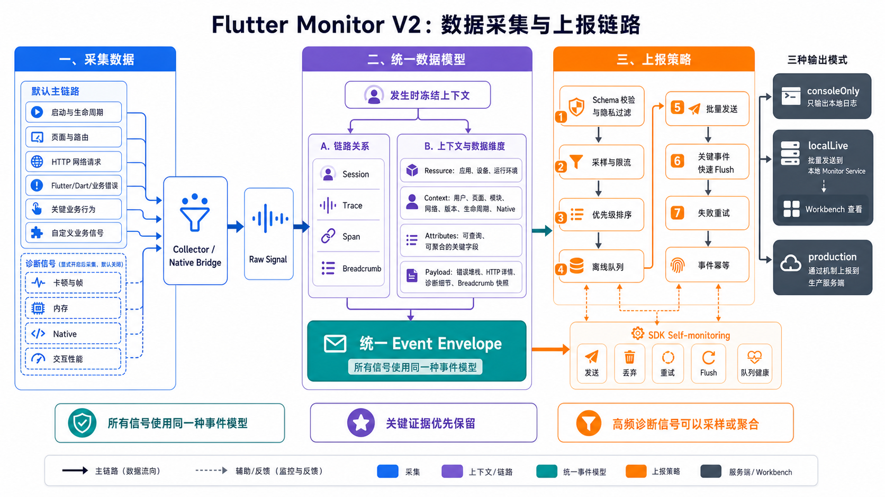
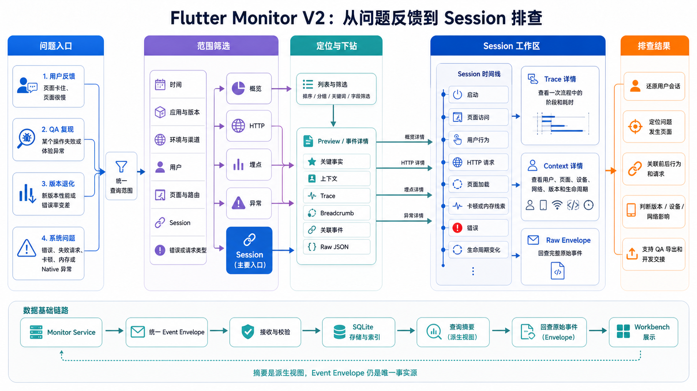

# Flutter Monitor

Flutter Monitor 是一个以 Session 链路为组织方式的 Flutter 端侧监控 workspace。它将错误、启动、页面、HTTP、业务行为和生命周期，以及显式开启的卡顿、帧、内存和 native 诊断信号，统一写入 `EventEnvelope`，帮助开发者与 QA 还原一次真实会话中发生了什么。


V1 关注独立指标；V2 保留原有采集能力，并通过 `sessionId`、`traceId`、`spanId`、breadcrumb、resource 和 context 把事件组织成可检索、可回查的证据链。完整背景见 [V1 到 V2](docs/background.md)。

## 当前能力

| 范围 | 能力 |
|---|---|
| 主链路采集 | Flutter/Dart error、冷/热启动、页面与路由、Dio/http、业务 `track`、lifecycle |
| 诊断信号 | frame、jank、RSS memory、interaction measure、native；默认关闭，显式开启 |
| 统一模型 | EventEnvelope、字段注册、schema validation、privacy、retention、summary |
| 可靠投递 | SQLite offline queue、batch、retry、TTL、优先级降级、SDK self-monitoring |
| 本地排查 | Monitor Service、SQLite、SSE、Workbench 概览/Catalog/Session/详情/Raw JSON |
| Native 增强 | Android/iOS resource、memory、memory pressure、lifecycle；默认关闭 |

Native crash、OOM、ANR 目前只有 schema 和 mapper 边界，没有可靠平台捕获实现。Flutter DevTools extension、session 文件导入/导出、remote config、多租户和生产告警也不属于当前能力。

## 端到端架构


所有信号遵循同一条处理链路：

```text
Collector / Native Bridge
  -> RawSignal
  -> ContextSnapshot + TraceSnapshot
  -> EventEnvelope
  -> Schema Validation + Privacy Filter
  -> Sampling / Rate Limit / Retention
  -> Console / Monitor Service
  -> Workbench
```



核心约束：

- `flutter_monitor_core` 是唯一事件模型、字段和状态来源；
- `flutter_monitor_sdk` 负责 Flutter runtime 采集、链路、pipeline 和 output；
- `flutter_monitor_native` 只提供可选 native 原始事实，不独立上报；
- Monitor Service 与 Workbench 只消费 envelope，不改写 SDK 事件；
- Catalog、Analytics、Session summary 和 UI view model 都必须能回查 raw envelope。

详细设计见 [当前架构](docs/architecture.md)。

## Workbench

Workbench 是 Flutter Monitor 当前的本地与 QA 排查入口：



```text
概览       当前范围的启动、页面、HTTP、埋点、异常与 Session 情况
Session    会话检索和事件链路工作区
HTTP       请求筛选、请求/响应详情、cURL 与 Session 回查
埋点       业务动作、结果、上下文与关联事件
异常       稳定性错误、聚合错误和业务失败
```

**工作台文档入口：[Platform / Workbench 文档](platform/docs/README.md)**

相关入口：

- [Workbench 产品](platform/docs/product.md)
- [Workbench 当前功能](platform/docs/FEATURES.md)
- [Workbench 设计原则](platform/docs/DESIGN.md)
- [Platform 架构](platform/docs/architecture.md)
- [Monitor Service 数据边界](platform/services/monitor-service/docs/boundaries.md)
- Swagger：`http://localhost:3700/docs`

## Quick Start

安装 Dart/Flutter workspace 依赖并运行检查：

```sh
fvm flutter pub get
bash scripts/check.sh
```

启动 Monitor Service 与 Workbench：

```sh
bash scripts/platform.sh dev
```

默认地址：

| 服务 | 地址 |
|---|---|
| Workbench | `http://localhost:4700` |
| Monitor Service | `http://localhost:3700` |
| Swagger | `http://localhost:3700/docs` |
| Ingest | `http://localhost:3700/api/monitor/v1/events` |

启动 PulseFit example 并接入本地 Workbench：

```sh
bash scripts/run_example.sh
```

只运行 example 或指定 ingest：

```sh
bash scripts/run_example.sh --no-workbench
bash scripts/run_example.sh --server-url http://host:3700/api/monitor/v1/events
```

如果 `3700` 或 `4700` 已经运行本项目进程，脚本会复用；端口被其他进程占用时会报错。

## SDK 接入

初始化 SDK：

```dart
final appStartTime = DateTime.now();
WidgetsFlutterBinding.ensureInitialized();

final appInfo = await AppInfo.fromPackageInfo(
  appKey: 'my_app',
  // 自由字符串；推荐 `dev` / `test` / `staging` / `production`。
  environment: 'dev',
);

await FlutterMonitorSDK.init(
  config: MonitorConfig(
    appInfo: appInfo,
    mode: MonitorMode.localLive(),
  ),
  appStartTime: appStartTime,
);
```

接入页面与 HTTP：

```dart
final dio = Dio();
dio.interceptors.add(FlutterMonitorSDK.createDioInterceptor());

MaterialApp(
  navigatorObservers: [FlutterMonitorSDK.routeObserver],
);
```

写入用户上下文和关键业务结果：

```dart
FlutterMonitorSDK.setContext(
  userId: 'user_123',
  moduleName: 'checkout',
  releaseId: '2026.07',
);

FlutterMonitorSDK.track(
  action: 'checkout.submit',
  result: MonitorTrackResult.success,
);
```

HTTP query、headers 和双向 body 当前默认采集到 sensitive payload，并按模式截断。真实 App 应根据数据安全要求配置 `MonitorHttpConfig.redactor` 或关闭对应采集项。完整配置见 [信号采集设计](docs/signal_collection.md)。

## 输出模式

| 模式 | 用途 | 行为 |
|---|---|---|
| `MonitorMode.consoleOnly()` | 本地开发 | 输出 compact/quiet/json/silent log |
| `MonitorMode.localLive()` | 本地或 QA | 小 batch 写入本机 Monitor Service |
| `MonitorMode.production(...)` | 灰度或生产 | 离线队列、batch、retry 和 self-monitoring |

输出模式不改变采集开关。默认只启用高确定性主链路；frame、jank、memory、measure 和 native 由 `MonitorSignalConfig` 显式开启。production 的采样、限流和队列策略见 [事件模型](docs/event_model.md) 与 [信号采集设计](docs/signal_collection.md)。

## Workspace

```text
docs/                         项目背景、架构、模型、采集和协议
packages/
  flutter_monitor_core/       Dart-only 事件模型核心
  flutter_monitor_sdk/        Flutter runtime SDK 与 example
  flutter_monitor_native/     可选 Android/iOS native bridge
platform/
  docs/                       Platform / Workbench 文档
  services/monitor-service/   NestJS + SQLite + Swagger + SSE
  web/                        React/Vite Workbench
  shared/                     TypeScript wire mirror
scripts/                      检查、Platform 和 example 脚本
```

## 文档

项目级事实文档：

- [V1 到 V2 背景](docs/background.md)
- [当前架构](docs/architecture.md)
- [事件模型](docs/event_model.md)
- [信号采集设计](docs/signal_collection.md)
- [服务端协议](docs/server_protocol.md)
- [DevTools 与 Session Export 边界](docs/devtools_integration.md)

工程规范：

- [项目方向与硬约束](AGENTS.md)
- [仓库变更工作流](SKILL.md)
- [Platform README](platform/README.md)
- [PulseFit Example](packages/flutter_monitor_sdk/example/README.md)
- [flutter_monitor_core](packages/flutter_monitor_core/README.md)
- [flutter_monitor_sdk](packages/flutter_monitor_sdk/README.md)
- [flutter_monitor_native](packages/flutter_monitor_native/README.md)

README 只作为入口。字段以 `docs/event_model.md` 和 core 为准，采集以 `docs/signal_collection.md` 和 SDK 为准，Workbench 边界以 `platform/docs/` 为准。

## 验证命令

```sh
fvm dart test packages/flutter_monitor_core
fvm flutter test packages/flutter_monitor_sdk/test
fvm flutter test packages/flutter_monitor_native/test

pnpm --dir platform typecheck
pnpm --dir platform build
pnpm --dir platform run smoke
```

全量检查与 `scripts/check.sh` 一致。

## License

MIT. See [LICENSE](LICENSE).
