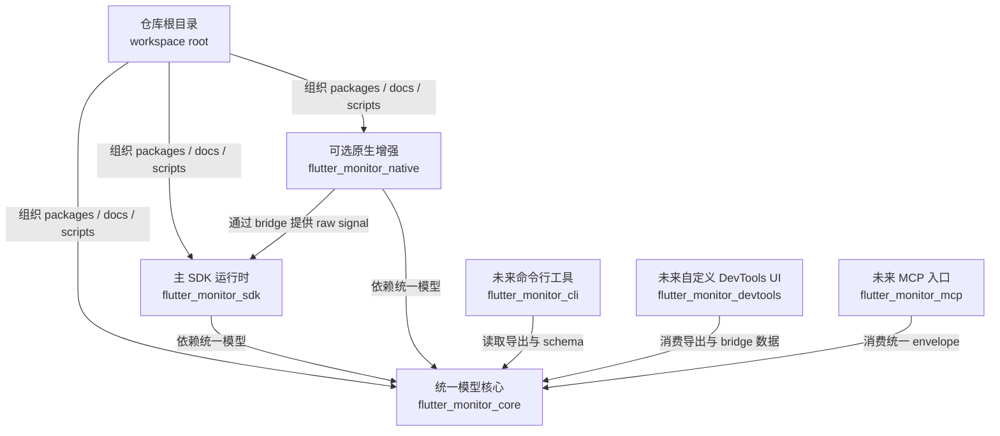
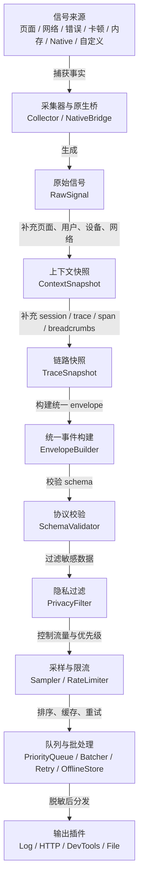
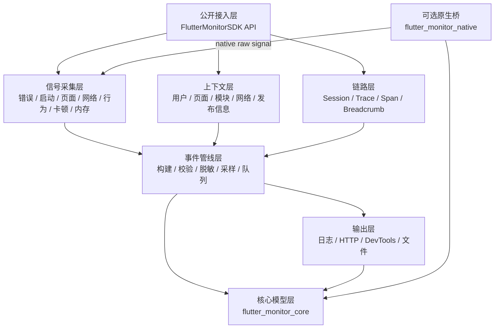

# 目标架构

## 架构目标

Flutter Monitor 的目标架构是一个基于 Dart pub workspaces 的多包监控与链路观测 workspace。仓库根目录作为 workspace root，发布能力拆分到 `packages/` 下的独立包。

架构目标：

- 用 `flutter_monitor_core` 承载唯一事件模型、schema、字段注册、隐私规则和导出格式。
- 用 `flutter_monitor_sdk` 承载 Flutter runtime 主 SDK、采集器、pipeline、outputs 和业务接入 API。
- 用 `flutter_monitor_native` 承载可选 native plugin 能力，例如 native memory、memory pressure、OOM、ANR 和 native crash 信号。
- 用 `workbench` 承载本地调试、QA 复现、session timeline、查询和性能诊断工作台。
- 让 DevTools、CLI、MCP 和其他未来入口复用 `flutter_monitor_core`，不产生第二套协议。
- 让 Flutter 层信号、native 信号和未来工具入口都进入统一 session/trace/span/breadcrumb/context 模型。

## 包组织策略

本仓库使用官方 Dart pub workspaces，不使用 Melos 作为基础依赖解析机制。

目标 workspace：

```text
flutter_monitor/
  pubspec.yaml
  AGENTS.md
  README.md
  docs/
  packages/
    flutter_monitor_core/
    flutter_monitor_sdk/
    flutter_monitor_native/
  scripts/
  workbench/
```

根目录职责：

- workspace 配置；
- 项目总文档；
- CI、脚本和 schema 工具；
- 不作为发布包。

包依赖方向：

```text
flutter_monitor_core
  <- flutter_monitor_sdk
  <- flutter_monitor_native
  <- future flutter_monitor_cli
  <- future flutter_monitor_devtools
  <- future flutter_monitor_mcp
```



这张图表达依赖方向：`flutter_monitor_core` 是协议核心，其他包只能复用它，不能反向污染 core，也不能各自生成第二套模型。

约束：

- `flutter_monitor_core` 不依赖 Flutter，只依赖 Dart。
- `flutter_monitor_sdk` 可以依赖 Flutter、Dio、http、device/app 信息等 runtime 能力。
- `flutter_monitor_native` 是可选 Flutter plugin，不应成为 `flutter_monitor_sdk` 的强依赖。
- future CLI、DevTools、MCP 只能复用 `flutter_monitor_core` 的模型和协议，不得定义独立事件结构。
- 当前阶段的 DevTools 能力属于 `flutter_monitor_sdk`：写入 Flutter Timeline、提供 DevTools bridge、暴露 session timeline 和导出数据。future `flutter_monitor_devtools` 指可选的自定义 DevTools extension/UI 包，不承担 runtime 采集。

## 目标目录结构

### Workspace

```text
flutter_monitor/
  pubspec.yaml
  analysis_options.yaml
  AGENTS.md
  README.md
  docs/
    background.md
    event_model.md
    signal_collection.md
    server_protocol.md
    devtools_integration.md
    architecture.md
    implementation_plan.md
  packages/
    flutter_monitor_core/
      pubspec.yaml
      lib/
        flutter_monitor_core.dart
        src/
          model/
          schema/
          privacy/
          export/
          validation/
          constants/
      test/
    flutter_monitor_sdk/
      pubspec.yaml
      lib/
        flutter_monitor_sdk.dart
        src/
          core/
          context/
          tracing/
          collectors/
          pipeline/
          outputs/
          integrations/
          devtools/
      example/
      test/
    flutter_monitor_native/
      pubspec.yaml
      lib/
        flutter_monitor_native.dart
        src/
          native_bridge.dart
          native_signal_mapper.dart
      android/
      ios/
      test/
  workbench/
    package.json
    docs/
    service/
    web/
    shared/
  scripts/
```

### `flutter_monitor_core`

`flutter_monitor_core` 是所有包共享的协议核心。

职责：

- event envelope 类型；
- `signalType`、`level`、`status` 等枚举；
- session、trace、span、breadcrumb、resource、context、attributes、payload 模型；
- 字段注册表；
- schema version 和 schema validation 基础能力；
- privacy level、脱敏规则和字段裁剪规则；
- session export/import 数据格式；
- 事件优先级、采样配置、限流配置等共享配置模型；
- 与 Flutter runtime 无关的工具函数。

不得包含：

- Flutter imports；
- platform channel；
- Dio/http client runtime instrumentation；
- 文件、网络或 UI 侧 effect；
- 输出器实现。

### `flutter_monitor_sdk`

`flutter_monitor_sdk` 是 Flutter 应用主要依赖的 runtime SDK。

职责：

- SDK 初始化和公开 API；
- Flutter error、Dart error、launch、route/page、network、behavior、jank、memory、lifecycle、自定义 trace 采集；
- context manager；
- session/trace/span/breadcrumb 管理；
- event pipeline；
- log/http/custom/devtools/file outputs；
- Dio、`http`、Navigator、Widget 包装等 Flutter 集成；
- 与 `flutter_monitor_native` 的可选 extension/bridge 对接。

不得包含：

- 第二套 event model；
- native 平台重实现；
- 与 `flutter_monitor_core` 字段注册表冲突的私有字段；
- 绕过 pipeline 的直接上报逻辑。

### `flutter_monitor_native`

`flutter_monitor_native` 是可选 native plugin。

职责：

- Android/iOS native memory sample；
- native memory pressure / low memory warning；
- native lifecycle 补充；
- OOM、ANR、native crash 的事件模型和可实现 bridge；
- 将 native signal 映射为 SDK 可消费的 native raw signal 或可持久化 raw payload；
- 在异常生命周期下尽力持久化关键 native 信号。

不得包含：

- 独立 HTTP 上报协议；
- 独立 session 或 trace id 体系；
- 与主 SDK pipeline 并行的第二套上传队列；
- 强制业务方接入 native 能力。

native 能力应是可选增强。基础 Flutter 监控能力不应因为 native plugin 而增加不必要的权限、平台配置或构建复杂度。

## 核心运行时数据流

目标数据流：

```text
Collector / NativeBridge
  -> RawSignal
  -> ContextSnapshot
  -> TraceSnapshot
  -> EnvelopeBuilder
  -> SchemaValidator
  -> PrivacyFilter
  -> Sampler / RateLimiter
  -> PriorityQueue
  -> Batcher / RetryScheduler / OfflineStore
  -> Outputs
```



采集器只捕获事实，最终协议由 pipeline 统一构建。任何 output 都只能消费脱敏后的统一 event envelope。

说明：

- Collector 只负责捕获事实，不构造最终协议。
- NativeBridge 只负责把 native signal 转换为 SDK 可理解的 raw signal。
- NativeBridge 不构建最终 event envelope；最终 envelope 由 SDK pipeline 或下次启动的补全流程统一构建。
- ContextSnapshot 固化事件发生时的 `context.route.*`、`context.module.*`、`context.user.*`、`resource.device.*`、`context.network.*`、`context.release.*` 和 `context.release.featureFlags`。
- TraceSnapshot 固化事件发生时的 session、trace、span 和裁剪后的相关 breadcrumbs。
- EnvelopeBuilder 是唯一 event envelope 构建入口。
- PrivacyFilter 必须早于任何 output。
- Outputs 只能消费脱敏后的 event envelope。

## 核心模型层

核心模型由 `flutter_monitor_core` 提供。



代码分层应围绕“采集事实、补充上下文、构建统一事件、脱敏后输出”展开。`flutter_monitor_core` 提供模型和规则，`flutter_monitor_sdk` 承担 runtime 编排。

建议类型：

```text
EventEnvelope
SignalType
EventLevel
EventStatus
MonitorResource
MonitorContext
SessionInfo
TraceInfo
SpanInfo
Breadcrumb
PrivacyLevel
FieldRegistry
SchemaVersion
EventPriority
SessionExport
```

模型层要求：

- 类型应可序列化为稳定 JSON。
- 字段命名必须与 `docs/event_model.md` 一致。
- `attributes` 默认只接受 `FieldRegistry` 已注册字段；未注册诊断详情应进入 `payload`。
- payload-only 未知字段可以透传，但必须经过隐私过滤和大小裁剪，不得破坏已知字段语义，也不得作为服务端索引字段。
- 模型不能依赖 Flutter runtime。

## 上下文层

上下文层由 `flutter_monitor_sdk` 实现，输出 `MonitorContext` 或 `ContextSnapshot`。

模块：

- `ContextManager`
- `ResourceProvider`
- `UserContextController`
- `RouteContextController`
- `ModuleContextController`
- `NetworkContextProvider`
- `ReleaseContextProvider`
- `FeatureFlagContextProvider`
- `CustomContextProvider`

要求：

- 事件捕获时必须取快照，避免异步 flush 时上下文漂移。
- 用户登录、登出、切换账号时应更新 context，但不得改写已捕获事件。
- route name 不稳定时，可以通过统一上下文入口补充可选业务语义；module/scene 不作为基础接入前置条件。
- 用户维度排查依赖 `context.user.userId`。未提供 userId 时，SDK 仍必须能按时间、版本、route、错误和性能信号构建可查询链路。

## 链路层

链路层由 `flutter_monitor_sdk` 实现，输出 `TraceSnapshot`。

模块：

- `SessionManager`
- `TraceManager`
- `SpanManager`
- `BreadcrumbStore`
- `IdGenerator`
- `Clock`

要求：

- session 是绝大多数业务事件的最小归属单位。
- cold start、hot start、page visit、关键 action、自定义业务流程应优先建模为 trace。
- route push、page load、first frame、interactive、http request、image decode、list build、custom step 应建模为 span。
- breadcrumbs 使用环形缓冲；错误、卡顿、失败 HTTP、慢 trace 和 native 异常应携带相关窗口内 breadcrumbs。
- 事件附加的 breadcrumb 快照应优先选择同 `traceId` / 同 `route` 足迹，再补最近全局关键足迹，并移除嵌套 breadcrumbs、长 stacktrace 等高风险 payload。

## 采集层

采集层由 `flutter_monitor_sdk` 和 `flutter_monitor_native` 分别实现。

Flutter runtime collectors：

- `ErrorCollector`
- `LaunchCollector`
- `RouteCollector`
- `PagePerformanceCollector`
- `NetworkCollector`
- `BehaviorCollector`
- `JankCollector`
- `MemoryCollector`
- `LifecycleCollector`
- `CustomTraceCollector`

Native collectors / bridge：

- `NativeMemoryCollector`
- `NativeLifecycleCollector`
- `NativeCrashCollector`
- `NativeAnrCollector`
- `NativeOomCollector`
- `NativeSignalMapper`

采集层要求：

- 采集器输出 raw signal，不输出最终 envelope。
- 采集器不做采样、重试、隐私过滤和上报。
- native signal 必须映射到统一 signal type、name、attributes 和 payload。

## Pipeline 层

Pipeline 层由 `flutter_monitor_sdk` 实现，依赖 `flutter_monitor_core` 的模型和规则。

模块：

- `EventPipeline`
- `EnvelopeBuilder`
- `SchemaValidator`
- `PrivacyFilter`
- `Sampler`
- `RateLimiter`
- `PriorityQueue`
- `Batcher`
- `RetryScheduler`
- `OfflineStore`
- `SelfMonitoring`

Pipeline 要求：

- 同一 raw signal 默认只生成一条主事件。
- schema validation 早于输出。
- privacy filtering 早于采样、存储和输出。
- 高优先级事件可绕过部分低优先级批处理延迟。
- 采样和限流不能破坏错误、native crash、OOM、关键卡顿、关键慢页面的定位链路。
- pipeline 自身失败应生成 SDK self-monitoring 事件。

## 输出层

Outputs 由 `flutter_monitor_sdk` 实现。

目标 outputs：

- `LogOutput`
- `HttpOutput`
- `CustomOutput`
- `DevToolsOutput`
- `FileExportOutput`
- future `OpenTelemetryOutput`

输出层要求：

- Output 只能消费 event envelope。
- Output 不修改事件语义。
- Output 不重新读取未脱敏原始数据。
- HTTP output 使用 `docs/server_protocol.md`。
- DevTools/File export 使用 `docs/devtools_integration.md` 的导出格式。
- future `OpenTelemetryOutput` 只能从统一 event envelope 派生映射，不能成为 SDK 内部主模型或第二套协议。

## DevTools Bridge

DevTools bridge 由 `flutter_monitor_sdk` 提供本地数据源，并优先接入官方 Flutter DevTools / Timeline 能力。未来如果需要更完整的自定义面板，可新增 `flutter_monitor_devtools` 作为独立 DevTools extension/UI 包，但它只消费 bridge/export 数据，不承担 runtime 采集，并必须复用 `flutter_monitor_core`。

模块：

- `DevToolsOutput`
- `DevToolsBridge`
- `TimelineWriter`
- `SessionTimelineStore`
- `SessionExporter`
- `SessionImporter`

职责：

- 写入 Flutter Timeline；
- 暴露当前 session timeline；
- 展示 trace/span/event/context 详情；
- 展示 jank、memory、native signals；
- 支持本地 session export/import；
- 展示 SDK self-monitoring 状态。

## Native Bridge

Native bridge 是 `flutter_monitor_sdk` 与 `flutter_monitor_native` 的连接边界。

`flutter_monitor_native` 是可选增强包，不是第二个监控 SDK。它的职责是通过 Flutter plugin 能力把 Android/iOS 原生信号送到主 SDK；最终事件模型、字段注册、隐私过滤、session/trace 关联、采样、输出和上报仍由 `flutter_monitor_core` 与 `flutter_monitor_sdk` 负责。

完整 native 能力需要 `flutter_monitor_native` 提供 Flutter 与原生平台之间的通信层。第一阶段建议使用：

- `MethodChannel`：SDK 主动请求 native resource snapshot、memory snapshot 或 flush。
- `EventChannel`：native 主动推送 low memory warning、native lifecycle、OOM/ANR/crash 线索等异步信号。

后续如果 native payload 和类型契约变复杂，可迁移到 Pigeon，但不得因此改变最终 `EventEnvelope` 或服务端协议。

建议形态：

```dart
abstract interface class MonitorNativeBridge {
  Stream<NativeSignal> get signals;
  Future<NativeResourceSnapshot> getResourceSnapshot();
  Future<NativeMemorySnapshot?> getMemorySnapshot();
  Future<void> dispose();
}
```

接入要求：

- `flutter_monitor_sdk` 只依赖 bridge 抽象，不强依赖 native plugin。
- 未配置 bridge 时，SDK 使用 no-op 降级路径，`context.native.available = false`，启动、页面、HTTP、错误、卡顿、基础 memory、基础 lifecycle 和 `track` 不受影响。
- 配置 bridge 时，SDK 在 bootstrap resource resolve 阶段解析一次 native resource snapshot；该阶段有短 deadline，成功后首批 bootstrap 事件携带 native context，不可用或超时时降级为 `context.native.available = false`。
- `flutter_monitor_native` 提供 bridge 实现。
- `flutter_monitor_core` 承载最终 event envelope、字段注册、隐私规则和可共享的 native raw payload contract。
- `flutter_monitor_sdk` 持有 runtime bridge 抽象、上下文补全和 pipeline 接入。
- `flutter_monitor_native` 只实现 bridge 并提供 native raw signal，不构建最终 envelope，不定义独立上报协议。
- native signal 进入 SDK pipeline 后再构建 envelope。
- `native.memory.pressure` 和 `native.warning` 属于高价值诊断足迹，应进入 breadcrumb store，帮助解释后续 error、jank、OOM/ANR/crash 线索。
- native 异常生命周期下无法完整进入 pipeline 时，应先持久化 native raw signal 或可补全 payload，并在下次启动后由 SDK pipeline 补全为统一 envelope。

推荐数据流：

```text
Android / iOS native callbacks
  -> MethodChannel / EventChannel
  -> flutter_monitor_native Dart bridge
  -> MonitorNativeBridge
  -> flutter_monitor_sdk native signal mapper
  -> RawSignal
  -> EventPipeline
  -> EventEnvelope
  -> Outputs
```

`flutter_monitor_native` 应主要包含：

- Dart bridge 实现，例如 `FlutterMonitorNativeBridge`。
- Android/iOS native raw signal 采集，并通过 core 定义的 `NativeSignal` / `NativeMemorySnapshot` / `NativeResourceSnapshot` 交给 SDK。
- Android/iOS memory collector，例如 RSS、native heap 或平台可获得的内存线索。
- Android/iOS memory pressure / low memory warning listener。
- Android/iOS native lifecycle 补充信号。
- OOM、ANR、native crash 的 schema 入口、bridge 入口和异常生命周期下的 raw signal 暂存能力。
- 用于平台不可用或测试环境的降级路径。no-op/fake bridge 只服务 SDK 内部测试，不是业务层主动写入 native 事件的 API。

Native signal 的最终字段映射发生在 SDK pipeline 入口：`flutter_monitor_native` 负责提供平台事实，`flutter_monitor_sdk` 负责把它映射为 `RawSignal`，再由 `EventPipeline` 构建统一 `EventEnvelope`。平台原始证据进入 canonical `payload.native`；raw JSON 中表现为 payload 内的 `payload.native` key。

`flutter_monitor_native` 不得包含：

- HTTP output、独立上传队列或服务端鉴权逻辑。
- 第二套 session id、trace id 或 event id 生成体系。
- 第二套 event model、导出格式或字段注册表。
- 会让主 SDK 基础接入变成强制 native 接入的配置。

如果用户不接入 `flutter_monitor_native`，或接入失败，SDK 必须无损降级：

- Phase 3 的启动、页面、HTTP、错误、卡顿、行为、基础 lifecycle 和业务 `track` 能力继续工作。
- Flutter/Dart 层可获得的 memory/lifecycle 仍可工作。
- native memory、native pressure、native lifecycle、native crash/OOM/ANR 线索缺失。
- `context.native.available` 应为 `false`；需要解释缺失时使用 `context.missingReason = native_bridge_unavailable`。
- 如果用户显式启用了 native bridge 但 bridge 不可用，应记录 SDK self-monitoring warning，而不是抛出影响 App 运行的异常。

完成 native bridge 后，相比 Flutter-only 能力，SDK 增强的是对 Flutter runtime 视野之外问题的解释能力：进程级/native 内存、平台 low memory warning、native lifecycle 缺口、OOM/ANR/native crash 线索，以及这些信号与当前 session、route、jank、error、HTTP 和 breadcrumbs 的统一关联。

## Public API

`flutter_monitor_sdk` 提供 Flutter 业务主入口：

```dart
await FlutterMonitorSDK.init(
  config: MonitorConfig(...),
  appStartTime: appStartTime,
);
```

公开 API 应覆盖：

- SDK 初始化；
- 业务主动埋点 `track(...)`；
- 设置通用上下文 `setContext(...)` 和按 scope 清理 `clearContext(...)`；
- 手动上报已处理 error `recordError(...)`；
- 获取 route observer；
- 创建 Dio interceptor；
- 创建 `http` client；
- 标记页面首帧完成；
- 手动记录 lifecycle state；
- 注册可选 native bridge；
- flush；
- dispose。

普通真实 App 接入不应被要求理解 trace/span/breadcrumb、`FieldPaths`、`RawSignal`、`EventEnvelope`、attributes/payload。`startTrace`、`startSpan`、`addBreadcrumb`、自定义 attributes/payload、`MonitorBinding`、`Reporter` 等能力定位为 SDK 内部或未来高级诊断入口，不从主库导出。历史 `setUserId`、`setUserInfo`、`setCustomData`、`setModule` 不再作为 public API；用户、模块、发布和网络上下文统一通过 `setContext(...)` 表达。

API 要求：

- 默认接入保持低侵入。
- native 能力必须显式接入。
- 公开 API 不暴露内部 pipeline 细节。
- 手动事件也必须进入统一 envelope。

## 模块边界和禁止事项

- 不得在 `flutter_monitor_sdk` 或 `flutter_monitor_native` 中定义第二套 event model。
- 不得让 collector 直接调用 HTTP output。
- 不得让 native plugin 绕过 SDK pipeline 直接上报。
- 不得让 DevTools 使用独立事件结构。
- 不得让 CLI/MCP 使用与服务端协议不兼容的导出格式。
- 不得新增无法关联 session/context 的业务指标；SDK self-monitoring 和 pre-session 事件必须显式标记缺失原因。
- 不得把敏感字段放入 `attributes` 参与索引，除非经过隐私策略允许。
