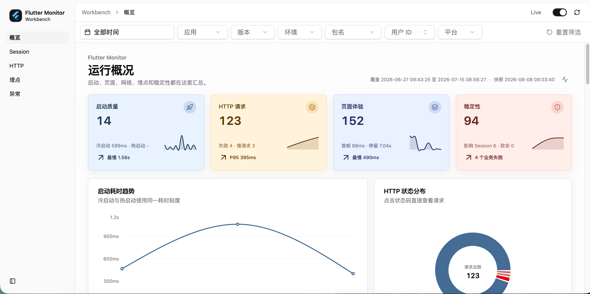
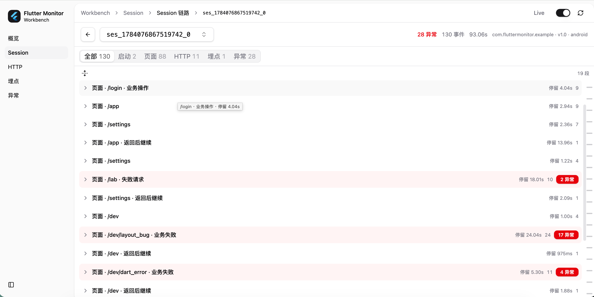
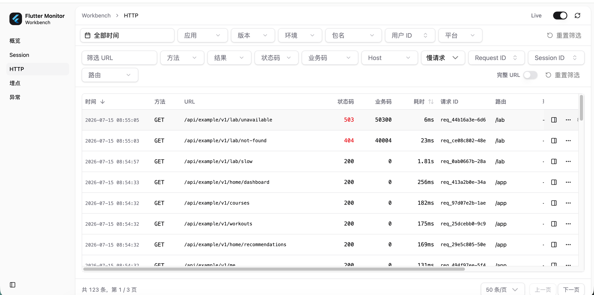
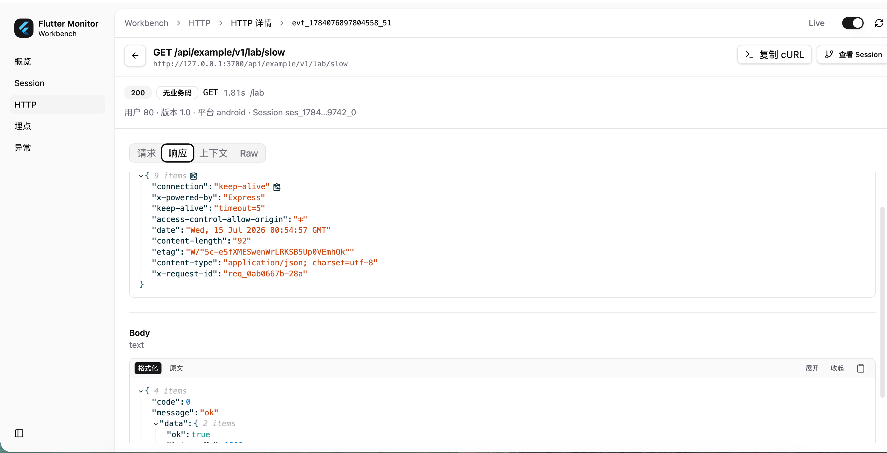
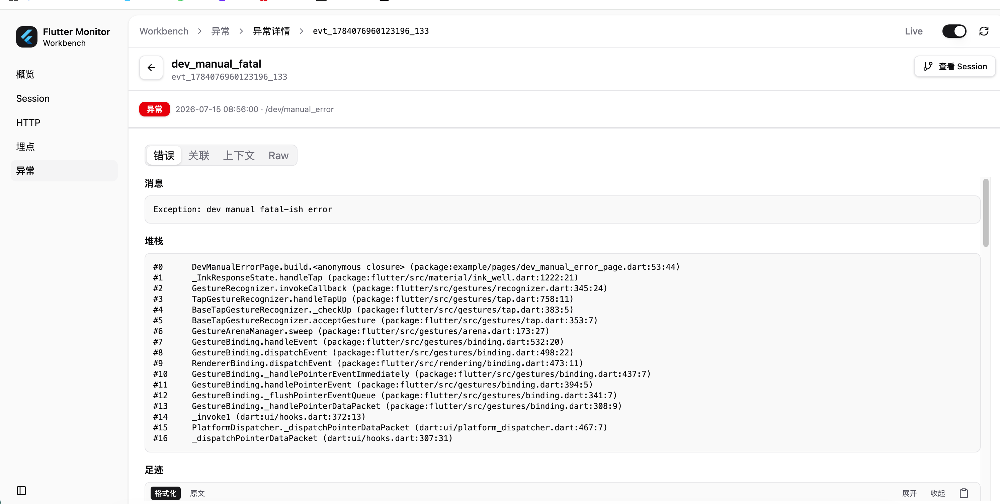

# 排查 App 问题：别只盯着报错，把前后发生的事情串起来

副标题：从看指标，到还原一次真实使用｜LINRayQ

---

大家好，我是 **LINRayQ**。

做 App 久了，大概都经历过这样的对话。

客服或运营转来一句用户反馈：「刚才结算页卡住了，再点就好了。」  
QA 在群里说：「订单页有时候很慢，我这边复现不太稳定。」  
产品追问：「这个版本反馈变多了，到底是网络、页面，还是某次发版引入的？」

于是你打开错误面板，看看有没有 Crash；打开网络日志，挑几个慢请求；打开埋点后台，确认用户是不是点了提交；再翻翻启动耗时报表，怀疑是不是冷启动变差了。

**每一块都能看到一点东西。**

真正难的是下一句问题：

- 这些信号，是不是同一次使用里发生的？
- 前后顺序是什么？
- 当时版本、网络、页面栈、用户身份又是什么？
- 如果用户已经说不清路径，你还能不能把现场一点点捞回来？

很多团队缺的不是再多一个采集项，也不是再多一张趋势图，而是：

**把一次真实会话里的证据，按发生顺序组织起来。**

这就是我做端侧监控工作台时，反复回到的主线。这篇文章想讲清楚三件事：我们到底卡在什么场景；工作台怎么帮人把「前后发生的事」串起来；实现上为什么要克制地接入，而不是堆更多 API。

---

## 一、为什么「指标都有」，现场还是拼不起来

### 1. 能力清单越长，越像「完整」

早期做端侧监控，很容易陷入「能力清单思维」：

- 错误要有
- 启动要有
- 页面要有
- HTTP 要有
- 行为埋点要有
- 最好再加卡顿、内存、Native……

清单越长，汇报时越像「我们已经很完整了」。但排查现场往往是另一回事——指标各自为政，上下文分散，最后只能靠时间戳和页面名人工脑补。

脑补一多，结论就脆：  
「大概是那个慢接口。」  
「可能是这个页面。」  
「也许和这次发版有关。」

这些话在会上能过，到了改代码和回归时，经常经不起追问。

### 2. 从「采集更多」到「回答更好」

我后来把目标从「采集更多」改成「回答更好」：

| 旧问题 | 新问题 |
|---|---|
| 哪个指标变了？ | **这次会话发生了什么？** |
| 有没有报错？ | 报错前后用户走了哪条路？ |
| 某个接口 P95 多少？ | 慢请求落在哪次使用、哪个页面、哪个版本？ |
| 埋点有没有上报？ | 这个动作成功还是失败，前后踩了哪些坑？ |

一句话：监控的第一产物，不该只是一张孤立指标表，而该是一条可回放、可交接的用户会话证据链。


*图：左侧是各指标独立查看；右侧用 Session / Trace / Breadcrumb 把证据串成可回查的链路。*

### 3. 主链路先可信，诊断信号再叠加

不是所有信号都值得默认全开。

错误、启动、页面、网络、行为、生命周期——这些相对「高确定性」，适合作为默认主链路：它们直接描述用户做了什么、系统怎么响应。

卡顿、帧、内存、部分 Native 诊断——更依赖采样、调度和启发式，适合作为可选线索。默认全开，往往先被噪声淹没；需要时再打开，叠到同一条会话上，才有诊断价值。

所以设计取舍很明确：

> 先保证「故事线」清楚，再叠加「线索」。  
> 慢帧不能单独证明业务根因；内存增长也不能直接宣称为确定泄漏。

### 4. 两个角色，其实在问不同的问题

还有一层容易被忽略的分工：

| 角色 | 更该回答的问题 |
|---|---|
| 本地 / QA / 工作台 | **这一次**复现里发生了什么？ |
| 服务端聚合与治理 | **这一类**问题影响谁、多严重、哪版回归？ |

如果两边吃两套字段、两套语义，会出现永久分裂：「本地看起来对，线上对不上。」  
所以工作台不是另起炉灶的第二套协议，而是同一份事件信封的排查入口。

---

## 二、三个真实场景：报错只是冰山一角

下面三个场景，几乎每个做 App 的团队都碰过。它们的共同点是：**只盯着报错，通常不够。**

### 场景 A：用户只记得「刚才卡住了」

这是最折磨人的一类反馈。描述短、路径不清、复现不稳定。

传统路径往往是：

1. 翻 Crash / Error，没有 fatal 就先卡住  
2. 翻接口日志，挑几个慢请求猜  
3. 让用户再操作一遍——用户已经走了  

更接近真实的排查方式应该是：

1. 先找到**那一次 Session**（或最接近的那段活动窗口）  
2. 看前后足迹：进了哪些页、点了什么、发了哪些请求、是否切过后台  
3. 再决定要不要叠加卡顿 / 内存等诊断线索  

价值不在「多报几个数字」，而在把「模糊体感」落成「可讨论的时间线」。  
当用户说不清路径时，Session 时间线就是你唯一还能握住的把手。

### 场景 B：QA 说「订单页加载慢」

慢，常常不是单点。

可能是：

- 进页后连环请求  
- 弱网叠加重试  
- 用户已经离开页面，请求才回来  
- 某个版本 / 灰度路径变了  
- HTTP 200，但业务码失败，页面表现为「转圈很久然后提示失败」

如果只看「平均页面耗时」或「某个接口 P95」，你会得到趋势，但未必得到**这次复现的证据包**。

更有用的是：从慢请求或慢页面进入同一次 Session，核对：

- 页面从哪来、停了多久  
- 请求状态码、业务码、耗时  
- 当时网络、版本、设备环境  
- 前后有没有业务失败或异常  

这样 QA 和开发交接时，说的是同一条故事线，而不是各看各的截图。

### 场景 C：版本发了之后，「好像变差了」

这类问题更偏治理：影响谁、哪些环境、哪个版本、哪条路由。

端侧如果只有本地日志，很难支持版本对比；如果只有服务端聚合，又容易丢掉「单次现场」。

理想状态是：聚合告诉你「哪一版变差了」，Session 告诉你「差在哪一次、差成什么样」。  
工作台先把后半句做扎实——这也是真实业务环境里最先被验证、最先被团队用起来的部分。

---

## 三、真实环境里，一次排查通常怎么走

这套能力已经在真实业务环境里跑通过：不是纸上画的架构，而是能跟着真实会话往下钻。

真人排查习惯很朴素：**先看全局，再进会话，再看请求与异常。**  
工作台按这个顺序组织，而不是按「采集器模块名」组织。


*图：从概览 / Catalog 下钻到 Session 工作区，再回查事件细节。*

下面按这条路径，把每一屏到底解决什么问题讲清楚。

### 1）先问：这段时间 App 健康吗？

概览把启动质量、HTTP、页面体验、稳定性放在同一视野里。你会先看到：

- 冷启动 / 热启动是否异常  
- HTTP 失败与慢请求是否抬头  
- 页面首帧、停留是否异常  
- 有没有问题 Session、业务失败  

而不是一上来淹没在原始日志里。



*图：运行概况——启动、HTTP、页面、稳定性同屏，可按版本 / 环境 / 用户筛选。*

这一屏的价值，是「缩小范围」。  
用户只记得「刚才卡住了」时，你至少能先判断：是启动问题，还是 HTTP，还是稳定性 / 业务失败在抬头。  
真正还原现场，还是要进 **Session**。

筛选也很关键：版本、环境、用户、平台——不是装饰，而是让「这次对比」可复现。  
同一套 Scope 带到 Session / HTTP / 埋点 / 异常，避免概览看到的是 A 范围，详情却是 B 范围。

### 2）再问：那一次使用，按什么顺序发生？

Session 链路是我认为最值钱的一屏。

登录 → 主页 → 设置 → 某个功能页……  
停留多久、触发多少事件、哪一页开始变红，一眼能看出来。



*图：同一次会话的页面路径；失败页会标出异常数，方便从「体感」落到「时间线」。*

它解决的是交接成本：

- 开发不用听 QA「我大概点了哪里」  
- QA 不用反复录屏补描述  
- 产品也能看懂：问题是集中在某一页，还是贯穿整次使用  

你还可以按类型过滤：启动、页面、HTTP、埋点、异常。  
过滤不是为了「少看一点」，而是为了在同一条时间线上切换视角——先看页面路径，再只看异常，再只看 HTTP，故事线不断。

对「用户说不清」的场景，这几乎是唯一靠谱的入口：  
先找到会话，再沿着变红的页面往下挖。

### 3）网络问题：先筛请求，再回会话

「页面慢」经常是连环请求、弱网、重试，或用户已经离开页面请求才回来。

HTTP 列表把状态码、业务码、耗时、路由、Session 放在一起扫，失败和慢请求会先跳出来。



*图：按状态码 / 慢请求 / 路由 / Session 筛选，从 Catalog 进入细节。*

这里有几个容易被忽略、但排查时很值钱的点：

- **业务码和 HTTP 状态码分开看**：200 也可能是业务失败  
- **路由一起看**：请求挂在哪个页面上下文  
- **Session 可跳转**：这条请求不是孤岛  
- **慢请求可筛**：成功但慢，往往比失败更隐蔽  

点进一条请求，不只看响应体——更重要的是 **复制 cURL** 和 **查看 Session**：  
前者方便本地复放，后者把这条请求放回整次使用。



*图：请求/响应与上下文；状态成功但耗时偏长的「慢」也能被定位，并一键回 Session。*

很多「页面卡住」最后落成这样的结论：

> 不是 Crash，是某个接口 1.8 秒才回来；  
> 用户已经点去别的页，页面却还在等；  
> 回到 Session 一看，前后还有两次失败请求和一次业务失败埋点。

没有 Session，你只会得到「有个慢接口」；有了 Session，你得到的是「一次完整故事」。

### 4）异常：堆栈是必要的，但不是全部

堆栈告诉你「倒在哪一行」；Session 告诉你「怎么走到这里的」。

异常详情里保留消息与堆栈，同时提供回查 Session——两者缺一，都容易误判。



*图：错误消息 + 堆栈；右上角可回到完整会话，而不是停在孤立报错。*

只看堆栈，常见误判是：

- 把偶发框架噪声当成主因  
- 忽略「异常前用户已经经历过两次业务失败」  
- 忽略「同页还有失败 HTTP」  

只看 Session 不看堆栈，又会缺定位信息。  
所以工作台坚持：异常是详情，Session 是现场；两边一键可跳。

埋点域也是同一套逻辑：关键业务动作不只是「上报了」，还要有结果（成功 / 失败），并能回到会话。  
否则埋点后台永远回答「有没有点」，回答不了「点了之后世界发生了什么」。

---

## 四、实现上抓什么：设计取舍 + 接入侧几步

价值在链路，接入却要克制。  
采集器负责「看见」，统一模型负责「能串起来」，工作台负责「能看懂」。  
三者不能各写各的字段。

### 1）所有信号进同一套事件信封

错误、启动、页面、HTTP、埋点、生命周期，不再各写各的字段；统一成可检索、可回查的事件结构。

常见分层是：

- **resource**：相对稳定的 App / 设备 / 运行环境信息  
- **context**：事件发生时的动态上下文（页面、用户、网络、发布、生命周期等）  
- **attributes**：适合检索与聚合的结构化字段  
- **payload**：事件特有详情，可裁剪，不作为主要索引来源  

本地工作台和服务端消费同一语义，避免「本地一套、线上一套」。  
Catalog、摘要、图表都是派生视图，最终应能回查原始事件——这是可信排查的底线。

### 2）用 Session / Trace / Span / Breadcrumb 组织关系

事件发生时冻结上下文快照：当时页面、用户、版本、网络等，而不是事后靠日志猜。

可以粗略理解：

- **session**：一次可分析的使用窗口  
- **trace**：一次可追踪流程（例如冷启动、页面打开、某次业务流）  
- **span**：流程中的阶段  
- **breadcrumb**：问题前后的关键足迹  

你不需要在业务代码里手工维护整棵树；更常见的是：SDK 在路由、HTTP、生命周期等时机自动挂上关联，业务只在关键节点补 `track`。

### 3）一条处理管线走完

采集 → 校验 → 隐私过滤 → 采样 / 限流 → 投递。

投递策略可以换（控制台、实时工作台、生产队列重试），模型不变。  
采样、限流、离线、重试、优先级，应属于统一管线，而不是每个采集器私自处理——否则「有的事件有重试，有的没有」会让排查本身变得不可信。

端到端大致是这样：


*图：从采集与可选 Native 增强，到统一事件，再到工作台消费。*

采集与上报侧可以理解成：


*图：主链路信号默认开启；诊断类信号按需打开，避免噪声先淹没事实。*

可选 Native 增强（内存压力、平台生命周期等）也走同一条管线，而不是绕过 SDK 直接上报。  
否则工作台看到的又是分裂事实。

### 4）接入侧：初始化、页面、HTTP、关键业务结果

真实项目里，常见就这几步——重点不是 API 多，而是**写进去的东西都能回到同一条 Session**。

#### 初始化

指定 App 信息与输出模式。开发 / QA 联调时，常用实时进工作台的模式；生产侧再换成带队列、batch、retry 的策略。模式换了，事件语义不应换。

```dart
final appInfo = await AppInfo.fromPackageInfo(
  appKey: 'my_app',
  environment: 'production',
);

await FlutterMonitorSDK.init(
  config: MonitorConfig(
    appInfo: appInfo,
    mode: MonitorMode.localLive(), // 联调进工作台；生产可换 production 模式
  ),
  appStartTime: appStartTime,
);
```

`appStartTime` 尽早记录，启动链路才站得住。  
环境、版本、渠道这些 resource 信息，决定你之后能不能按「哪一版变差了」过滤。

#### 页面进主链路

路由观察写入页面上下文：进入、离开、停留、来源，都会成为 Session 时间线上的节点。

```dart
MaterialApp(
  navigatorObservers: [FlutterMonitorSDK.routeObserver],
  // ...
);
```

很多团队已经有自己的路由封装，关键是：**页面变化要进入同一套 context**，而不是另写一套 page_log。

#### HTTP 进主链路

拦截器采集完成态请求，并挂上当时的 route / session。

```dart
final dio = Dio();
dio.interceptors.add(FlutterMonitorSDK.createDioInterceptor());
```

完成态很重要：你要的是耗时、状态码、业务码、失败类型，而不是「发出去了就算」。  
跨页面完成的请求，仍应保留发起时的页面归属，并在完成上下文里解释「回来时用户已经在别的页」——否则 Session 会被误导。

敏感信息（query、headers、body）要按数据安全要求配置脱敏或关闭。  
监控能帮排查，不该变成第二份明文日志仓库。

#### 关键业务结果

失败也能进同一条故事线，而不只是「有个埋点」。

```dart
FlutterMonitorSDK.setContext(
  userId: userId,
  moduleName: 'checkout',
  releaseId: '2026.07',
);

FlutterMonitorSDK.track(
  action: 'checkout.submit',
  result: MonitorTrackResult.success,
);

// 失败时同样上报，并带上可读错误信息
FlutterMonitorSDK.track(
  action: 'checkout.submit',
  result: MonitorTrackResult.failure,
  error: 'inventory_not_enough',
);
```

`setContext` 更新的是后续事件共享的动态上下文；`track` 写的是「这个动作发生了，结果如何」。  
二者配合，工作台才能在埋点域和 Session 域同时看见业务失败，而不是只有技术异常。

这几步对应工作台里你看到的：概览聚合、Session 时间线、HTTP Catalog、异常回查——不是另一套上报，而是同一份事件信封的不同入口。

### 5）实现上刻意不做的事

也值得写清楚，避免预期错位：

- 不为了「看起来全能」默认打开所有诊断信号  
- 不让各模块私自定义互不兼容的字段名  
- 不把内存增长直接宣称为确定泄漏  
- 不让工作台摘要变成第二套协议（摘要必须能回查原始事件）  
- 不把「有看板」等同于「能还原现场」  

克制，本身就是产品能力。

---

## 五、这套东西真正交付的价值

压缩成三句仍然成立，但展开说会更清楚。

### 1. 把散落信号变成可回放的会话证据

监控首先服务排查，而不只服务看板。  
看板告诉你「坏了多少」；会话告诉你「坏成什么样、怎么坏的」。

### 2. 让开发、QA、产品说同一种现场语言

版本、环境、页面路径、前后足迹可交接。  
减少「你再复现一遍」「你截个图我看看」「我这边没有」的拉锯。

### 3. 主链路先可信，诊断信号再叠加

先把故事讲清，再谈卡顿 / 内存等线索。  
否则诊断信号会反过来污染主链路的可信度。

它不是「又一个崩溃上报」，也不是「又一个埋点统计后台」。  
更接近：给 App 端侧问题，准备一个**以链路为组织方式的监控工作区**。

当然边界也要诚实：重型原生崩溃捕获、长期多租户治理、复杂告警编排等，不必假装一天做完。  
当前主线是把「单次会话能不能被说清楚」做扎实——这也是真实环境里最先被验证、也最先产生协作收益的部分。

---

## 六、如果你也在搭监控，可以先问自己这五个问题

写给正在做或准备做端侧监控的同学，当作自检：

1. **用户只说「刚才怪怪的」时，你有没有 Session 可进？**  
2. **一条失败 HTTP，能否一键看到同一次使用的页面与埋点？**  
3. **异常堆栈之外，能不能看到前后足迹？**  
4. **本地排查和线上聚合，是不是同一套事件语义？**  
5. **新增一个采集项时，它能否挂上 session / context，而不是又一个孤儿指标？**

如果五问里有两问答不上来，优先补的往往不是新图表，而是链路模型与回查能力。

---

## 写在最后

做监控久了会发现：团队缺的往往不是更多图表，而是——

> 当用户只能说出「刚才怪怪的」时，你是否仍能把现场一点点捞回来。

从看指标，到还原一次真实使用；从只盯报错，到把前后发生的事串起来——这不是文案游戏，是排查方式的切换。

如果这篇文章对你排查 App 问题有一点启发，随手点个赞或收藏，方便之后对照自己的链路设计；有场景想聊，也欢迎留言。  
我是 **LINRayQ**，后续会继续分享真实环境里踩过的坑，以及工作台怎么把「一次会话」讲清楚。

（完）
