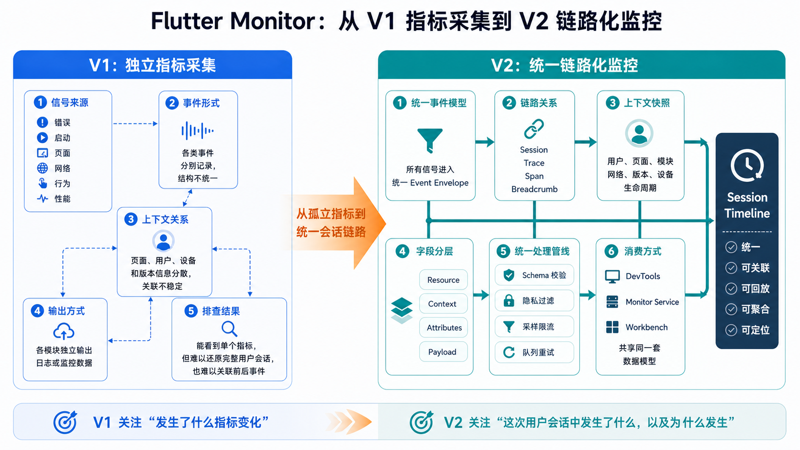
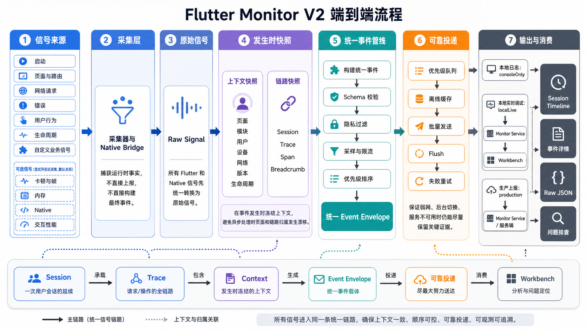

# V1 到 V2：从指标采集到链路化监控

## 文档目的

本文说明 Flutter Monitor 为什么从 V1 的独立指标采集演进为 V2 的链路化监控，以及当前代码已经落地到什么程度。它是产品和技术背景，不承担实施计划或版本路线图职责。

当前项目的一句话定位：

> Flutter Monitor 是一个面向 Flutter 应用的端侧监控 workspace。它将错误、启动、页面、网络、行为和生命周期等高确定性信号，以及显式开启的卡顿、帧、内存和 native 诊断信号，统一组织成可检索、可回查的用户会话链路。



## V1 与 V2 的核心差异

V1 的问题不是采集能力不足，而是每类指标相互独立。错误、页面耗时、HTTP、卡顿和行为能够单独查看，但上下文分散，难以回答一次真实用户会话中事件如何前后关联。

V2 保留这些信号源，改变它们的组织和处理方式：所有信号先转换为统一 `EventEnvelope`，在事件发生时冻结上下文和链路快照，再经过同一条校验、隐私、采样、限流和投递管线。

| 维度 | V1：独立指标采集 | V2：统一链路化监控 |
|---|---|---|
| 事件结构 | 各模块分别记录，字段和上下文容易分散 | 所有信号进入统一 `EventEnvelope` |
| 关联方式 | 主要依赖时间和页面名人工推断 | 使用 `sessionId`、`traceId`、`spanId`、breadcrumb 关联 |
| 上下文 | 用户、页面、设备、版本等信息不稳定 | 事件发生时冻结 `resource`、`context` 和链路快照 |
| 处理管线 | 各模块可能自行输出 | 统一 schema 校验、隐私过滤、采样、限流和优先级 |
| 投递 | 日志或模块独立上报 | `consoleOnly`、`localLive`、`production` 共用同一模型 |
| 排查入口 | 查看单个指标或日志 | 从概览、Catalog、事件详情进入 Session 工作区 |
| 最终问题 | “哪个指标发生了变化” | “这次会话发生了什么，以及相关证据是什么” |

## V2 当前链路



当前运行时主链路已经落地：

```text
Collector / Native Bridge
  -> RawSignal
  -> ContextSnapshot + TraceSnapshot
  -> EventEnvelope
  -> Schema Validation
  -> Privacy Filter
  -> Sampling / Rate Limit / Retention
  -> Output
```

其中：

- `flutter_monitor_core` 定义唯一事件模型、字段、状态、隐私、保留等级、摘要和导出结构。
- `flutter_monitor_sdk` 负责 Flutter runtime 采集、session/trace/span/breadcrumb、pipeline 和输出。
- `flutter_monitor_native` 提供可选的 native resource、memory、memory pressure 和 lifecycle 信号。
- Monitor Service 接收并保存 raw envelope，同时构建可回查原事件的查询摘要。
- Workbench 提供概览、Session、HTTP、埋点、异常、详情和 Raw JSON 排查入口。

## 当前支持范围

默认主链路采集高确定性信号：

- Flutter framework error、Dart uncaught error 和业务手动错误；
- 冷启动、热启动、生命周期和 SDK 初始化；
- 页面进入、加载、停留、恢复和 route context；
- Dio 与 `http.Client` 的 completed HTTP 事件；
- `FlutterMonitorSDK.track(...)` 业务动作；
- SDK queue、flush、retry、drop 等自监控证据。

以下能力默认关闭，只有通过 `MonitorSignalConfig` 显式开启后才产生诊断事件：

- frame stats；
- jank sequence；
- RSS memory sample、growth 和 suspect 线索；
- `FlutterMonitorSDK.measure(...)` 交互性能窗口；
- native bridge 信号。

这些信号受平台调度、采样、GC 或启发式阈值影响，只能作为诊断线索。内存增长不能直接表述为确定泄漏，慢帧也不能单独证明业务根因。

## 输出与消费

SDK 对外提供三种输出模式：

| 模式 | 用途 | 去向 |
|---|---|---|
| `consoleOnly` | 本地开发 | compact/quiet/json/silent console log |
| `localLive` | 本地或 QA 排查 | Monitor Service + Workbench |
| `production` | 内部灰度或生产接入 | 带队列、batch、retry 和自监控的服务端上报 |

三种模式使用相同的采集模型。模式只决定事件生成后的输出和可靠性策略，不改变已启用信号的字段语义。

Workbench 是 V2 的主要本地排查入口，但不是事件事实源。SQLite 索引、Catalog、Session summary、Analytics 和界面 view model 都是派生视图，必须能通过 `eventId`、`sessionId` 或 `traceId` 回查 raw `EventEnvelope`。

## 已落地与预留边界

| 范围 | 当前状态 |
|---|---|
| EventEnvelope、字段注册、隐私、Retention | 已落地，`flutter_monitor_core` 为事实源 |
| Flutter 错误、启动、页面、HTTP、行为、生命周期 | 已落地，默认主链路 |
| 可靠投递、离线队列、batch、retry、SDK self-monitoring | 已落地 |
| Monitor Service、SQLite、查询 API、SSE | 已落地，定位为本地/QA/小规模验证服务 |
| Workbench 概览、Catalog、Session、详情、Raw 回查 | 已落地 |
| Native resource、memory、pressure、lifecycle | 已落地为可选增强，默认关闭 |
| Native crash、OOM、ANR | 仅有模型和映射边界，尚无可靠平台捕获实现 |
| Session export 数据结构 | core 已定义；完整导出/导入工作流尚未实现 |
| Flutter DevTools extension / Timeline bridge | 设计预留，当前未实现 |
| Remote config、告警、多租户、长期趋势治理 | 不属于当前本地 Workbench 闭环 |

## 典型排查结果

V2 的价值不只是把指标放到同一张页面，而是让排查问题可以沿着 session、trace、span 和 breadcrumb 回到发生现场。

### 用户反馈“刚才页面卡住了”

开发者可以从最近 Session 进入页面 trace，查看用户动作、页面恢复、HTTP、错误和前后 breadcrumbs。显式开启 jank 或 memory 后，可以把慢帧和内存压力作为诊断线索叠加到同一条链路，但不能把它们直接当成根因。

### QA 反馈“订单页加载慢”

从 page load 或 HTTP Catalog 进入 Session 工作区，可以核对页面来源、页面实例、请求耗时、状态码、网络上下文、版本和设备等级。跨页面完成的请求仍保留发起时的 owner route，并通过 completion context 解释完成时页面已经变化的情况。

### 线上版本性能退化

服务端可以按 app version、environment、route、module、device tier、network type 和 feature flags 聚合启动、页面、HTTP、错误和显式开启的诊断信号。当前本地 Monitor Service 只承担本地、QA 和小规模验证，长期趋势、告警、多租户和权限治理属于生产服务扩展。

## DevTools 与服务端分工

DevTools 或 Workbench 主要回答“这一次复现发生了什么”：强调事件顺序、上下文、trace/span 关系和 SDK health。服务端主要回答“这个问题影响了谁、在哪些版本和环境发生”：强调检索、聚合、分位数、趋势、版本对比和告警。

两侧必须共享 `EventEnvelope`、字段注册、隐私规则和 session/trace/span 语义。Workbench 的 Catalog、Analytics、Session summary 和 UI view model 都是派生视图，不得成为第二套协议或回写 raw envelope。

## V1 到 V2 的设计原则

- 先稳定 event envelope、schema version、字段路径和 privacy，再扩展采集器或 UI；
- 新信号必须能关联 session、trace、span、breadcrumb 或 context，不能新增孤立业务指标；
- 采样、限流、离线、重试和优先级属于统一 pipeline，不由各 collector 私自处理；
- 低可信诊断信号默认关闭，启用后也只能作为定位线索；
- Native、DevTools、CLI、MCP 和服务端都复用 core，不得分叉事件模型或导出格式；
- 文档应明确当前实现与预留能力，不能用设计接口或 schema 预留冒充已完成能力。

## 文档分层

当前文档按事实归属维护：

- `docs/background.md`：V1/V2 演进背景和当前能力边界。
- `docs/architecture.md`：当前 workspace、包职责、运行时数据流和边界。
- `docs/event_model.md`：唯一事件模型和字段语义。
- `docs/signal_collection.md`：SDK 采集行为、配置、限制与降级。
- `docs/server_protocol.md`：当前 ingest 合同与生产协议边界。
- `docs/devtools_integration.md`：DevTools 和 session export 的当前状态与设计边界。
- `platform/docs/`：Monitor Service 与 Workbench 的产品、架构、功能和设计文档。

README 只负责项目入口和导航，不替代上述事实文档。
