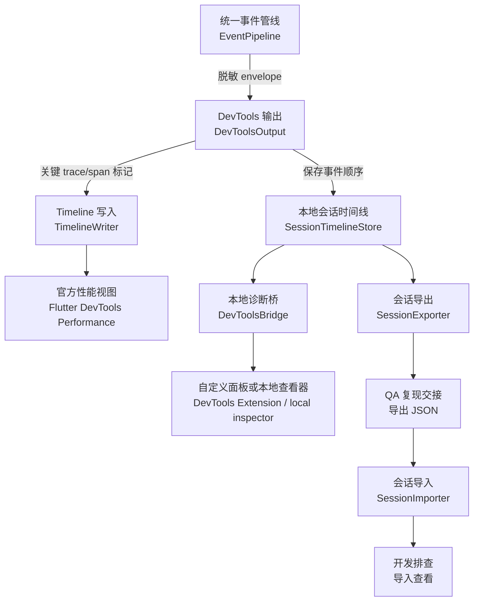

# DevTools 集成

## 目标

DevTools 集成服务于本地复现、性能优化和 QA 交接。它回答“这一次发生了什么”，不承担长期历史分析、告警和跨用户聚合职责。

当前阶段的 DevTools 集成优先指接入官方 Flutter DevTools / Flutter Timeline：SDK 写入 Timeline 标记、维护本地 session timeline、提供导出数据。未来可选的 `flutter_monitor_devtools` 是自定义 DevTools extension/UI 包，用于更完整地展示 session、trace、memory、jank 和 native signals；它消费 SDK bridge/export 数据，不承担 runtime 采集。

DevTools 必须消费 `flutter_monitor_core` 定义的统一 event envelope，不得定义第二套事件结构。Flutter runtime 信号和 native 信号都应通过同一 session timeline 展示。

## 本地架构

目标模块：

- `DevToolsOutput`
- `DevToolsBridge`
- `TimelineWriter`
- `SessionTimelineStore`
- `SessionExporter`
- `SessionImporter`
- `SdkHealthStore`

数据流：

```text
EventPipeline
  -> DevToolsOutput
    -> TimelineWriter
    -> SessionTimelineStore
    -> DevToolsBridge
      -> DevTools Extension / local inspector
```



DevTools 只消费 pipeline 输出的脱敏 envelope。本地 Timeline 负责快速定位性能片段，session timeline 和导出文件负责还原一次复现过程。

要求：

- DevTools 只读取 pipeline 输出的脱敏 event envelope。
- DevTools 不重新读取 collector 原始数据。
- native 信号必须先进入 pipeline，再进入 DevTools。
- DevTools 面板展示的事件语义应与 HTTP 上报和 session export 一致。

## Flutter Timeline 标记

SDK 应将关键 trace/span 写入 Flutter Timeline。

建议标记：

- `app.cold_start`
- `app.hot_start`
- `app.first_frame`
- `app.interactive`（预留；基础 SDK 当前不自动生成）
- `route.push` / `route.pop`
- `page.visit`
- `page.load`
- `page.first_frame`
- `http.client`
- `custom.trace` / `custom.step`
- `ui.jank.sequence`
- `memory.pressure`
- `native.crash`
- `native.oom`
- `native.anr`

标记规则：

- trace/span 写入 Timeline 区间。
- jank sequence 写入 Timeline 区间，并携带 frame budget、max frame、jank count。
- error/native crash/OOM/ANR 写入关键瞬时标记。
- breadcrumb 默认进入 SDK session timeline；只有调试模式或显式配置时才写 Flutter Timeline，避免 Timeline 噪声过大。
- memory sample 默认不逐条写 Timeline；memory pressure、异常增长或 suspect leak 可写关键标记。

Timeline arguments 应只包含脱敏后的必要字段，例如 `sessionId`、`traceId`、`spanId`、`context.route.name`、`context.module.name`、`status`、关键 attributes。

DevTools 中展示的 `priority` 必须来自统一 event envelope，不应根据 UI 分组重新计算另一套优先级。

## DevTools 面板

### Session Timeline

展示当前 session 的事件顺序：

```text
12:00:00 app.cold_start
12:00:01 page.view /home
12:00:03 ui.click home_banner
12:00:03 http.client GET /campaign
12:00:04 page.visit /product/detail
12:00:04 page.load /product/detail
12:00:05 ui.jank.sequence
12:00:05 memory.sample
12:00:06 error.dart
```

每条事件展示：

- timestamp；
- signal type；
- name；
- level/status；
- duration；
- `context.route.*` / `context.module.*`；
- trace/span；
- priority；
- key attributes。

### Trace Detail

展示 trace 内部 span：

- root trace 信息；
- span 树；
- duration 和状态；
- 页面 first frame / interactive；
- HTTP 请求；
- jank、memory、error 关联事件；
- native 信号关联事件；
- recent breadcrumbs。

### Event Detail

展示单个 event envelope：

- public fields；
- resource；
- context；
- attributes；
- payload；
- breadcrumbs；
- related trace/span；
- privacy filtering 状态；
- schema validation 状态。

### Context Snapshot

展示事件捕获时的上下文：

- `resource.app.*` / `context.release.*`；
- `context.user.*`；
- `context.route.stack`；
- `context.module.*`；
- `context.network.*`；
- `resource.device.*`；
- `context.lifecycle.*`；
- `context.native.*`。

### Memory / Jank View

展示本地性能线索：

- frame budget；
- jank sequences；
- FPS/stability；
- memory sample；
- memory growth；
- memory pressure；
- suspect leak 线索；
- 相关 route/action/http/native 信号。

内存泄漏只能展示为 suspect，不应在 DevTools 中宣称确定泄漏。

### Native Signals View

展示来自 `flutter_monitor_native` 的可选信号：

- native memory sample；
- native memory pressure；
- native crash；
- ANR；
- OOM；
- native lifecycle warning。

DevTools 不直接采集 native 数据，只展示已经进入 event envelope 的 native events。

### SDK Health

展示 SDK 自身状态：

- event queue size；
- dropped event count；
- flush success/failure；
- sampling state；
- rate limit state；
- privacy filtering state；
- offline cache size；
- active session id；
- active trace count；
- native bridge state；
- schema validation failure count。

## QA 导出与开发导入

DevTools 应支持导出当前 session，供 QA 转交开发。

导出格式：

```json
{
  "schemaVersion": "1.0",
  "exportedAt": "2026-05-24T12:10:00.000+08:00",
  "source": {
    "type": "devtools",
    "sdkVersion": "1.0.0",
    "coreVersion": "1.0.0"
  },
  "session": {
    "sessionId": "ses_001",
    "startedAt": "2026-05-24T12:00:00.000+08:00",
    "endedAt": "2026-05-24T12:10:00.000+08:00"
  },
  "events": [],
  "sdkHealth": {},
  "privacy": {
    "filtered": true,
    "policyVersion": "1.0"
  }
}
```

导出要求：

- `events` 必须使用 `docs/event_model.md` 定义的 event envelope。
- 导出文件不应包含未经脱敏的敏感字段。
- 导出文件可以包含 session metadata，但不得定义另一套事件字段。
- native 信号和 Flutter 信号在同一 `events` 数组中表达。
- SDK self-monitoring events 应可选包含，便于判断是否丢失数据。

导入策略：

- schema major 不兼容时，应明确提示并拒绝完整解析。
- schema minor 新增字段不认识时，应保留原始 JSON 并弱展示。
- 缺失 resource/context 时，应展示缺失原因和可用字段。
- 不应在导入时重新执行隐私还原。

## 本地诊断场景

DevTools 应支持以下场景：

- 页面加载慢：查看 page trace 下的 `context.route.name`、first frame、HTTP、jank、memory；如业务或 native 提供 interactive，再展示可交互点。
- 点击后卡顿：查看 action breadcrumb、后续 span、jank sequence 和 memory sample。
- 请求慢：查看 http span 是否影响页面 trace 或 action trace。
- 冷启动慢：查看 app cold start trace、SDK init、first frame；如业务或 native 提供 interactive，再展示可交互点。
- 热启动慢：查看 lifecycle resume、hot start trace、页面恢复和首个可交互点。
- 内存上涨：查看 memory growth、`context.route.*` / `context.module.*` / `context.network.*`、HTTP、native 信号和 suspect leak 线索。
- native 异常：查看 native crash/OOM/ANR 的 `sessionId`、`context.route.*`、`payload.breadcrumbs` 和设备上下文。
- QA 复现：导出 session 给开发。
- 自定义业务流程优化：比较 custom trace 的 span 耗时。

## 边界

DevTools 不负责：

- 跨用户历史查询；
- 长期趋势；
- 告警；
- 影响用户数统计；
- 多版本聚合对比；
- 服务端鉴权；
- native 原始 crash dump 解析；
- 未脱敏敏感字段展示。

这些能力由服务端、native 工具链或其他专门工具承担。
