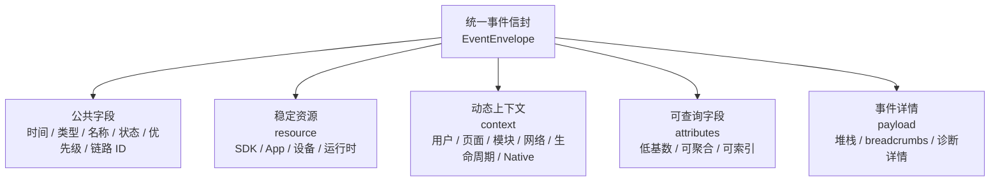
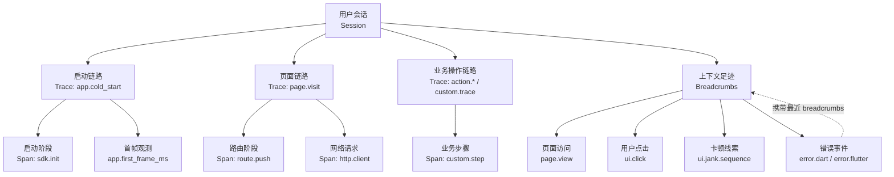

# 事件模型

## 目标

本文档定义 Flutter Monitor workspace 内所有包共享的唯一事件模型。未来该模型由 `flutter_monitor_core` 承载，`flutter_monitor_sdk`、`flutter_monitor_native`、DevTools、CLI、MCP 和服务端协议都必须复用它。

事件模型的目标是让所有信号具备三个能力：

- 可回放：能还原一次用户或 QA 会话中发生的关键过程。
- 可聚合：能按页面、模块、版本、设备、网络、用户分群、feature flag 等维度统计。
- 可定位：能把错误、慢请求、页面慢、卡顿、内存、native 信号和用户操作关联到同一条链路。

排查入口不等于链路主键。`sessionId`、`traceId`、`spanId` 和 `eventId` 是事件链路的事实主键；真实排查时，QA 或开发者更常从 `userId + 时间范围`、App 版本、页面、错误、慢请求、卡顿或启动问题进入 Workbench，再反查 session timeline 和完整 envelope。

## 设计原则

### 关联优先

业务事件应尽量关联：

- 所属 session；
- 当前 `context.route.*` / `context.module.*` / `context.module.scene`；
- 当前 trace 或 active span；
- 最近 breadcrumbs；
- app/device/network/release/user/native 上下文。

无法关联上下文的事件仍可进入模型，但必须显式标记 `context.missing = true` 和 `context.missingReason`。普通业务事件不应长期以缺失上下文的方式上报。

### Trace 与 Span 一等化

Trace 和 span 都是一等事件：

- `signalType = trace` 表示一次可排查流程的根事件或流程摘要。
- `signalType = span` 表示 trace 内部的一个阶段。

不要用 `signalType = trace` 同时表达 root trace 和内部 span。HTTP 请求、route push、首帧、可交互、图片解码、列表构建、native step 等阶段应使用 `signalType = span`。

Trace/span 可按生命周期流式上报，也可只上报完成态摘要。流式上报时必须使用 `event.phase` 明确区分：

- `start`：区间开始，允许 `status = unknown`，可无 `endTime` 和 `durationMs`。
- `end`：区间结束，必须包含 `endTime`、`durationMs` 和最终 `status`。
- `instant`：瞬时事件，例如 breadcrumb、metric、error、log、sdk event。

### 字段分层

- `resource` 放稳定资源，例如 SDK、App、设备、系统和运行环境。
- `context` 放事件发生时的动态上下文，例如 user、route、module、network、release、native runtime。
- `attributes` 放可检索、可聚合、低基数的结构化字段。
- `payload` 放事件特有详情，可为空，可裁剪，不应作为主要索引来源。

同一个语义字段只能有一个规范路径。不要在 `resource`、`context`、`attributes` 和 `payload` 中重复表达同一含义。

### 业务接入面最小化

真实 App 的普通接入不应要求业务方理解 `EventEnvelope`、`FieldPaths`、trace/span、breadcrumb store、attributes/payload 的内部细节。SDK 自动采集是主线，业务侧只保留少量明确职责的入口：

- `FlutterMonitorSDK.track(...)`：业务主动埋点入口，记录关键业务动作。
- 未来统一上下文入口，例如 `FlutterMonitorSDK.setContext(...)`：补充 `userId` 等通用排查上下文。

`startTrace`、`startSpan`、`addBreadcrumb`、自定义 `attributes` / `payload` 等能力如保留，应定位为 SDK 内部、高级调试能力，不作为真实 App 的普通接入示例。用户、发布、模块等通用排查上下文由统一上下文入口承载，避免在 public API 中形成多套概念。

### 隐私默认安全

URL query、request body、response body、token、cookie、手机号、身份证、地址、精确位置等数据默认不进入事件。确需上报时必须经过显式配置和脱敏策略。

隐私过滤必须早于任何 output，包括 log、HTTP、DevTools 和文件导出。

## 字段状态

字段状态用于说明事件中字段是否必须存在：

| 状态 | 含义 |
|---|---|
| required | 所有事件必须提供，且不可为空 |
| conditional | 满足条件时必须提供 |
| optional | 可省略 |
| nullable | 字段可存在但值为 `null` |
| default | SDK 可在缺失时使用默认值 |

## Event Envelope

所有事件都应使用统一 envelope：



`resource` 描述相对稳定的信息，`context` 描述事件发生时的动态环境，`attributes` 服务查询和聚合，`payload` 保存可裁剪的事件详情。

```json
{
  "schemaVersion": "1.0",
  "eventId": "evt_001",
  "timestamp": "2026-05-24T12:00:00.000+08:00",
  "startTime": "2026-05-24T12:00:00.000+08:00",
  "endTime": "2026-05-24T12:00:00.523+08:00",
  "durationMs": 523,
  "signalType": "span",
  "name": "http.client",
  "level": "info",
  "status": "ok",
  "priority": "normal",
  "sessionId": "ses_001",
  "traceId": "trace_page_product_detail",
  "spanId": "span_http_product",
  "parentSpanId": "span_page_product_detail",
  "resource": {},
  "context": {},
  "attributes": {"event.phase": "instant"},
  "payload": {}
}
```

### 公共字段

| 字段 | 类型 | 状态 | 可空 | 隐私等级 | 建议索引 | 说明 |
|---|---|---|---:|---|---:|---|
| `schemaVersion` | string | required | 否 | safe | 是 | 事件 schema 版本 |
| `eventId` | string | required | 否 | safe | 是 | 事件唯一 ID，也是幂等键 |
| `timestamp` | string | required | 否 | safe | 是 | 事件捕获时间，ISO-8601 wall clock |
| `startTime` | string | conditional | 是 | safe | 否 | trace/span/耗时类事件开始时间 |
| `endTime` | string | conditional | 是 | safe | 否 | trace/span/耗时类事件结束时间 |
| `durationMs` | number | conditional | 是 | safe | 是 | 耗时，优先来自 monotonic clock |
| `signalType` | string | required | 否 | safe | 是 | `trace`、`span`、`metric`、`error`、`breadcrumb`、`log`、`sdk` |
| `name` | string | required | 否 | queryable | 是 | 稳定事件名，不包含动态业务值 |
| `level` | string | optional | 是 | safe | 是 | `debug`、`info`、`warning`、`error`、`fatal` |
| `status` | string | optional | 是 | safe | 是 | `ok`、`error`、`cancelled`、`timeout`、`unknown` |
| `priority` | string | default | 否 | safe | 是 | `critical`、`high`、`normal`、`low`，默认 `normal` |
| `sessionId` | string | conditional | 是 | queryable | 是 | 普通业务事件必填；pre-session/sdk 事件可缺省 |
| `traceId` | string | conditional | 是 | queryable | 是 | trace/span/page/http/custom flow 必填 |
| `spanId` | string | conditional | 是 | queryable | 是 | span 必填 |
| `parentSpanId` | string | optional | 是 | queryable | 是 | root span 可为空 |
| `resource` | object | required | 否 | mixed | 否 | SDK、App、设备和运行环境 |
| `context` | object | required | 否 | mixed | 否 | 用户、页面、网络、release、native runtime 等上下文 |
| `attributes` | object | optional | 否 | mixed | 是 | 可检索、可聚合字段，默认 `{}` |
| `payload` | object | optional | 否 | mixed | 否 | 事件详情，默认 `{}`，可裁剪 |

### 时间模型

- `timestamp` 使用 wall clock，用于 session timeline 排序和用户可读展示。
- `startTime` / `endTime` 也使用 wall clock，便于 DevTools 和导出文件显示。
- `durationMs` 应优先来自 monotonic clock 或平台高精度计时，避免系统时间变化影响耗时。
- 如果只能获得 duration 而不能获得准确 start/end，可只提供 `timestamp` 和 `durationMs`。
- 如果事件是瞬时 breadcrumb，可不提供 `startTime`、`endTime` 和 `durationMs`。

### 优先级模型

`priority` 表示事件在 pipeline、队列、离线缓存、重试和服务端处理中的保留优先级。

建议语义：

| 值 | 说明 |
|---|---|
| `critical` | crash、OOM、严重错误、关键链路丢失等必须尽量保留的事件 |
| `high` | 关键错误、关键慢页面、严重卡顿、memory pressure 等高价值诊断事件 |
| `normal` | 默认业务监控事件，例如页面、网络、行为、普通性能事件 |
| `low` | 高频、可降采样、辅助性日志或调试事件 |

采集器只能提供 priority suggestion，最终 `priority` 由 pipeline 在构建 event envelope 时确定。缺省值为 `normal`。

## 唯一字段契约

本节是项目内部字段的唯一契约。一个语义只能出现在一个规范路径中，不允许通过 `attributes` 复制 `resource` 或 `context` 中已经存在的字段。

本节只定义 canonical field paths。新文档、新示例、core 注册表和 SDK 输出都应以本节为准。

字段归属规则：

- public envelope fields 表达事件身份、时间、状态、优先级和链路 ID。
- `resource`、`context`、`attributes`、`payload` 也是顶层规范字段，分别承载稳定资源、动态上下文、可检索字段和诊断详情。
- `resource.*` 表达稳定资源，例如 SDK、App、设备和运行时。
- `context.*` 表达事件发生时的动态上下文，例如用户、路由、模块、网络、发布、生命周期和 native runtime。
- `attributes.*` 只表达事件特有、低基数、可聚合的结构化指标或状态。
- `payload.*` 只表达可裁剪诊断详情，不作为主要索引来源。

### Resource 字段

| 字段 | 类型 | 隐私等级 | 建议索引 | 说明 |
|---|---|---|---:|---|
| `resource.sdk.name` | string | safe | 是 | SDK 名称 |
| `resource.sdk.version` | string | safe | 是 | Flutter SDK package 版本 |
| `resource.sdk.coreVersion` | string | safe | 是 | `flutter_monitor_core` 版本 |
| `resource.sdk.nativeVersion` | string | safe | 是 | native plugin 版本，可为空 |
| `resource.app.appKey` | string | safe | 是 | 应用标识 |
| `resource.app.appName` | string | safe | 否 | 应用名称 |
| `resource.app.appVersion` | string | safe | 是 | App 语义版本 |
| `resource.app.buildNumber` | string | safe | 是 | App 构建号 |
| `resource.app.packageName` | string | safe | 是 | 应用包名 |
| `resource.app.environment` | string | safe | 是 | `dev`、`test`、`staging`、`production` |
| `resource.app.channel` | string | safe | 是 | 分发渠道 |
| `resource.app.flavor` | string | safe | 是 | Flutter flavor 或企业自定义 flavor |
| `resource.device.platform` | string | safe | 是 | android/ios/web/macos 等 |
| `resource.device.model` | string | queryable | 是 | 设备型号 |
| `resource.device.manufacturer` | string | queryable | 是 | 设备厂商 |
| `resource.device.osVersion` | string | safe | 是 | OS 版本 |
| `resource.device.isPhysicalDevice` | boolean | safe | 是 | 是否真机 |
| `resource.device.refreshRate` | number | safe | 是 | 屏幕刷新率 |
| `resource.device.deviceTier` | string | safe | 是 | high/medium/low/unknown |
| `resource.runtime.flutterVersion` | string | safe | 是 | Flutter 版本 |
| `resource.runtime.dartVersion` | string | safe | 是 | Dart 版本 |
| `resource.runtime.isDebug` | boolean | safe | 是 | 是否 debug runtime |

### Context 字段

| 字段 | 类型 | 隐私等级 | 建议索引 | 说明 |
|---|---|---|---:|---|
| `context.user.userId` | string | sensitive | 是 | 用户标识，必须支持匿名化或关闭 |
| `context.user.userType` | string | queryable | 是 | 用户类型 |
| `context.user.userTags` | array | queryable | 是 | 用户标签 |
| `context.user.cohort` | string | queryable | 是 | 用户分群 |
| `context.route.name` | string | queryable | 是 | 当前 route 标识 |
| `context.route.fullName` | string | queryable | 是 | 带参数的完整 route 标识，例如 `/detail?id=1` |
| `context.route.stack` | array | queryable | 是 | 当前 route stack |
| `context.route.source` | string | queryable | 是 | 页面来源 |
| `context.module.name` | string | queryable | 是 | 业务模块，可选增强上下文，不作为基础接入前置条件 |
| `context.module.scene` | string | queryable | 是 | 业务场景，可选增强上下文，不作为基础接入前置条件 |
| `context.network.type` | string | safe | 是 | wifi/cellular/none/unknown |
| `context.network.isWeakNetwork` | boolean | safe | 是 | 弱网判断 |
| `context.release.releaseId` | string | safe | 是 | 可组合 app/package/version/build |
| `context.release.featureFlags` | array | queryable | 是 | 事件发生时命中的 feature flags |
| `context.release.experiments` | object | queryable | 是 | 实验名到分组的映射 |
| `context.lifecycle.state` | string | safe | 是 | resumed/inactive/paused/detached/hidden |
| `context.lifecycle.previousState` | string | safe | 是 | 上一个生命周期状态 |
| `context.lifecycle.isForeground` | boolean | safe | 是 | 是否前台 |
| `context.native.available` | boolean | safe | 是 | native bridge 是否可用 |
| `context.native.platform` | string | safe | 是 | android/ios 等 native platform |
| `context.native.processId` | number | safe | 否 | native 进程 ID |
| `context.native.bridgeVersion` | string | safe | 是 | native bridge 版本 |
| `context.native.signalSource` | string | safe | 是 | native 信号来源 |
| `context.missing` | boolean | safe | 是 | 上下文是否缺失 |
| `context.missingReason` | string | safe | 是 | 上下文缺失原因 |

`context.missingReason` 必须使用固定值，不允许自由文本：

| 值 | 说明 |
|---|---|
| `pre_session` | 事件发生时 session 尚未建立 |
| `sdk_bootstrap_incomplete` | SDK 初始化尚未完成 |
| `app_start_time_missing` | 启动起点缺失 |
| `route_name_missing` | route name 不可用 |
| `route_stack_unavailable` | route stack 不可用 |
| `native_bridge_unavailable` | native bridge 不可用 |
| `platform_limited` | 平台能力限制 |
| `privacy_filtered` | 隐私策略导致字段缺失 |

### Attribute 字段

| 字段 | 类型 | 隐私等级 | 建议索引 | 说明 |
|---|---|---|---:|---|
| `app.start.type` | string | safe | 是 | cold/hot；当前 core/SDK 只注册并发出 cold、hot，warm 如需支持必须先扩展 core 常量与采集语义 |
| `app.start.end_reason` | string | safe | 是 | first_frame/interactive/timeout/manual，说明启动 trace 的闭合口径 |
| `event.phase` | string | safe | 是 | start/end/instant，用于区分 trace/span 生命周期事件 |
| `app.first_frame_ms` | duration_ms | safe | 是 | 启动首帧耗时 |
| `app.interactive_ms` | duration_ms | safe | 是 | 启动可交互耗时；当前 core 预留，基础 SDK 仅在明确以 interactive 闭合时填写 |
| `sdk.init.duration_ms` | duration_ms | safe | 是 | SDK 初始化耗时 |
| `native.start.elapsed_ms` | duration_ms | safe | 是 | native 启动起点到 Flutter 可观测点耗时 |
| `page.first_frame_ms` | duration_ms | safe | 是 | 页面首帧耗时 |
| `page.interactive_ms` | duration_ms | safe | 是 | 页面可交互耗时；当前 core 预留，基础 SDK 不自动生成 |
| `page.from` | string | queryable | 是 | 页面来源 route |
| `page.from_full_name` | string | queryable | 是 | 页面来源完整 route |
| `page.to` | string | queryable | 是 | 页面离开后进入的 route |
| `page.to_full_name` | string | queryable | 是 | 页面离开后进入的完整 route |
| `page.instance_id` | string | queryable | 是 | 单次页面实例 ID，用于区分同 route 多次进入 |
| `page.active_phase` | string | safe | 是 | 页面活跃窗口阶段，例如 page.enter、page.covered、page.exit、page.resume、lifecycle.background、app.dispose |
| `page.load_ms` | duration_ms | safe | 是 | 页面加载耗时，通常等于首次可渲染帧耗时 |
| `http.method` | string | safe | 是 | GET/POST 等 |
| `http.url.normalized` | string | queryable | 是 | 归一化 URL，不含 query |
| `http.status_code` | number | safe | 是 | HTTP 状态码 |
| `http.success` | boolean | safe | 是 | 请求是否成功 |
| `http.error_type` | string | queryable | 是 | 网络错误类型 |
| `http.retry_count` | number | safe | 否 | 重试次数 |
| `http.cache_status` | string | safe | 是 | hit/miss/bypass/unknown |
| `request.size_bytes` | number | safe | 否 | 请求大小 |
| `response.size_bytes` | number | safe | 否 | 响应大小 |
| `ui.target` | string | queryable | 是 | 控件或交互目标标识 |
| `ui.action` | string | safe | 是 | tap/scroll/input 等 |
| `business.action` | string | queryable | 是 | 业务动作 |
| `business.result` | string | safe | 是 | success/failure/cancelled |
| `jank.count` | number | safe | 是 | 连续慢帧数量 |
| `frame.max_ms` | duration_ms | safe | 是 | 最大帧耗时 |
| `frame.avg_ms` | duration_ms | safe | 是 | 平均帧耗时 |
| `frame.budget_ms` | duration_ms | safe | 是 | 帧预算 |
| `frame.fps` | number | safe | 是 | 最近窗口 FPS |
| `frame.stability` | number | safe | 是 | 稳定性 |
| `frame.p50_ms` | duration_ms | safe | 是 | 帧耗时 P50 |
| `frame.p90_ms` | duration_ms | safe | 是 | 帧耗时 P90 |
| `frame.p99_ms` | duration_ms | safe | 是 | 帧耗时 P99 |
| `frame.sample_count` | number | safe | 是 | 窗口内参与统计的帧样本数 |
| `frame.slow_count` | number | safe | 是 | 窗口内超过帧预算的慢帧数量 |
| `frame.dropped_count` | number | safe | 是 | 基于帧耗时估算的 dropped frame 数量 |
| `frame.refresh_rate` | number | safe | 是 | 当前窗口采用的刷新率，用于解释帧预算 |
| `memory.rss_mb` | number | safe | 是 | 进程常驻内存 |
| `memory.start_rss_mb` | number | safe | 是 | trace 起点进程 RSS，当前用于启动性能证据 |
| `memory.end_rss_mb` | number | safe | 是 | trace 终点进程 RSS，当前用于启动性能证据 |
| `memory.enter_rss_mb` | number | safe | 是 | 页面进入时进程 RSS，当前用于页面性能证据 |
| `memory.exit_rss_mb` | number | safe | 是 | 页面离开时进程 RSS，当前用于页面性能证据 |
| `memory.delta_rss_mb` | number | safe | 是 | 同一 trace/window 内 RSS 差值，只表示增长线索，不表示确定泄漏 |
| `memory.heap_used_mb` | number | safe | 否 | Dart/Flutter heap 使用 |
| `memory.heap_capacity_mb` | number | safe | 否 | heap 容量 |
| `memory.external_mb` | number | safe | 否 | external memory |
| `memory.native_used_mb` | number | safe | 是 | native memory，可由 native plugin 提供 |
| `memory.growth_mb` | number | safe | 是 | 增长量 |
| `memory.growth_duration_ms` | duration_ms | safe | 是 | 观察窗口 |
| `memory.pressure_level` | string | safe | 是 | none/moderate/critical/unknown |
| `memory.sample_source` | string | safe | 是 | dart/native/system/unknown |
| `memory.sample_phase` | string | safe | 是 | 内存采样阶段，例如 session.start、page.enter、page.covered、page.exit、page.resume、lifecycle.background |
| `app.exit_flush.success` | boolean | safe | 是 | 退出前 flush 是否成功 |
| `native.signal` | string | safe | 是 | memory/crash/anr/oom/lifecycle |
| `native.thread` | string | queryable | 否 | native 线程名 |
| `native.thread_id` | string | queryable | 否 | native 线程 ID |
| `native.crash.type` | string | queryable | 是 | native crash 类型 |
| `native.anr.duration_ms` | duration_ms | safe | 是 | ANR 持续时间 |
| `native.oom.reason` | string | queryable | 否 | OOM 线索 |
| `error.type` | string | queryable | 是 | exception/error 类型 |
| `error.mechanism` | string | queryable | 是 | flutter/dart/native/manual/custom |
| `error.handled` | boolean | safe | 是 | 是否已处理 |
| `error.fatal` | boolean | safe | 是 | 是否致命 |
| `error.thread` | string | queryable | 否 | 线程/isolate/native thread |

## 内存、Lifecycle 与 Native 事件契约

内存、增强 lifecycle 和 native bridge 不改变统一 envelope。所有 memory、lifecycle 和 native 信号仍必须使用本文件定义的 public fields、`resource`、`context`、`attributes` 和 `payload` 分层。

### 内存事件

内存事件用于解释页面慢、卡顿、错误、OOM 线索和资源增长趋势。Flutter/Dart 层只能上报实际可获得的字段；拿不到的 RSS、native memory、heap capacity 等字段必须省略，或在上下文中标记 `context.missingReason = platform_limited`，不得伪造。

基础 SDK 的启动和页面性能证据属于主链路。启动 RSS 使用 `memory.start_rss_mb`、`memory.end_rss_mb`、`memory.delta_rss_mb` 写入 `app.cold_start` / `app.hot_start` trace end；页面 RSS 使用 `memory.enter_rss_mb`、`memory.exit_rss_mb`、`memory.delta_rss_mb` 写入对应 `page.visit` trace end。`memory.sample` 用于 session/lifecycle/jank/native 等低频采样，不作为页面切换证据形态。

| name | signalType | status | priority 建议 | 必须/条件字段 | 说明 |
|---|---|---|---|---|---|
| `memory.sample` | `metric` | `ok` | `low` | `memory.sample_source`；至少一个 `memory.*_mb` 字段 | 低频内存采样，用于时间线和趋势观察 |
| `memory.growth` | `metric` | `ok` / `warning` | `normal` | `memory.growth_mb`、`memory.growth_duration_ms`、`memory.sample_source` | 观察窗口内增长量；没有足够样本不得生成 |
| `memory.pressure` | `metric` | `warning` / `error` | `high` | `memory.pressure_level`、`memory.sample_source` | memory pressure / low memory warning 线索，应进入 breadcrumb store |
| `memory.leak.suspect` | `metric` | `warning` | `high` | `memory.growth_mb`、`memory.growth_duration_ms`、`memory.sample_source` | 只能表达疑似泄漏线索，payload 必须说明依据 |
| `native.memory.sample` | `metric` | `ok` | `normal` | `memory.sample_source = native`，条件字段 `memory.native_used_mb` | native bridge 提供的内存采样 |
| `native.memory.pressure` | `metric` | `warning` / `error` | `high` | `memory.sample_source = native`、`memory.pressure_level` | native bridge 提供的 pressure / low memory warning |

内存字段归属：

- `attributes.memory.*` 保存可聚合数值和状态，例如 `memory.heap_used_mb`、`memory.native_used_mb`、`memory.growth_mb`、`memory.pressure_level`。
- `context.route.*` / `context.module.*` 表达采样发生时的页面和业务场景。
- `resource.device.*` 表达设备、刷新率和设备等级。
- `payload` 只保存诊断详情，例如采样窗口、样本数量、触发原因、裁剪状态和 suspect leak 依据。

业务层不得主动构造或上报 `memory.growth`、`memory.pressure` 或 `memory.leak.suspect`。这些事件只能由 SDK memory collector、native bridge 或 SDK 内部测试根据真实采样、平台 warning、阈值判断等证据生成。example 若需要验证内存链路，应制造真实内存分配、持有、释放或 jank 场景，让 SDK 自动捕获；生命周期链路通过真实 App 前后台切换触发，不提供公开 API 或示例按钮伪造 lifecycle。

`memory.sample_source` 取值必须稳定：

| 值 | 说明 |
|---|---|
| `dart` | Dart/Flutter runtime 可获得的 heap/external 等线索 |
| `native` | `flutter_monitor_native` 或其他 native bridge 提供的内存线索 |
| `system` | 平台或系统 API 提供的进程级线索 |
| `sdk` | SDK 自身队列、缓存或 offline store 状态 |
| `unknown` | 来源不可判断 |

`memory.pressure_level` 取值必须稳定：

| 值 | 说明 |
|---|---|
| `none` | 未观察到内存压力 |
| `moderate` | 中等压力或平台 low memory warning |
| `critical` | 严重压力，可能影响稳定性 |
| `unknown` | 平台只提供了 pressure 信号，但无法判断等级 |

`payload.trigger` 用于说明 SDK 内部采样或诊断事件的触发来源。当前标准值：

| 值 | 说明 |
|---|---|
| `manual` | 手动或测试触发 |
| `session.start` | session 建立后的初始采样 |
| `page.enter` | 页面活跃窗口开始时触发 |
| `page.covered` | 当前页面被新页面覆盖、活跃窗口结束时触发 |
| `page.exit` | 页面出栈、页面实例结束时触发 |
| `page.resume` | 已存在页面重新成为当前可见页面时触发 |
| `lifecycle.background` | App 进入后台、当前页面活跃窗口结束时触发 |
| `app.dispose` | SDK 或 App 退出清理当前页面活跃窗口时触发 |
| `jank.sequence` | 卡顿序列后触发的采样或增长检查 |
| `lifecycle.paused` | 进入 paused 后触发的采样 |
| `lifecycle.hidden` | 进入 hidden 后触发的采样 |
| `lifecycle.resumed` | 回到 resumed 后触发的增长检查 |

`memory.leak.suspect` 不是确定性泄漏结论。SDK、example、DevTools、Workbench 和服务端展示都只能使用“疑似泄漏”或“泄漏线索”表达；只有业务或外部工具提供额外证据时，才能在 payload 中附带该证据来源。

### 页面实例与可见阶段

页面性能采集需要区分 route 名称和页面实例，二者不能互相替代：

| 概念 | 字段 | 语义 | 主要用途 |
|---|---|---|---|
| route 名称 | `context.route.name` | 页面类型或路由标识，例如 `/detail` | 查询、聚合 |
| 完整 route 名称 | `context.route.fullName` | 带参数的业务可读 route，例如 `/detail?id=1` | 展示、定位、区分业务对象 |
| 页面实例 | `page.instance_id` | 一次 route push 产生的页面实例，推荐由 route 名称和单调时间/ID 组成 | 区分同 route 多次进入，关联 page trace/load/stay |

同一个 route 可以同时或连续产生多个页面实例。例如 `A -> B(id=1) -> B(id=2) -> C -> A` 中，页面实例是 `A1`、`B1`、`B2`、`C1`。回到 A 时不应伪造成新的 A route 实例；它仍然是 `A1`，恢复后的可见阶段通过 `page.active_phase = page.resume` 表达。SDK 应把 `page.enter` 和 `page.resume` 作为可见区段边界写入 envelope，调试工具可以据此把同一个 `page.instance_id` 拆成多个用户可见区段。

页面 trace 由 `trace page.visit` 表达页面实例生命周期。基础 SDK 把页面可见期间的帧摘要和页面进入/退出 RSS 写入 `page.visit` trace end：`context.route.name` 用于聚合，`context.route.fullName` 用于展示和定位，`page.instance_id` 用于内部关联并区分同 route 多实例。`page.visit.durationMs` 不代表某个单独可见区段的停留时间；当页面被下级 route 覆盖后恢复，后续业务操作、请求、错误和交互性能仍挂到同一个页面 trace，但 timeline 应以 `page.resume` 开启新的可见区段。

页面活跃阶段推荐使用固定值：

| 值 | 说明 |
|---|---|
| `page.enter` | 新页面实例进入并成为当前可见页面 |
| `page.covered` | 当前页面被新页面覆盖，页面实例仍在栈中但不再可见 |
| `page.exit` | 当前页面出栈，页面实例结束 |
| `page.resume` | 栈中已有页面重新成为当前可见页面 |
| `lifecycle.background` | App 进入后台，当前可见页面活跃窗口闭合 |
| `app.dispose` | SDK dispose 或 App 退出时尽力闭合当前窗口 |

页面访问足迹使用 `breadcrumb page.view` 表达页面变为可见。首次进入页面时应携带 `page.active_phase = page.enter` 和 `page.instance_id`；从子页面 pop 或 App 前台恢复后重新可见时应携带 `page.active_phase = page.resume` 和原 `page.instance_id`。Navigator pop 动作可用 `span route.pop` 表达，并挂在被 pop 页面 trace 上；恢复页的 `page.view` 仍挂在恢复后的页面 trace 上。

### 增强 Lifecycle 事件

Lifecycle 事件既影响 session 切分和 hot start，也用于解释请求中断、后台 flush、卡顿和 native 异常。状态字段属于 `context.lifecycle.*`，持续时间使用 envelope `durationMs`，不要新增平行 duration 字段。

`app.background_duration` 和 `app.hot_start` 必须保持语义分离：`app.background_duration.durationMs` 只表示 App 在后台停留的间隔，可用于 session 切分和恢复上下文；`app.hot_start.durationMs` 只表示从恢复到前台后到恢复观测点的耗时，不得复用后台停留间隔。热启动 trace 由 `resumed` 打开，由恢复后首帧、可交互、业务手动标记或超时降级闭合，并通过 `app.start.end_reason` 标明闭合口径。

| name | signalType | phase | status | priority 建议 | 必须/条件字段 | 说明 |
|---|---|---|---|---|---|---|
| `app.lifecycle` | `breadcrumb` | `instant` | `ok` | `normal` | `context.lifecycle.state`、`context.lifecycle.isForeground`，条件字段 `context.lifecycle.previousState` | 生命周期状态变化足迹 |
| `app.foreground_duration` | `metric` | `instant` | `ok` | `normal` | `durationMs`、`context.lifecycle.state` | 一段前台 activity window 的持续时间 |
| `app.background_duration` | `metric` | `instant` | `ok` | `normal` | `durationMs`、`context.lifecycle.previousState` | 一段后台停留时间，可辅助 hot start 和 session 切分 |
| `app.hot_start` | `trace` | `end` | `ok` / `error` | `normal` | `durationMs`、`app.start.type = hot`、`app.start.end_reason` | 后台恢复到前台后的热重启链路，`durationMs` 不得表示后台停留间隔 |
| `sdk.lifecycle.flush` | `sdk` | `instant` | `ok` / `error` | `normal` / `high` | `app.exit_flush.success` | 进入后台或退出前 flush 的 SDK 自监控结果；成功为 normal，失败为 high |

`sdk.lifecycle.flush` 是 SDK self-monitoring 事件，不是业务事件。触发状态、flush 错误摘要等诊断信息可放在 `payload`，但 `app.exit_flush.success` 必须放在 attributes，方便 DevTools 和服务端判断 flush 是否成功。

### Native Bridge 事件

Native bridge 只负责把 native 信号转换为 SDK 可消费的 raw signal。最终 event envelope 必须由 SDK pipeline 构建，native 包不得直接 HTTP 上报，不得维护第二套 session/trace id，不得定义独立字段协议。

| name | signalType | status | priority 建议 | 必须/条件字段 | 说明 |
|---|---|---|---|---|---|
| `native.memory.sample` | `metric` | `ok` | `normal` | `native.signal = memory`、`memory.sample_source = native` | native memory 采样 |
| `native.memory.pressure` | `metric` | `warning` / `error` | `high` | `native.signal = memory`、`memory.pressure_level` | native low memory / pressure |
| `native.lifecycle` | `breadcrumb` | `ok` | `normal` | `native.signal = lifecycle`、`context.native.*` | native lifecycle 补充足迹 |
| `native.warning` | `breadcrumb` | `warning` | `high` | `native.signal` | native 侧可恢复 warning |
| `native.crash` | `error` | `error` | `critical` | `native.signal = crash`、`error.mechanism = native`，条件字段 `native.crash.type` | native crash schema 和 bridge 入口 |
| `native.oom` | `error` | `error` | `critical` | `native.signal = oom`、`error.mechanism = native`，条件字段 `native.oom.reason` | OOM schema 和 bridge 入口 |
| `native.anr` | `error` | `error` | `critical` | `native.signal = anr`、`error.mechanism = native`，条件字段 `native.anr.duration_ms` | ANR schema 和 bridge 入口 |

`native.signal` 取值必须稳定：

| 值 | 说明 |
|---|---|
| `memory` | native memory sample 或 pressure |
| `lifecycle` | native lifecycle 补充 |
| `crash` | native crash |
| `oom` | OOM 线索 |
| `anr` | ANR 线索 |

native runtime 上下文使用 `context.native.*`：

- `context.native.available` 表示 bridge 是否可用。
- `context.native.platform` 表示 android/ios 等 native platform。
- `context.native.processId`、`context.native.bridgeVersion`、`context.native.signalSource` 保存可安全公开的 bridge 元信息。

Native 信号使用两层表达：

- 标准层：`context.native.*`、`context.lifecycle.*`、`attributes.native.signal`、`attributes.memory.*` 等 canonical fields。标准层只保存语义确定、可检索、可聚合的状态和指标。
- 原始证据层：`payload.native`。原始证据层保存平台回调、系统原始状态、等级、通知名、线程线索、平台错误码和采集时间等排查证据。Android/iOS 差异优先放在这里，不新增平行 public fields。

在 raw JSON 中，payload 内部使用 canonical field path 作为 key，因此实际形态是 `payload["payload.native"]`、`payload["payload.breadcrumbs"]`、`payload["payload.properties"]`。文档中提到的 `payload.native` 指 canonical field path，不表示 JSON 内一定是嵌套的 `{ "payload": { "native": ... } }`。

Native lifecycle 不得为了“看起来完整”强行写入 `context.lifecycle.state`。只有 native callback 能明确映射到标准 lifecycle 状态时，才允许写入 `context.lifecycle.*`；不能确定时，只写 `native.signal = lifecycle`，并把完整平台原始信息放入 `payload.native`。Flutter lifecycle 仍负责维护主链路里的当前标准 lifecycle 上下文，native lifecycle 是补充证据，不应覆盖 Flutter 当前状态。

native 诊断详情使用 `payload.native`。原始 crash dump、寄存器、线程堆栈、系统日志等内容默认不应上传；确需上传时必须先经过隐私过滤、大小裁剪和显式配置。

SDK 内部 mapper 必须把 `NativeSignal` 映射为 `RawSignal` 后进入统一 pipeline。未接入 bridge 的普通 Flutter 事件仍应保留 `context.native.available = false`；接入 bridge 后，SDK 应在 bootstrap resource resolve 阶段用短 deadline 解析一次 `NativeResourceSnapshot`，用于在首批事件前更新 `context.native.*` 和 `resource.sdk.nativeVersion`。`native.memory.pressure` 与 `native.warning` 是高价值 breadcrumb，后续 error、jank、OOM/ANR/crash 可携带它们作为上下文。

`context.native.available` 是事件捕获时的 context snapshot，不是 session 级最终状态。配置了 `flutter_monitor_native` 时，正常情况下 bootstrap 事件应携带 `context.native.available = true`、`context.native.bridgeVersion`、`context.native.processId` 和 `resource.sdk.nativeVersion`；只有 bridge 未配置、不可用、超时或平台不支持时，才降级为 `context.native.available = false`。

异常生命周期中拿不到完整上下文时，事件仍可进入 pipeline，但必须保留可用的 `sessionId` / `traceId` / `context.route.*` / `context.module.*` / breadcrumbs，并设置：

```json
{
  "context": {
    "missing": true,
    "missingReason": "native_bridge_unavailable"
  }
}
```

`context.missingReason` 必须使用本文档定义的固定值。native 事件不得使用自由文本 missing reason。

## 业务主动埋点与上下文 API 契约

自动采集负责启动、页面、HTTP、错误、卡顿、生命周期等基础链路。业务侧只在关键业务点主动埋点，并且推荐只使用一个主入口：

```dart
FlutterMonitorSDK.track(
  action: 'profile.save',
  result: MonitorTrackResult.failed,
  level: MonitorEventLevel.warning,
  error: 'validation_failed',
  target: 'save_button',
  properties: {
    'field': 'phone',
  },
);
```

业务层不得直接依赖 `FieldPaths`、`RawSignal`、`EventEnvelope`、breadcrumb store 或 pipeline 内部结构。`FieldPaths` 是 `flutter_monitor_core` 中的 schema 契约，由 SDK 内部使用；业务 API 参数必须保持稳定、简单，并由 SDK 映射到 canonical fields。

`track` 的职责是记录一次业务动作，不是设置全局上下文。`track.properties` 是这次动作的详情，默认进入 payload，不作为主要聚合索引，也不承担 userId、版本、页面、设备等通用上下文职责。

`track` 参数契约：

| 参数 | 类型 | 必填 | 说明 | 内部映射 |
|---|---|---:|---|---|
| `action` | string | 是 | 稳定业务动作名，例如 `checkout.submit`、`profile.save`。不得包含订单号、用户 ID 等动态值。 | `name`、`attributes.business.action` |
| `result` | `MonitorTrackResult` | 否 | 业务结果，默认 `unknown`。 | `attributes.business.result`、`status` |
| `target` | string | 否 | 控件或业务对象标识，例如 `save_button`。 | `attributes.ui.target` |
| `level` | `MonitorEventLevel` | 否 | 事件等级；未传时由 `result` 推导。 | envelope `level` |
| `error` | string | 否 | 业务错误摘要，例如 `validation_failed`。不得放长堆栈或敏感原文。 | `payload.error.message` |
| `properties` | map | 否 | 业务详情。默认进入 payload，不作为主要聚合字段。 | `payload.properties` |

`MonitorTrackResult` 取值：

| 值 | 说明 | 默认 status | 默认 level |
|---|---|---|---|
| `started` | 业务动作开始 | `ok` | `info` |
| `success` | 业务动作成功 | `ok` | `info` |
| `failed` | 业务动作失败 | `error` | `warning` |
| `cancelled` | 用户或业务取消 | `cancelled` | `info` |
| `unknown` | 未提供明确结果 | `unknown` | `info` |

`track` 生成 `signalType = breadcrumb` 的完整 `EventEnvelope`，进入 session timeline，并由 pipeline 自动加入 recent breadcrumb store。后续 error、jank、failed HTTP 可携带它作为 `payload.breadcrumbs` 上下文。业务层不需要也不应该主动调用 `addBreadcrumb` 来实现常规埋点。

`measure` 的职责是记录一次关键业务交互的性能窗口，不接管业务逻辑，不接受回调函数。`measure(action: ...)` 中的 `action` 与 `track(action: ...)` 语义一致：它是稳定低基数业务动作名，例如 `tab.switch`、`chart.zoom`、`sheet.open`、`filter.apply`，不得包含用户输入、订单号、URL query 或其他动态 ID。

```dart
FlutterMonitorSDK.measure(
  action: 'tab.switch',
  target: 'orders_tab',
);

final measure = FlutterMonitorSDK.measure(
  action: 'sheet.open',
  mode: MonitorMeasureMode.stage,
);
measure.finish();
```

`measure` 生成稳定事件名 `interaction.measure`，默认使用 `signalType = span`，挂到当前 `page.visit` trace 下，并自动携带当前 session、route、`page.instance_id`、module、user、release、network、lifecycle 和 recent breadcrumbs。业务动作名写入 `attributes.business.action`，目标控件写入 `attributes.ui.target`，交互采集语义写入 `attributes.interaction.*`。

`MonitorMeasureMode` 取值：

| 值 | 说明 | 窗口闭合 |
|---|---|---|
| `common` | 业务只标记一个交互点，SDK 围绕调用时刻观察前后短窗口 | 自动闭合，`interaction.end_reason = auto_window` |
| `stage` | 业务标记明确开始与结束的阶段，例如弹层展开、筛选刷新、图表渲染 | `finish()` 后追加短 settle 窗口；忘记结束时 timeout 闭合 |

`MonitorMeasureResult` 取值：

| 值 | 说明 | 默认 status | 默认 level |
|---|---|---|---|
| `success` | 交互观测正常完成 | `ok` | `info` |
| `failed` | 业务显式标记交互失败 | `error` | `warning` |
| `cancelled` | 业务显式取消观测 | `cancelled` | `info` |
| `timeout` | stage 模式超时自动闭合 | `timeout` | `warning` |
| `unknown` | 无明确结果 | `unknown` | `info` |

`interaction.measure` 关键字段：

| 字段 | 说明 |
|---|---|
| `business.action` | 稳定业务交互名 |
| `business.result` | 交互观测结果 |
| `ui.target` | 可选低基数控件或业务对象标识 |
| `interaction.mode` | `common` / `stage` |
| `interaction.end_reason` | `auto_window` / `finish` / `cancel` / `timeout` / `dispose` |
| `interaction.active_ms` | stage 从开始到 finish/cancel/timeout 的业务阶段时长 |
| `interaction.settle_ms` | finish 后追加观察窗口时长 |
| `interaction.observe_ms` | common 自动观察窗口时长 |
| `interaction.timeout_ms` | stage 超时阈值 |
| `page.instance_id` | 当前页面实例，自动对齐当前 route |
| `frame.*` | 交互窗口内的帧摘要，复用页面/卡顿帧字段 |
| `payload.properties` | 业务详情，只做诊断展示，不作为主要索引 |

`measure` 完成事件会进入 breadcrumb store，使后续错误、卡顿和失败 HTTP 能携带最近交互上下文。它不替代 `track`：只需要记录“发生过什么”时用 `track`；需要回答“这个交互卡不卡、窗口内帧表现如何”时用 `measure`。

`reportEvent(category, data)`、组件式点击埋点、`startTrace` / `startSpan` / `addBreadcrumb` 不作为当前 `FlutterMonitorSDK` 公开业务接入 API。后续只有出现明确业务场景时，才重新设计并暴露高级诊断 API。

### SDK 内部 source 标准值

`RawSignal.source` 是 SDK pipeline 内部来源标识，不是业务 API 参数，也不是 envelope 顶层字段。它可出现在 SDK self-monitoring payload 中，用于排查采集器或 pipeline 问题。标准值由 `flutter_monitor_core` 维护：

| 值 | 说明 |
|---|---|
| `sdk.api` | SDK 内部 trace/span/breadcrumb 基础入口 |
| `sdk.http` | `package:http` 采集 |
| `sdk.dio` | Dio interceptor 采集 |
| `sdk.error` | Flutter/Dart error 采集 |
| `sdk.jank` | frame/jank 采集 |
| `sdk.lifecycle` | lifecycle/session 采集 |
| `sdk.memory` | memory collector 采集 |
| `sdk.page` | page/route 采集 |
| `sdk.runtime` | SDK runtime self-monitoring |
| `sdk.track` | `FlutterMonitorSDK.track(...)` 业务埋点 |
| `sdk.measure` | `FlutterMonitorSDK.measure(...)` 业务交互性能观测 |

### 通用上下文入口

为了支持 QA 和开发者从人类排查入口找到 session，SDK 提供统一上下文入口。该入口用于补充后续事件都会携带的 context snapshot，而不是记录某一次业务动作。

初始化期已知上下文应在 `init` 时传入，确保 `app.cold_start`、`sdk.init` 和首批 bootstrap 事件也能携带这些字段：

```dart
await FlutterMonitorSDK.init(
  config: monitorConfig,
  appStartTime: appStartTime,
  initialContext: const MonitorInitialContext(
    userId: 'user_001',
    userType: 'qa',
    releaseId: '2026.06.06',
    featureFlags: ['new_cart'],
  ),
);
```

运行时变化继续使用 `setContext(...)`：

```dart
FlutterMonitorSDK.setContext(
  userId: 'user_001',
  userType: 'qa',
  moduleName: 'checkout',
  moduleScene: 'submit',
);
```

当前 public API 只支持 canonical context 字段，不支持任意 custom map 或自定义索引字段：

| 参数 | 内部映射 | 说明 |
|---|---|---|
| `userId` | `context.user.userId` | QA / 用户维度检索的推荐字段；没有提供时不能按 userId 查 |
| `userType` | `context.user.userType` | 用户类型 |
| `userTags` | `context.user.userTags` | 用户标签 |
| `cohort` | `context.user.cohort` | 用户分群 |
| `moduleName` | `context.module.name` | 模块名，可选增强检索维度 |
| `moduleScene` | `context.module.scene` | 模块场景，可选增强检索维度 |
| `releaseId` | `context.release.releaseId` | 发布批次或版本标识 |
| `featureFlags` | `context.release.featureFlags` | 灰度或功能开关 |
| `experiments` | `context.release.experiments` | 实验分组 |
| `networkType` | `context.network.type` | 当前网络类型 |
| `isWeakNetwork` | `context.network.isWeakNetwork` | 是否弱网 |

route、app、device、runtime、HTTP、错误、卡顿、启动等上下文应优先由 SDK 自动采集。`setContext(...)` 只用于业务方确实掌握且有排查价值的通用上下文；不应要求业务方在每个代码模块或页面频繁手动调用上下文 API。

上下文清理使用 scope：

```dart
FlutterMonitorSDK.clearContext(
  scopes: {MonitorContextScope.user, MonitorContextScope.network},
);
```

如果 App 不调用统一上下文入口，SDK 仍必须能采集和查询基础链路。Workbench 仍可按时间范围、App 版本、环境、页面、错误、慢请求、卡顿、启动问题、session/trace/event ID 等维度查找数据。只有按用户排查时，才依赖 App 提供 `context.user.userId`。

用户上下文、用户标签和业务自定义详情必须保持分层：`context.user.*` 用于用户维度检索，`payload.properties` 用于业务动作详情，任意 custom map 不得默认提升为 `attributes` 或服务端索引。

### track 与上下文的区别

| 能力 | 职责 | 进入位置 | 是否默认聚合 |
|---|---|---|---|
| `setContext(userId: ...)` | 设置后续事件的通用排查上下文 | `context.user.*` | 是 |
| SDK 自动采集 route/device/app | 提供基础排查上下文 | `context.route.*`、`resource.*` | 是 |
| `track(action/result/target)` | 记录一次业务动作摘要 | `attributes.business.*`、`attributes.ui.target` | 是，低基数摘要 |
| `track.properties` | 记录该动作的详情 | `payload.properties` | 否，默认只做详情展示 |
| 未注册自定义 attributes | payload-only 详情 | `payload.unregistered.attributes` | 否 |

### Payload 字段

| 字段 | 类型 | 隐私等级 | 说明 |
|---|---|---|---|
| `payload.error.message` | string | sensitive | 错误消息 |
| `payload.error.stacktrace` | string | sensitive | 错误堆栈 |
| `payload.error.library` | string | queryable | framework/library 上下文 |
| `payload.breadcrumbs` | array | mixed | recent breadcrumbs 快照 |
| `payload.truncated` | boolean | safe | payload 是否被裁剪 |
| `payload.truncated.reason` | string | safe | payload 被裁剪的原因 |
| `payload.trace` | object | mixed | active trace/span 诊断快照 |
| `payload.native` | object | mixed | 脱敏后的 native crash/ANR/OOM 详情 |
| `payload.properties` | object | mixed | `track` 的业务详情，不作为默认主要索引 |

在 raw JSON 中，payload 详情字段使用上表的完整 canonical path 作为 key，例如：

```json
{
  "payload": {
    "trigger": "native.bridge",
    "payload.native": {
      "platform": "ios",
      "notification": "UIApplication.didBecomeActiveNotification",
      "rawState": "active"
    }
  }
}
```

### 禁止字段

以下字段默认禁止进入事件：

| 字段 | 说明 |
|---|---|
| `http.url.query` | 原始 URL query |
| `http.request.body` | request body |
| `http.response.body` | response body |
| `http.request.headers.cookie` | Cookie |
| `auth.token` | token |

## Core Concepts



链路模型的核心是：事件先归入 session，再通过 trace/span 表达流程与阶段，breadcrumbs 记录问题前后的关键足迹。

### Session

`session` 表示一次用户使用过程或一段可分析的 App 活动窗口。

Session 至少应包含：

- `sessionId`
- `startedAt`
- `endedAt`
- `durationMs`
- `isForeground`
- `context.lifecycle.state`
- `resource`
- `context.user`

Session 是绝大多数业务事件的最小归属单位。没有 `sessionId` 的事件只能作为 SDK 自监控、初始化前事件或异常生命周期 native 事件处理。

### Trace

`trace` 表示一次可追踪流程，例如：

- 冷启动；
- 热启动；
- 页面打开；
- 用户点击触发的业务流程；
- 一次接口调用链；
- 一段自定义业务流程；
- native crash / ANR / OOM 诊断流程。

Trace 事件通常表示流程整体，内部阶段应使用 span 表达。

### Span

`span` 表示 trace 中的一个阶段。

典型 span：

- `sdk.init`
- `app.interactive`（预留）
- `route.push`
- `http.client`
- `image.decode`
- `list.build`
- `native.memory.sample`
- `custom.step`

Span 必须能通过 `traceId` 关联所属 trace。除 root span 外，span 应尽量提供 `parentSpanId`。

### Breadcrumb

`breadcrumb` 表示问题发生前后的关键足迹。

典型 breadcrumb：

- page view
- click / tap
- scroll
- dialog show/dismiss
- http request completed
- lifecycle change
- jank sequence
- memory pressure
- native warning
- error captured
- custom business action

Breadcrumb 可以独立作为 `signalType = breadcrumb` 事件进入 session timeline，也可以作为错误、卡顿、慢 trace、native crash/OOM/ANR 的相关上下文快照进入 `payload.breadcrumbs`。

Breadcrumb 数量应有限制。SDK 可用环形缓冲保存最近若干足迹，但附加到事件 payload 时应按事件类型裁剪：错误默认最多 8 条，卡顿默认最多 5 条，失败 HTTP 默认最多 3 条。快照应优先选择同 `traceId` / 同 `route` 的 breadcrumb，再用最近全局关键 breadcrumb 补足。

`payload.breadcrumbs` 中的单条 breadcrumb 使用以下结构：

| 字段 | 类型 | 说明 |
|---|---|---|
| `timestamp` | string | breadcrumb 发生时间 |
| `name` | string | 稳定事件名，例如 `page.view`、`ui.click`、`http.client` |
| `level` | string | `debug`、`info`、`warning`、`error`、`fatal` |
| `eventId` | string | 原始事件 ID，可用于回查完整 envelope |
| `sessionId` | string | 原始事件所属 session |
| `traceId` | string | 原始事件所属 trace |
| `spanId` | string | 原始事件 span，可为空 |
| `route` | string | 原始事件发生时的 route |
| `attributes` | object | 精简后的关键 attributes |
| `payload` | object | 精简后的 payload |

为避免递归和 payload 过载，breadcrumb 快照中的 `payload` 不应携带嵌套 `payload.breadcrumbs` 或 `payload.error.stacktrace`。失败 HTTP 进入 breadcrumb 时只保留 source、url、duration 等精简信息；普通 breadcrumb 不应自动继承用户属性或全局自定义上下文。

## Resource

`resource` 描述稳定资源信息。

```json
{
  "sdk": {
    "name": "flutter_monitor_sdk",
    "version": "1.0.0",
    "coreVersion": "1.0.0",
    "nativeVersion": "1.0.0"
  },
  "app": {
    "appKey": "app_xxx",
    "appName": "Demo",
    "appVersion": "1.2.3",
    "buildNumber": "100",
    "packageName": "com.example.demo",
    "environment": "production",
    "channel": "official",
    "flavor": "prod"
  },
  "device": {
    "platform": "android",
    "model": "Pixel 7",
    "manufacturer": "Google",
    "osVersion": "14",
    "isPhysicalDevice": true,
    "refreshRate": 120,
    "deviceTier": "high"
  },
  "runtime": {
    "flutterVersion": "3.24.0",
    "dartVersion": "3.6.0",
    "isDebug": false
  }
}
```

`resource.app` 是 app 版本、构建、环境、渠道和 flavor 的规范来源。不要在 `context.release` 中重复表达 app version 或 build number。

## Context

`context` 描述事件发生时的动态上下文。

```json
{
  "user": {
    "userId": "user_001",
    "userType": "vip",
    "userTags": ["beta"],
    "cohort": "A"
  },
  "route": {
    "name": "/product/detail",
    "fullName": "/product/detail?id=42",
    "stack": ["/home", "/product/detail?id=42"],
    "source": "/home"
  },
  "module": {
    "name": "product",
    "scene": "detail"
  },
  "network": {
    "type": "wifi",
    "isWeakNetwork": false
  },
  "release": {
    "releaseId": "com.example.demo@1.2.3+100",
    "featureFlags": ["new_product_detail"],
    "experiments": {
      "product_detail_v2": "variant_a"
    }
  },
  "lifecycle": {
    "state": "resumed",
    "previousState": "paused",
    "isForeground": true
  },
  "native": {
    "available": true,
    "platform": "android",
    "processId": 12345,
    "bridgeVersion": "1.0.0",
    "signalSource": "android"
  }
}
```

## 核心聚合字段索引建议

常用聚合字段必须使用以下规范路径：

| 语义 | 规范路径 | 说明 |
|---|---|---|
| SDK 名称 | `resource.sdk.name` | 固定为 SDK 名称 |
| SDK 版本 | `resource.sdk.version` | Flutter SDK package 版本 |
| Core 版本 | `resource.sdk.coreVersion` | `flutter_monitor_core` 版本 |
| Native 版本 | `resource.sdk.nativeVersion` | native plugin 版本，可为空 |
| App Key | `resource.app.appKey` | 应用标识 |
| App 版本 | `resource.app.appVersion` | App 语义版本 |
| Build Number | `resource.app.buildNumber` | App 构建号 |
| Environment | `resource.app.environment` | `dev`、`test`、`staging`、`production` |
| Channel | `resource.app.channel` | 分发渠道 |
| Flavor | `resource.app.flavor` | Flutter flavor 或企业自定义 flavor |
| Release ID | `context.release.releaseId` | 可组合 app/package/version/build |
| Feature Flags | `context.release.featureFlags` | 事件发生时命中的 feature flags |
| Experiments | `context.release.experiments` | 实验名到分组的映射 |
| User ID | `context.user.userId` | 必须支持匿名化或关闭 |
| User Cohort | `context.user.cohort` | 用户分群 |
| Route Name | `context.route.name` | 当前 route 标识 |
| Route Full Name | `context.route.fullName` | 带参数的完整 route 标识 |
| Route Stack | `context.route.stack` | 当前 route stack |
| Route Source | `context.route.source` | 页面来源 |
| Module | `context.module.name` | 可选业务模块，不作为基础接入前置条件 |
| Scene | `context.module.scene` | 可选业务场景，不作为基础接入前置条件 |
| Network Type | `context.network.type` | wifi/cellular/none/unknown |
| Weak Network | `context.network.isWeakNetwork` | 弱网判断 |
| Device Tier | `resource.device.deviceTier` | high/medium/low/unknown |
| Refresh Rate | `resource.device.refreshRate` | 设备刷新率 |
| Lifecycle State | `context.lifecycle.state` | 当前生命周期状态 |
| Native Platform | `context.native.platform` | android/ios 等 |

新增字段前必须先判断是否已有规范路径。确需新增时，应说明字段是否可聚合、是否敏感、是否影响采样和是否需要服务端索引。

完整字段注册以 `flutter_monitor_core` 的 `FieldRegistry` 为准。本文后续“信号字段规范”中出现的字段，在进入代码实现前必须补充到 `FieldRegistry`，或明确降级为 payload/非索引字段，避免文档字段和代码字段分裂。

基础查询索引不依赖 App 提供 module 或任意自定义字段。最低可用索引应来自 public envelope fields、`resource.app.*`、`resource.device.*`、`context.route.*`、HTTP/error/jank/startup/page 等标准 attributes。`context.user.userId` 是推荐增强索引，用于 QA/用户维度排查；未提供时不得影响 SDK 采集和基础查询。

### 未注册字段策略

`attributes` 是可检索、可聚合字段层，默认只允许使用 `FieldRegistry` 中已注册的字段路径。未注册字段不得直接作为 canonical/index 字段进入 `attributes`。

确需保留但尚未注册的诊断详情，应放入 `payload`，并经过隐私过滤和大小裁剪。当前阶段不设计“可声明业务维度”或任意自定义索引字段；未来如需支持第三方扩展字段，应先定义稳定 namespace、隐私等级、服务端兼容规则和 DevTools 展示规则，再进入 `FieldRegistry` 或明确为 payload-only 字段。

`resource`、`context` 和 public envelope fields 不接受随意扩展。新增稳定资源、动态上下文或公共字段必须先更新本文档、`FieldPaths`、`FieldRegistry`、schema validation 和测试。

## 隐私分级

字段按隐私风险分为四类：

| 分级 | 说明 | 默认处理 |
|---|---|---|
| `safe` | SDK、版本、设备等级、稳定枚举等低风险字段 | 可进入事件和索引 |
| `queryable` | route、module、normalized URL、状态码、耗时等排查字段 | 可进入事件和索引，但应保持稳定和有限基数 |
| `sensitive` | userId、业务 ID、搜索词、地理位置、原始 URL 等可能识别用户或业务的数据 | 默认脱敏、哈希或截断，需显式配置 |
| `forbidden` | token、cookie、密码、身份证、手机号、完整地址、request/response body 等高风险数据 | 默认禁止进入事件 |

隐私策略要求：

- `attributes` 应优先使用低基数、可聚合字段。
- `payload` 可以保存排查详情，但仍必须经过脱敏。
- URL 默认只上报 normalized path，不上报 query。
- request body 和 response body 默认禁止上报。
- native crash payload 不应包含未经处理的寄存器、内存片段、用户输入或文件路径中的敏感信息。
- DevTools 展示、session 导出和 HTTP 上报必须复用同一套 privacy filtering 结果。

## 命名规则

事件名使用稳定、可聚合的点分命名：

- `app.cold_start`
- `app.hot_start`
- `app.interactive`（预留）
- `page.visit`
- `page.load`
- `page.stay`
- `page.view`
- `route.push`
- `http.client`
- `ui.click`
- `ui.scroll`
- `ui.jank.sequence`
- `interaction.measure`
- `memory.sample`
- `memory.growth`
- `memory.pressure`
- `native.memory.sample`
- `native.memory.pressure`
- `native.lifecycle`
- `native.oom`
- `native.anr`
- `native.crash`
- `error.flutter`
- `error.dart`
- `custom.trace`

不要把用户 ID、订单 ID、商品 ID、URL 原始 ID 等动态值放入 `name`。动态值应进入 `attributes` 或脱敏后的 `payload`。

## 信号字段规范索引

本节只做索引，避免在同一文档内维护第二套信号契约。各信号的完整字段归属以前文“唯一字段契约”“内存、Lifecycle 与 Native 事件契约”“业务主动埋点与上下文 API 契约”为准；采集时机和降级策略见 `docs/signal_collection.md`。

| 信号 | 推荐事件 | 关键字段 |
|---|---|---|
| 启动 | `trace app.cold_start`、`trace app.hot_start`、`span sdk.init`、预留 `span app.interactive` | `event.phase`、`app.start.type`、`app.start.end_reason`、`app.first_frame_ms`、预留 `app.interactive_ms`、`sdk.init.duration_ms`、`durationMs`、`memory.start_rss_mb`、`memory.end_rss_mb`、`memory.delta_rss_mb` |
| 页面 | `trace page.visit`、`span route.push`、`span page.load`、`metric page.stay`、`breadcrumb page.view` | `context.route.*`、`page.instance_id`、`page.from`、`page.from_full_name`、`page.to`、`page.to_full_name`、`page.load_ms`、`page.first_frame_ms`、`durationMs`、`frame.*` 摘要、`memory.enter_rss_mb`、`memory.exit_rss_mb`、`memory.delta_rss_mb` |
| 网络 | `span http.client`（completed single-span，`event.phase = instant`） | `http.method`、`http.url.normalized`、`http.status_code`、`http.success`、`http.error_type`、`request.size_bytes`、`response.size_bytes`、`startTime`、`endTime`、`durationMs` |
| 业务动作 | `breadcrumb <track.action>` | `business.action`、`business.result`、`ui.target`、`payload.properties` |
| 业务交互性能 | `span interaction.measure` | `business.action`、`business.result`、`ui.target`、`interaction.mode`、`interaction.end_reason`、`interaction.active_ms`、`interaction.settle_ms`、`interaction.observe_ms`、`interaction.timeout_ms`、`page.instance_id`、`durationMs`、`frame.*` |
| 卡顿 | `metric ui.jank.sequence`；页面帧摘要写入 `page.visit` trace end | `jank.count`、`frame.max_ms`、`frame.avg_ms`、`frame.budget_ms`、`frame.fps`、`frame.stability`、`frame.p50_ms`、`frame.p90_ms`、`frame.p99_ms` |
| 内存 | `metric memory.sample`、`metric memory.growth`、`metric memory.pressure`、`metric memory.leak.suspect`；页面/启动边界 RSS 默认合并到主 trace | `memory.sample_source`、`memory.rss_mb`、`memory.growth_mb`、`memory.growth_duration_ms`、`memory.pressure_level` |
| 生命周期 | `breadcrumb app.lifecycle`、`metric app.foreground_duration`、`metric app.background_duration`、`trace app.hot_start`、`sdk.lifecycle.flush` | `context.lifecycle.*`、`durationMs`、`app.start.type`、`app.exit_flush.success` |
| Native | `metric native.memory.sample`、`metric native.memory.pressure`、`breadcrumb native.lifecycle`、`breadcrumb native.warning`、`error native.oom`、`error native.anr`、`error native.crash` | `context.native.*`、`native.signal`、`memory.native_used_mb`、`memory.pressure_level`、`payload.native` |
| 错误 | `error error.flutter`、`error error.dart`、`error native.crash`、`error native.oom`、`error native.anr` | `error.type`、`error.mechanism`、`error.handled`、`error.fatal`、`error.thread`、`payload.error.*`、`payload.breadcrumbs` |

`http.error_type` 必须使用 SDK canonical 取值，不能直接透传 Dio、package:http 或平台异常名：

| 值 | 说明 |
|---|---|
| `http_status` | HTTP 非成功状态码 |
| `connection_error` | 连接失败、拒绝、DNS/host lookup 失败、网络不可达 |
| `timeout` | connect/send/receive timeout |
| `cancelled` | 请求取消 |
| `bad_certificate` | 证书错误 |
| `unknown_network` | 无法归类的网络错误 |

完整 URL、query、body 默认不应直接上报。失败请求的原始错误文本只允许作为短摘要存在；长错误文本必须裁剪，并通过 `error.truncated`、`error.original_length` 表达裁剪状态。稳定检索和聚合必须依赖 `attributes.http.error_type`，不能依赖错误原文。

业务侧普通接入推荐 `FlutterMonitorSDK.track(...)` 和 `FlutterMonitorSDK.measure(...)`。`measure` 也不接受回调函数；业务逻辑保持在业务代码中执行，SDK 只旁路观测。`startTrace`、`startSpan`、`addBreadcrumb`、任意自定义 attributes/payload 不作为当前公开业务 API；未来只有出现明确业务场景时才重新设计高级诊断入口。

## 完整 Session Batch 示例

以下示例展示一段 session 内多个事件如何共享上下文和链路关系。实际上报可以批量发送，也可以分批发送，服务端和 DevTools 通过 ID 重建关系。

```json
{
  "schemaVersion": "1.0",
  "requestId": "req_001",
  "sentAt": "2026-05-24T12:00:10.000+08:00",
  "events": [
    {
      "schemaVersion": "1.0",
      "eventId": "evt_start_trace",
      "timestamp": "2026-05-24T12:00:00.000+08:00",
      "startTime": "2026-05-24T12:00:00.000+08:00",
      "endTime": "2026-05-24T12:00:01.200+08:00",
      "durationMs": 1200,
      "signalType": "trace",
      "name": "app.cold_start",
      "level": "info",
      "status": "ok",
      "priority": "high",
      "sessionId": "ses_001",
      "traceId": "trace_start",
      "spanId": null,
      "parentSpanId": null,
      "resource": {
        "sdk": {"name": "flutter_monitor_sdk", "version": "1.0.0", "coreVersion": "1.0.0"},
        "app": {"appKey": "app_xxx", "appVersion": "1.2.3", "buildNumber": "100", "environment": "production", "channel": "official"},
        "device": {"platform": "android", "model": "Pixel 7", "osVersion": "14", "refreshRate": 120, "deviceTier": "high"}
      },
      "context": {
        "user": {"userId": "anon_hash_001"},
        "route": {"name": "/", "stack": ["/"]},
        "module": {"name": "app", "scene": "startup"},
        "network": {"type": "wifi", "isWeakNetwork": false},
        "release": {"releaseId": "com.example.demo@1.2.3+100", "featureFlags": ["new_home"], "experiments": {}},
        "lifecycle": {"state": "resumed", "previousState": "paused", "isForeground": true},
        "native": {"available": true, "platform": "android", "processId": 12345, "bridgeVersion": "1.0.0", "signalSource": "android"}
      },
      "attributes": {
        "app.start.type": "cold",
        "app.first_frame_ms": 640,
        "frame.sample_count": 42,
        "frame.slow_count": 3,
        "frame.dropped_count": 4,
        "frame.refresh_rate": 120,
        "frame.max_ms": 34,
        "frame.avg_ms": 12.8,
        "frame.budget_ms": 8.33,
        "frame.fps": 78.1,
        "frame.stability": 0.93,
        "memory.start_rss_mb": 180.5,
        "memory.end_rss_mb": 214.25,
        "memory.delta_rss_mb": 33.75
      },
      "payload": {}
    },
    {
      "schemaVersion": "1.0",
      "eventId": "evt_start_span_init",
      "timestamp": "2026-05-24T12:00:00.050+08:00",
      "durationMs": 220,
      "signalType": "span",
      "name": "sdk.init",
      "level": "info",
      "status": "ok",
      "priority": "normal",
      "sessionId": "ses_001",
      "traceId": "trace_start",
      "spanId": "span_app_init",
      "parentSpanId": null,
      "resource": {},
      "context": {},
      "attributes": {
        "event.phase": "end",
        "sdk.init.duration_ms": 45
      },
      "payload": {}
    },
    {
      "schemaVersion": "1.0",
      "eventId": "evt_page_visit_home",
      "timestamp": "2026-05-24T12:00:01.250+08:00",
      "signalType": "trace",
      "name": "page.visit",
      "level": "info",
      "status": "unknown",
      "priority": "normal",
      "sessionId": "ses_001",
      "traceId": "trace_page_home",
      "spanId": null,
      "parentSpanId": null,
      "resource": {},
      "context": {"route": {"name": "/home", "stack": ["/home"]}, "module": {"name": "home", "scene": "home"}},
      "attributes": {"event.phase": "start", "page.instance_id": "/home_001"},
      "payload": {}
    },
    {
      "schemaVersion": "1.0",
      "eventId": "evt_page_view_home",
      "timestamp": "2026-05-24T12:00:01.260+08:00",
      "signalType": "breadcrumb",
      "name": "page.view",
      "level": "info",
      "status": "ok",
      "priority": "normal",
      "sessionId": "ses_001",
      "traceId": "trace_page_home",
      "spanId": null,
      "parentSpanId": null,
      "resource": {},
      "context": {"route": {"name": "/home", "stack": ["/home"]}, "module": {"name": "home", "scene": "home"}},
      "attributes": {"event.phase": "instant"},
      "payload": {}
    },
    {
      "schemaVersion": "1.0",
      "eventId": "evt_page_visit_product",
      "timestamp": "2026-05-24T12:00:02.000+08:00",
      "signalType": "trace",
      "name": "page.visit",
      "level": "info",
      "status": "unknown",
      "priority": "normal",
      "sessionId": "ses_001",
      "traceId": "trace_page_product",
      "spanId": null,
      "parentSpanId": null,
      "resource": {},
      "context": {"route": {"name": "/product/detail", "stack": ["/home", "/product/detail"], "source": "/home"}, "module": {"name": "product", "scene": "detail"}},
      "attributes": {"event.phase": "start", "page.instance_id": "/product/detail_001", "page.from": "/home"},
      "payload": {}
    },
    {
      "schemaVersion": "1.0",
      "eventId": "evt_page_load_product",
      "timestamp": "2026-05-24T12:00:02.260+08:00",
      "startTime": "2026-05-24T12:00:02.000+08:00",
      "endTime": "2026-05-24T12:00:02.260+08:00",
      "durationMs": 260,
      "signalType": "span",
      "name": "page.load",
      "level": "info",
      "status": "ok",
      "priority": "normal",
      "sessionId": "ses_001",
      "traceId": "trace_page_product",
      "spanId": "span_page_load_product",
      "parentSpanId": null,
      "resource": {},
      "context": {"route": {"name": "/product/detail", "stack": ["/home", "/product/detail"], "source": "/home"}, "module": {"name": "product", "scene": "detail"}},
      "attributes": {"event.phase": "end", "page.instance_id": "/product/detail_001", "page.from": "/home", "page.load_ms": 260, "page.first_frame_ms": 260},
      "payload": {}
    },
    {
      "schemaVersion": "1.0",
      "eventId": "evt_http_product",
      "timestamp": "2026-05-24T12:00:02.120+08:00",
      "startTime": "2026-05-24T12:00:01.600+08:00",
      "endTime": "2026-05-24T12:00:02.120+08:00",
      "durationMs": 520,
      "signalType": "span",
      "name": "http.client",
      "level": "info",
      "status": "ok",
      "priority": "normal",
      "sessionId": "ses_001",
      "traceId": "trace_page_product",
      "spanId": "span_http_product",
      "parentSpanId": null,
      "resource": {},
      "context": {"route": {"name": "/product/detail"}, "module": {"name": "product", "scene": "detail"}},
      "attributes": {"event.phase": "instant", "http.method": "GET", "http.url.normalized": "/api/product/{id}", "http.status_code": 200, "http.success": true, "response.size_bytes": 23000},
      "payload": {}
    },
    {
      "schemaVersion": "1.0",
      "eventId": "evt_tap_buy",
      "timestamp": "2026-05-24T12:00:04.000+08:00",
      "signalType": "breadcrumb",
      "name": "ui.click",
      "level": "info",
      "status": "ok",
      "priority": "normal",
      "sessionId": "ses_001",
      "traceId": "trace_page_product",
      "spanId": null,
      "parentSpanId": null,
      "resource": {},
      "context": {"route": {"name": "/product/detail"}, "module": {"name": "product", "scene": "detail"}},
      "attributes": {"event.phase": "instant", "ui.target": "buy_now_button", "ui.action": "click"},
      "payload": {}
    },
    {
      "schemaVersion": "1.0",
      "eventId": "evt_jank",
      "timestamp": "2026-05-24T12:00:04.500+08:00",
      "durationMs": 320,
      "signalType": "metric",
      "name": "ui.jank.sequence",
      "level": "warning",
      "status": "ok",
      "priority": "high",
      "sessionId": "ses_001",
      "traceId": "trace_page_product",
      "spanId": null,
      "parentSpanId": null,
      "resource": {},
      "context": {"route": {"name": "/product/detail"}, "module": {"name": "product", "scene": "detail"}},
      "attributes": {"jank.count": 5, "frame.max_ms": 74, "frame.avg_ms": 48, "frame.budget_ms": 16.67, "frame.fps": 42},
      "payload": {}
    },
    {
      "schemaVersion": "1.0",
      "eventId": "evt_page_visit_product_end",
      "timestamp": "2026-05-24T12:00:05.000+08:00",
      "startTime": "2026-05-24T12:00:02.000+08:00",
      "endTime": "2026-05-24T12:00:05.000+08:00",
      "durationMs": 3000,
      "signalType": "trace",
      "name": "page.visit",
      "level": "info",
      "status": "ok",
      "priority": "normal",
      "sessionId": "ses_001",
      "traceId": "trace_page_product",
      "spanId": null,
      "parentSpanId": null,
      "resource": {},
      "context": {"route": {"name": "/product/detail"}, "module": {"name": "product", "scene": "detail"}},
      "attributes": {
        "event.phase": "end",
        "page.instance_id": "/product/detail_001",
        "page.from": "/home",
        "frame.sample_count": 180,
        "frame.slow_count": 9,
        "frame.dropped_count": 14,
        "frame.refresh_rate": 60,
        "frame.max_ms": 48,
        "frame.avg_ms": 17.2,
        "frame.budget_ms": 16.67,
        "frame.fps": 58.1,
        "frame.stability": 0.95,
        "memory.enter_rss_mb": 214.25,
        "memory.exit_rss_mb": 248.5,
        "memory.delta_rss_mb": 34.25
      },
      "payload": {"page.end_reason": "route_pop"}
    },
    {
      "schemaVersion": "1.0",
      "eventId": "evt_error",
      "timestamp": "2026-05-24T12:00:06.000+08:00",
      "signalType": "error",
      "name": "error.dart",
      "level": "error",
      "status": "error",
      "priority": "critical",
      "sessionId": "ses_001",
      "traceId": "trace_page_product",
      "spanId": null,
      "parentSpanId": null,
      "resource": {},
      "context": {"route": {"name": "/product/detail"}, "module": {"name": "product", "scene": "detail"}},
      "attributes": {"error.type": "NoSuchMethodError", "error.mechanism": "dart", "error.handled": false, "error.fatal": false},
      "payload": {
        "payload.error.message": "NoSuchMethodError: method was called on null",
        "payload.error.stacktrace": "...",
        "payload.error.library": "app.feature",
        "payload.breadcrumbs": [
          {"timestamp": "2026-05-24T12:00:02.120+08:00", "name": "http.client", "level": "info", "eventId": "evt_http_product", "sessionId": "ses_001", "traceId": "trace_page_product", "spanId": "span_http_product", "route": "/product/detail", "attributes": {"event.phase": "instant", "http.url.normalized": "/api/product/{id}", "http.status_code": 200}, "payload": {"duration_ms": 520}},
          {"timestamp": "2026-05-24T12:00:04.000+08:00", "name": "ui.click", "level": "info", "eventId": "evt_tap_buy", "sessionId": "ses_001", "traceId": "trace_page_product", "route": "/product/detail", "attributes": {"ui.target": "buy_now_button", "ui.action": "click"}, "payload": {}},
          {"timestamp": "2026-05-24T12:00:04.500+08:00", "name": "ui.jank.sequence", "level": "warning", "eventId": "evt_jank", "sessionId": "ses_001", "traceId": "trace_page_product", "route": "/product/detail", "attributes": {"jank.count": 5}, "payload": {}}
        ]
      }
    }
  ]
}
```

示例中部分事件的 `resource` 和 `context` 使用空对象仅表示文档省略。服务端上报时，每个事件应能独立解析；如果未来支持 batch-level `resourceDefaults` / `contextDefaults` 或 session-level defaults，必须先在 `docs/server_protocol.md` 中明确字段、继承规则和校验规则。

## 不推荐的事件形态

以下形态不应作为目标模型：

```json
{
  "category": "performance",
  "data": {
    "duration_ms": 523
  }
}
```

问题：

- 无 session；
- 无 trace/span；
- 无 `context.route.*` / `context.module.*`；
- 无 resource/context；
- 难以聚合；
- 难以与错误、卡顿、行为、native 信号关联。

## 派生指标

服务端和 DevTools 可基于统一事件模型派生指标：

- 启动 P50/P90/P95/P99；
- 页面 P50/P90/P95/P99；
- API P50/P90/P95/P99；
- 页面卡顿率；
- 页面错误率；
- session 错误率；
- native crash / ANR / OOM 影响面；
- 内存增长趋势；
- 影响用户数；
- 低端设备卡顿率；
- 弱网请求失败率；
- 版本退化率；
- feature flag 影响差异。

派生指标应来自统一事件模型，不应要求 SDK、native 包或工具入口上报另一套独立统计结构。
