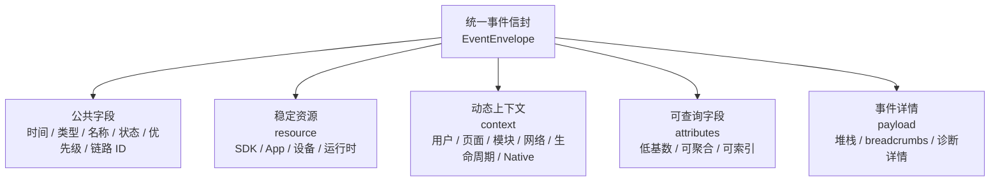
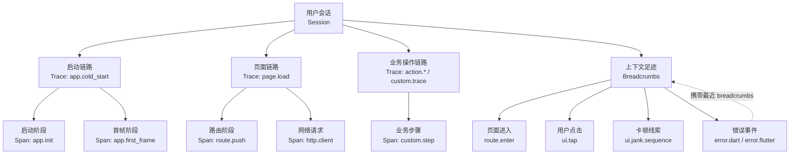

# 事件模型

## 目标

本文档定义 Flutter Monitor workspace 内所有包共享的唯一事件模型。未来该模型由 `flutter_monitor_core` 承载，`flutter_monitor_sdk`、`flutter_monitor_native`、DevTools、CLI、MCP 和服务端协议都必须复用它。

事件模型的目标是让所有信号具备三个能力：

- 可回放：能还原一次用户或 QA 会话中发生的关键过程。
- 可聚合：能按页面、模块、版本、设备、网络、用户分群、feature flag 等维度统计。
- 可定位：能把错误、慢请求、页面慢、卡顿、内存、native 信号和用户操作关联到同一条链路。

## 设计原则

### 关联优先

业务事件应尽量关联：

- 所属 session；
- 当前 route/module/scene；
- 当前 trace 或 active span；
- 最近 breadcrumbs；
- app/device/network/release/user/native 上下文。

无法关联上下文的事件仍可进入模型，但必须显式标记 `context.missing = true` 和 `context.missingReason`。普通业务事件不应长期以缺失上下文的方式上报。

### Trace 与 Span 一等化

Trace 和 span 都是一等事件：

- `signalType = trace` 表示一次可排查流程的根事件或流程摘要。
- `signalType = span` 表示 trace 内部的一个阶段。

不要用 `signalType = trace` 同时表达 root trace 和内部 span。HTTP 请求、route push、首帧、可交互、图片解码、列表构建、native step 等阶段应使用 `signalType = span`。

### 字段分层

- `resource` 放稳定资源，例如 SDK、App、设备、系统和运行环境。
- `context` 放事件发生时的动态上下文，例如 user、route、module、network、release、native runtime。
- `attributes` 放可检索、可聚合、低基数的结构化字段。
- `payload` 放事件特有详情，可为空，可裁剪，不应作为主要索引来源。

同一个语义字段只能有一个规范路径。不要在 `resource`、`context`、`attributes` 和 `payload` 中重复表达同一含义。

### 隐私默认安全

URL query、request body、response body、token、cookie、手机号、身份证、地址、精确位置等数据默认不进入事件。确需上报时必须经过显式配置和脱敏策略。

隐私过滤必须早于任何 output，包括 log、HTTP、DevTools 和文件导出。

## 字段状态

字段状态用于说明事件中字段是否必须存在：

| 状态 | 含义 |
|---|---|
| required | 所有事件必须提供，且不可为空 |
| conditional | 满足条件时必须提供 |
| optional | 可省略 |
| nullable | 字段可存在但值为 `null` |
| default | SDK 可在缺失时使用默认值 |

## Event Envelope

所有事件都应使用统一 envelope：



`resource` 描述相对稳定的信息，`context` 描述事件发生时的动态环境，`attributes` 服务查询和聚合，`payload` 保存可裁剪的事件详情。

```json
{
  "schemaVersion": "1.0",
  "eventId": "evt_001",
  "timestamp": "2026-05-24T12:00:00.000+08:00",
  "startTime": "2026-05-24T12:00:00.000+08:00",
  "endTime": "2026-05-24T12:00:00.523+08:00",
  "durationMs": 523,
  "signalType": "span",
  "name": "http.client",
  "level": "info",
  "status": "ok",
  "priority": "normal",
  "sessionId": "ses_001",
  "traceId": "trace_page_product_detail",
  "spanId": "span_http_product",
  "parentSpanId": "span_page_product_detail",
  "resource": {},
  "context": {},
  "attributes": {},
  "payload": {}
}
```

### 公共字段

| 字段 | 类型 | 状态 | 可空 | 隐私等级 | 建议索引 | 说明 |
|---|---|---|---:|---|---:|---|
| `schemaVersion` | string | required | 否 | safe | 是 | 事件 schema 版本 |
| `eventId` | string | required | 否 | safe | 是 | 事件唯一 ID，也是幂等键 |
| `timestamp` | string | required | 否 | safe | 是 | 事件捕获时间，ISO-8601 wall clock |
| `startTime` | string | conditional | 是 | safe | 否 | trace/span/耗时类事件开始时间 |
| `endTime` | string | conditional | 是 | safe | 否 | trace/span/耗时类事件结束时间 |
| `durationMs` | number | conditional | 是 | safe | 是 | 耗时，优先来自 monotonic clock |
| `signalType` | string | required | 否 | safe | 是 | `trace`、`span`、`metric`、`error`、`breadcrumb`、`log`、`sdk` |
| `name` | string | required | 否 | queryable | 是 | 稳定事件名，不包含动态业务值 |
| `level` | string | optional | 是 | safe | 是 | `debug`、`info`、`warning`、`error`、`fatal` |
| `status` | string | optional | 是 | safe | 是 | `ok`、`error`、`cancelled`、`timeout`、`unknown` |
| `priority` | string | default | 否 | safe | 是 | `critical`、`high`、`normal`、`low`，默认 `normal` |
| `sessionId` | string | conditional | 是 | queryable | 是 | 普通业务事件必填；pre-session/sdk 事件可缺省 |
| `traceId` | string | conditional | 是 | queryable | 是 | trace/span/page/http/custom flow 必填 |
| `spanId` | string | conditional | 是 | queryable | 是 | span 必填 |
| `parentSpanId` | string | optional | 是 | queryable | 是 | root span 可为空 |
| `resource` | object | required | 否 | mixed | 否 | SDK、App、设备和运行环境 |
| `context` | object | required | 否 | mixed | 否 | 用户、页面、网络、release、native runtime 等上下文 |
| `attributes` | object | optional | 否 | mixed | 是 | 可检索、可聚合字段，默认 `{}` |
| `payload` | object | optional | 否 | mixed | 否 | 事件详情，默认 `{}`，可裁剪 |

### 时间模型

- `timestamp` 使用 wall clock，用于 session timeline 排序和用户可读展示。
- `startTime` / `endTime` 也使用 wall clock，便于 DevTools 和导出文件显示。
- `durationMs` 应优先来自 monotonic clock 或平台高精度计时，避免系统时间变化影响耗时。
- 如果只能获得 duration 而不能获得准确 start/end，可只提供 `timestamp` 和 `durationMs`。
- 如果事件是瞬时 breadcrumb，可不提供 `startTime`、`endTime` 和 `durationMs`。

### 优先级模型

`priority` 表示事件在 pipeline、队列、离线缓存、重试和服务端处理中的保留优先级。

建议语义：

| 值 | 说明 |
|---|---|
| `critical` | crash、OOM、严重错误、关键链路丢失等必须尽量保留的事件 |
| `high` | 关键错误、关键慢页面、严重卡顿、memory pressure 等高价值诊断事件 |
| `normal` | 默认业务监控事件，例如页面、网络、行为、普通性能事件 |
| `low` | 高频、可降采样、辅助性日志或调试事件 |

采集器只能提供 priority suggestion，最终 `priority` 由 pipeline 在构建 event envelope 时确定。缺省值为 `normal`。

## Core Concepts



链路模型的核心是：事件先归入 session，再通过 trace/span 表达流程与阶段，breadcrumbs 记录问题前后的关键足迹。

### Session

`session` 表示一次用户使用过程或一段可分析的 App 活动窗口。

Session 至少应包含：

- `sessionId`
- `startedAt`
- `endedAt`
- `durationMs`
- `isForeground`
- `appLifecycleState`
- `resource`
- `context.user`

Session 是绝大多数业务事件的最小归属单位。没有 `sessionId` 的事件只能作为 SDK 自监控、初始化前事件或异常生命周期 native 事件处理。

### Trace

`trace` 表示一次可追踪流程，例如：

- 冷启动；
- 热启动；
- 页面打开；
- 用户点击触发的业务流程；
- 一次接口调用链；
- 一段自定义业务流程；
- native crash / ANR / OOM 诊断流程。

Trace 事件通常表示流程整体，内部阶段应使用 span 表达。

### Span

`span` 表示 trace 中的一个阶段。

典型 span：

- `app.init`
- `app.first_frame`
- `app.interactive`
- `route.push`
- `http.client`
- `image.decode`
- `list.build`
- `native.memory.sample`
- `custom.step`

Span 必须能通过 `traceId` 关联所属 trace。除 root span 外，span 应尽量提供 `parentSpanId`。

### Breadcrumb

`breadcrumb` 表示问题发生前后的关键足迹。

典型 breadcrumb：

- route enter/leave
- tap
- scroll
- dialog show/dismiss
- http request start/end
- lifecycle change
- jank sequence
- memory pressure
- native warning
- error captured
- custom business action

Breadcrumb 可以独立作为 `signalType = breadcrumb` 事件进入 session timeline，也可以作为错误、卡顿、慢 trace、native crash/OOM/ANR 的相关上下文快照进入 `payload.breadcrumbs`。

Breadcrumb 数量应有限制，建议以环形缓冲保存最近 50 条。

## Resource

`resource` 描述稳定资源信息。

```json
{
  "sdk": {
    "name": "flutter_monitor_sdk",
    "version": "1.0.0",
    "coreVersion": "1.0.0",
    "nativeVersion": "1.0.0"
  },
  "app": {
    "appKey": "app_xxx",
    "appName": "Demo",
    "appVersion": "1.2.3",
    "buildNumber": "100",
    "packageName": "com.example.demo",
    "environment": "production",
    "channel": "official",
    "flavor": "prod"
  },
  "device": {
    "platform": "android",
    "model": "Pixel 7",
    "manufacturer": "Google",
    "osVersion": "14",
    "isPhysicalDevice": true,
    "refreshRate": 120,
    "deviceTier": "high"
  },
  "runtime": {
    "flutterVersion": "3.24.0",
    "dartVersion": "3.6.0",
    "isDebug": false
  }
}
```

`resource.app` 是 app 版本、构建、环境、渠道和 flavor 的规范来源。不要在 `context.release` 中重复表达 app version 或 build number。

## Context

`context` 描述事件发生时的动态上下文。

```json
{
  "user": {
    "userId": "user_001",
    "userType": "vip",
    "userTags": ["beta"],
    "cohort": "A"
  },
  "route": {
    "name": "/product/detail",
    "stack": ["/home", "/product/detail"],
    "source": "/home"
  },
  "module": {
    "name": "product",
    "scene": "detail"
  },
  "network": {
    "type": "wifi",
    "isWeakNetwork": false
  },
  "release": {
    "releaseId": "com.example.demo@1.2.3+100",
    "featureFlags": ["new_product_detail"],
    "experiments": {
      "product_detail_v2": "variant_a"
    }
  },
  "lifecycle": {
    "state": "resumed",
    "isForeground": true
  },
  "native": {
    "available": true,
    "platform": "android",
    "processId": 12345,
    "threadName": "main"
  }
}
```

## 核心聚合字段索引建议

常用聚合字段必须使用以下规范路径：

| 语义 | 规范路径 | 说明 |
|---|---|---|
| SDK 名称 | `resource.sdk.name` | 固定为 SDK 名称 |
| SDK 版本 | `resource.sdk.version` | Flutter SDK package 版本 |
| Core 版本 | `resource.sdk.coreVersion` | `flutter_monitor_core` 版本 |
| Native 版本 | `resource.sdk.nativeVersion` | native plugin 版本，可为空 |
| App Key | `resource.app.appKey` | 应用标识 |
| App 版本 | `resource.app.appVersion` | App 语义版本 |
| Build Number | `resource.app.buildNumber` | App 构建号 |
| Environment | `resource.app.environment` | `dev`、`test`、`staging`、`production` |
| Channel | `resource.app.channel` | 分发渠道 |
| Flavor | `resource.app.flavor` | Flutter flavor 或企业自定义 flavor |
| Release ID | `context.release.releaseId` | 可组合 app/package/version/build |
| Feature Flags | `context.release.featureFlags` | 事件发生时命中的 feature flags |
| User ID | `context.user.userId` | 必须支持匿名化或关闭 |
| User Cohort | `context.user.cohort` | 用户分群 |
| Route Name | `context.route.name` | 当前 route 标识 |
| Route Stack | `context.route.stack` | 当前 route stack |
| Route Source | `context.route.source` | 页面来源 |
| Module | `context.module.name` | 业务模块 |
| Scene | `context.module.scene` | 业务场景 |
| Network Type | `context.network.type` | wifi/cellular/none/unknown |
| Weak Network | `context.network.isWeakNetwork` | 弱网判断 |
| Device Tier | `resource.device.deviceTier` | high/medium/low/unknown |
| Refresh Rate | `resource.device.refreshRate` | 设备刷新率 |
| Native Platform | `context.native.platform` | android/ios 等 |

新增字段前必须先判断是否已有规范路径。确需新增时，应说明字段是否可聚合、是否敏感、是否影响采样和是否需要服务端索引。

完整字段注册以 `flutter_monitor_core` 的 `FieldRegistry` 为准。本文后续“推荐 attributes”中出现的字段，在进入代码实现前必须补充到 `FieldRegistry`，或明确降级为 payload/非索引字段，避免文档字段和代码字段分裂。

## 隐私分级

字段按隐私风险分为四类：

| 分级 | 说明 | 默认处理 |
|---|---|---|
| `safe` | SDK、版本、设备等级、稳定枚举等低风险字段 | 可进入事件和索引 |
| `queryable` | route、module、normalized URL、状态码、耗时等排查字段 | 可进入事件和索引，但应保持稳定和有限基数 |
| `sensitive` | userId、业务 ID、搜索词、地理位置、原始 URL 等可能识别用户或业务的数据 | 默认脱敏、哈希或截断，需显式配置 |
| `forbidden` | token、cookie、密码、身份证、手机号、完整地址、request/response body 等高风险数据 | 默认禁止进入事件 |

隐私策略要求：

- `attributes` 应优先使用低基数、可聚合字段。
- `payload` 可以保存排查详情，但仍必须经过脱敏。
- URL 默认只上报 normalized path，不上报 query。
- request body 和 response body 默认禁止上报。
- native crash payload 不应包含未经处理的寄存器、内存片段、用户输入或文件路径中的敏感信息。
- DevTools 展示、session 导出和 HTTP 上报必须复用同一套 privacy filtering 结果。

## 命名规则

事件名使用稳定、可聚合的点分命名：

- `app.cold_start`
- `app.hot_start`
- `app.first_frame`
- `app.interactive`
- `page.load`
- `page.stay`
- `route.enter`
- `route.leave`
- `http.client`
- `ui.tap`
- `ui.jank.sequence`
- `memory.sample`
- `memory.growth`
- `memory.pressure`
- `native.memory.sample`
- `native.memory.pressure`
- `native.oom`
- `native.anr`
- `native.crash`
- `error.flutter`
- `error.dart`
- `custom.trace`

不要把用户 ID、订单 ID、商品 ID、URL 原始 ID 等动态值放入 `name`。动态值应进入 `attributes` 或脱敏后的 `payload`。

## 信号字段规范

### 启动

冷启动和热启动必须作为核心 trace，不属于未来增强。

推荐事件：

- `signalType = trace`、`name = app.cold_start`
- `signalType = trace`、`name = app.hot_start`
- `signalType = span`、`name = app.init`
- `signalType = span`、`name = app.first_frame`
- `signalType = span`、`name = app.interactive`

推荐 attributes：

| 字段 | 说明 |
|---|---|
| `app.start.type` | `cold`、`hot`、`warm` |
| `app.start.duration_ms` | 启动总耗时 |
| `app.first_frame_ms` | 首帧耗时 |
| `app.interactive_ms` | 可交互耗时 |
| `app.lifecycle.previous_state` | 热启动前状态 |
| `sdk.init.duration_ms` | SDK 初始化耗时 |
| `native.start.elapsed_ms` | native 启动起点到 Flutter 可观测点的耗时，可为空 |

### 页面

页面相关信号应挂在页面 trace 下。

推荐事件：

- `trace page.load`
- `span route.push`
- `span page.first_frame`
- `span page.interactive`
- `metric page.stay`
- `breadcrumb route.enter`
- `breadcrumb route.leave`

推荐 attributes：

| 字段 | 说明 |
|---|---|
| `page.route` | 当前 route |
| `page.route.source` | 来源 route |
| `page.module` | 业务模块 |
| `page.scene` | 业务场景 |
| `page.stay_ms` | 页面停留时长 |
| `page.first_frame_ms` | 页面首帧 |
| `page.interactive_ms` | 页面可交互 |

### 网络

网络请求使用 `signalType = span`、`name = http.client`。

推荐 attributes：

| 字段 | 说明 |
|---|---|
| `http.method` | GET/POST 等 |
| `http.url.normalized` | 归一化 URL，例如 `/api/product/{id}` |
| `http.status_code` | HTTP 状态码 |
| `http.success` | 是否成功 |
| `http.error_type` | 错误类型 |
| `http.retry_count` | 重试次数 |
| `http.cache_status` | hit/miss/bypass/unknown |
| `request.size_bytes` | 请求大小 |
| `response.size_bytes` | 响应大小 |

完整 URL、query、body 默认不应直接上报。

### 行为

行为信号默认作为 breadcrumb。关键业务操作可以创建 trace。

推荐事件：

- `breadcrumb ui.tap`
- `breadcrumb ui.scroll`
- `breadcrumb business.action`
- `trace action.submit_order`
- `trace action.login`

推荐 attributes：

| 字段 | 说明 |
|---|---|
| `ui.target` | 控件标识 |
| `ui.action` | tap/scroll/input 等 |
| `business.action` | 业务动作 |
| `business.result` | success/failure/cancelled |

普通点击不应制造过多 trace。只有能代表业务流程起点的行为才应创建 trace。

### 卡顿

卡顿事件使用 `signalType = metric`、`name = ui.jank.sequence`。

推荐 attributes：

| 字段 | 说明 |
|---|---|
| `jank.count` | 连续慢帧数量 |
| `frame.max_ms` | 最大帧耗时 |
| `frame.avg_ms` | 平均帧耗时 |
| `frame.budget_ms` | 帧预算 |
| `frame.fps` | 最近窗口 FPS |
| `frame.stability` | 稳定性 |
| `frame.p50_ms` | 帧耗时 P50 |
| `frame.p90_ms` | 帧耗时 P90 |
| `frame.p99_ms` | 帧耗时 P99 |
| `device.tier` | 设备等级 |

卡顿应关联当前 session、页面 trace 和最近 breadcrumbs。

### 内存

内存是核心信号，不是附属指标。

推荐事件：

- `metric memory.sample`
- `metric memory.growth`
- `metric memory.pressure`
- `metric memory.leak.suspect`

推荐 attributes：

| 字段 | 说明 |
|---|---|
| `memory.rss_mb` | 进程常驻内存 |
| `memory.heap_used_mb` | Dart/Flutter heap 使用 |
| `memory.heap_capacity_mb` | heap 容量 |
| `memory.external_mb` | external memory |
| `memory.native_used_mb` | native memory，可由 native plugin 提供 |
| `memory.growth_mb` | 增长量 |
| `memory.growth_duration_ms` | 观察窗口 |
| `memory.pressure_level` | none/moderate/critical/unknown |
| `memory.sample_source` | dart/native/system/unknown |

内存泄漏判断应谨慎表达为线索。SDK 可以上报 `memory.leak.suspect`，但不应在缺少证据时宣称确定泄漏。

### 生命周期

推荐事件：

- `breadcrumb app.lifecycle`
- `metric app.foreground_duration`
- `span app.resume`
- `span app.exit_flush`

推荐 attributes：

| 字段 | 说明 |
|---|---|
| `app.lifecycle.state` | resumed/inactive/paused/detached/hidden |
| `app.lifecycle.previous_state` | 上一个状态 |
| `app.foreground_duration_ms` | 前台时长 |
| `app.background_duration_ms` | 后台时长 |
| `app.exit_flush.success` | 退出前 flush 是否成功 |

### 原生信号

Native 信号由 `flutter_monitor_native` 可选提供，但必须进入统一事件模型。

推荐事件：

- `metric native.memory.sample`
- `metric native.memory.pressure`
- `error native.oom`
- `error native.anr`
- `error native.crash`
- `breadcrumb native.warning`

推荐 attributes：

| 字段 | 说明 |
|---|---|
| `native.platform` | android/ios |
| `native.signal` | memory/crash/anr/oom/lifecycle |
| `native.thread` | 线程名 |
| `native.thread_id` | 线程 ID |
| `native.crash.type` | crash 类型 |
| `native.anr.duration_ms` | ANR 持续时间 |
| `native.oom.reason` | OOM 线索 |
| `native.memory.used_mb` | native 侧内存 |
| `native.memory.pressure_level` | native 内存压力 |

第一阶段可以先定义 schema 和 bridge，不要求完整实现 native crash、ANR、OOM。

### 错误

错误事件使用 `signalType = error`。

推荐 attributes：

| 字段 | 说明 |
|---|---|
| `error.type` | exception/error 类型 |
| `error.mechanism` | flutter/dart/native/manual |
| `error.handled` | 是否已处理 |
| `error.fatal` | 是否致命 |
| `error.thread` | 线程/isolate/native thread |

推荐 payload：

- exception message；
- stack；
- library/framework context；
- recent breadcrumbs；
- active trace/span；
- native crash details，脱敏后可选。

### 自定义 Trace/Span

业务自定义 trace/span 必须使用稳定 name，并将动态业务值放入 `attributes` 或脱敏后的 `payload`。

推荐事件：

- `trace custom.trace`
- `span custom.step`
- `breadcrumb custom.event`
- `metric custom.metric`

## 完整 Session Batch 示例

以下示例展示一段 session 内多个事件如何共享上下文和链路关系。实际上报可以批量发送，也可以分批发送，服务端和 DevTools 通过 ID 重建关系。

```json
{
  "schemaVersion": "1.0",
  "requestId": "req_001",
  "sentAt": "2026-05-24T12:00:10.000+08:00",
  "events": [
    {
      "schemaVersion": "1.0",
      "eventId": "evt_start_trace",
      "timestamp": "2026-05-24T12:00:00.000+08:00",
      "startTime": "2026-05-24T12:00:00.000+08:00",
      "endTime": "2026-05-24T12:00:01.200+08:00",
      "durationMs": 1200,
      "signalType": "trace",
      "name": "app.cold_start",
      "level": "info",
      "status": "ok",
      "priority": "high",
      "sessionId": "ses_001",
      "traceId": "trace_start",
      "spanId": null,
      "parentSpanId": null,
      "resource": {
        "sdk": {"name": "flutter_monitor_sdk", "version": "1.0.0", "coreVersion": "1.0.0"},
        "app": {"appKey": "app_xxx", "appVersion": "1.2.3", "buildNumber": "100", "environment": "production", "channel": "official"},
        "device": {"platform": "android", "model": "Pixel 7", "osVersion": "14", "refreshRate": 120, "deviceTier": "high"}
      },
      "context": {
        "user": {"userId": "anon_hash_001"},
        "route": {"name": "/", "stack": ["/"]},
        "module": {"name": "app", "scene": "startup"},
        "network": {"type": "wifi", "isWeakNetwork": false},
        "release": {"releaseId": "com.example.demo@1.2.3+100", "featureFlags": ["new_home"]}
      },
      "attributes": {
        "app.start.type": "cold",
        "app.start.duration_ms": 1200,
        "app.first_frame_ms": 640,
        "app.interactive_ms": 1180
      },
      "payload": {}
    },
    {
      "schemaVersion": "1.0",
      "eventId": "evt_start_span_init",
      "timestamp": "2026-05-24T12:00:00.050+08:00",
      "durationMs": 220,
      "signalType": "span",
      "name": "app.init",
      "level": "info",
      "status": "ok",
      "priority": "normal",
      "sessionId": "ses_001",
      "traceId": "trace_start",
      "spanId": "span_app_init",
      "parentSpanId": null,
      "resource": {},
      "context": {},
      "attributes": {
        "sdk.init.duration_ms": 45
      },
      "payload": {}
    },
    {
      "schemaVersion": "1.0",
      "eventId": "evt_route_home",
      "timestamp": "2026-05-24T12:00:01.250+08:00",
      "signalType": "breadcrumb",
      "name": "route.enter",
      "level": "info",
      "status": "ok",
      "priority": "normal",
      "sessionId": "ses_001",
      "traceId": null,
      "spanId": null,
      "parentSpanId": null,
      "resource": {},
      "context": {"route": {"name": "/home", "stack": ["/home"]}, "module": {"name": "home", "scene": "home"}},
      "attributes": {"page.route": "/home"},
      "payload": {}
    },
    {
      "schemaVersion": "1.0",
      "eventId": "evt_page_trace",
      "timestamp": "2026-05-24T12:00:02.000+08:00",
      "durationMs": 860,
      "signalType": "trace",
      "name": "page.load",
      "level": "info",
      "status": "ok",
      "priority": "normal",
      "sessionId": "ses_001",
      "traceId": "trace_page_product",
      "spanId": null,
      "parentSpanId": null,
      "resource": {},
      "context": {"route": {"name": "/product/detail", "stack": ["/home", "/product/detail"], "source": "/home"}, "module": {"name": "product", "scene": "detail"}},
      "attributes": {"page.route": "/product/detail", "page.first_frame_ms": 260, "page.interactive_ms": 860},
      "payload": {}
    },
    {
      "schemaVersion": "1.0",
      "eventId": "evt_http_product",
      "timestamp": "2026-05-24T12:00:02.120+08:00",
      "durationMs": 520,
      "signalType": "span",
      "name": "http.client",
      "level": "info",
      "status": "ok",
      "priority": "normal",
      "sessionId": "ses_001",
      "traceId": "trace_page_product",
      "spanId": "span_http_product",
      "parentSpanId": "span_page_load",
      "resource": {},
      "context": {"route": {"name": "/product/detail"}, "module": {"name": "product", "scene": "detail"}},
      "attributes": {"http.method": "GET", "http.url.normalized": "/api/product/{id}", "http.status_code": 200, "http.success": true, "response.size_bytes": 23000},
      "payload": {}
    },
    {
      "schemaVersion": "1.0",
      "eventId": "evt_tap_buy",
      "timestamp": "2026-05-24T12:00:04.000+08:00",
      "signalType": "breadcrumb",
      "name": "ui.tap",
      "level": "info",
      "status": "ok",
      "priority": "normal",
      "sessionId": "ses_001",
      "traceId": "trace_page_product",
      "spanId": null,
      "parentSpanId": null,
      "resource": {},
      "context": {"route": {"name": "/product/detail"}, "module": {"name": "product", "scene": "detail"}},
      "attributes": {"ui.target": "buy_now_button", "ui.action": "tap"},
      "payload": {}
    },
    {
      "schemaVersion": "1.0",
      "eventId": "evt_jank",
      "timestamp": "2026-05-24T12:00:04.500+08:00",
      "durationMs": 320,
      "signalType": "metric",
      "name": "ui.jank.sequence",
      "level": "warning",
      "status": "ok",
      "priority": "high",
      "sessionId": "ses_001",
      "traceId": "trace_page_product",
      "spanId": null,
      "parentSpanId": null,
      "resource": {},
      "context": {"route": {"name": "/product/detail"}, "module": {"name": "product", "scene": "detail"}},
      "attributes": {"jank.count": 5, "frame.max_ms": 74, "frame.avg_ms": 48, "frame.budget_ms": 16.67, "frame.fps": 42, "device.tier": "high"},
      "payload": {}
    },
    {
      "schemaVersion": "1.0",
      "eventId": "evt_memory",
      "timestamp": "2026-05-24T12:00:05.000+08:00",
      "signalType": "metric",
      "name": "memory.sample",
      "level": "info",
      "status": "ok",
      "priority": "low",
      "sessionId": "ses_001",
      "traceId": "trace_page_product",
      "spanId": null,
      "parentSpanId": null,
      "resource": {},
      "context": {"route": {"name": "/product/detail"}, "module": {"name": "product", "scene": "detail"}},
      "attributes": {"memory.rss_mb": 248.5, "memory.heap_used_mb": 82.1, "memory.external_mb": 24.0, "memory.native_used_mb": 91.2, "memory.sample_source": "native"},
      "payload": {}
    },
    {
      "schemaVersion": "1.0",
      "eventId": "evt_error",
      "timestamp": "2026-05-24T12:00:06.000+08:00",
      "signalType": "error",
      "name": "error.dart",
      "level": "error",
      "status": "error",
      "priority": "critical",
      "sessionId": "ses_001",
      "traceId": "trace_page_product",
      "spanId": null,
      "parentSpanId": null,
      "resource": {},
      "context": {"route": {"name": "/product/detail"}, "module": {"name": "product", "scene": "detail"}},
      "attributes": {"error.type": "NoSuchMethodError", "error.mechanism": "dart", "error.handled": false, "error.fatal": false},
      "payload": {
        "message": "NoSuchMethodError: method was called on null",
        "stack": "...",
        "breadcrumbs": [
          {"timestamp": "2026-05-24T12:00:02.120+08:00", "name": "http.client", "attributes": {"http.url.normalized": "/api/product/{id}", "http.status_code": 200}},
          {"timestamp": "2026-05-24T12:00:04.000+08:00", "name": "ui.tap", "attributes": {"ui.target": "buy_now_button"}},
          {"timestamp": "2026-05-24T12:00:04.500+08:00", "name": "ui.jank.sequence", "attributes": {"jank.count": 5}}
        ]
      }
    }
  ]
}
```

示例中部分事件的 `resource` 和 `context` 使用空对象仅表示文档省略。服务端上报时，每个事件应能独立解析；如果未来支持 batch-level `resourceDefaults` / `contextDefaults` 或 session-level defaults，必须先在 `docs/server_protocol.md` 中明确字段、继承规则和校验规则。

## 不推荐的事件形态

以下形态不应作为目标模型：

```json
{
  "category": "performance",
  "data": {
    "duration_ms": 523
  }
}
```

问题：

- 无 session；
- 无 trace/span；
- 无 route/module；
- 无 resource/context；
- 难以聚合；
- 难以与错误、卡顿、行为、native 信号关联。

## 派生指标

服务端和 DevTools 可基于统一事件模型派生指标：

- 启动 P50/P90/P95/P99；
- 页面 P50/P90/P95/P99；
- API P50/P90/P95/P99；
- 页面卡顿率；
- 页面错误率；
- session 错误率；
- native crash / ANR / OOM 影响面；
- 内存增长趋势；
- 影响用户数；
- 低端设备卡顿率；
- 弱网请求失败率；
- 版本退化率；
- feature flag 影响差异。

派生指标应来自统一事件模型，不应要求 SDK、native 包或工具入口上报另一套独立统计结构。
