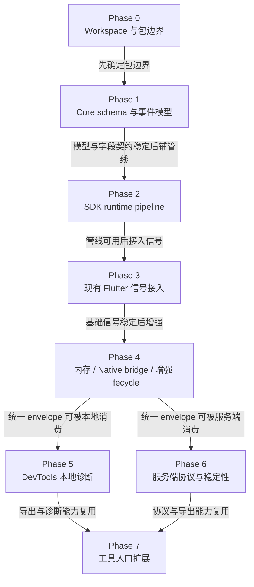

# 实施计划

## 原则

实施顺序应先稳定 workspace 边界和模型，再调整代码，再扩展能力。

阶段验收不只看“事件能发出去”，还要看“事件能否被串成链路并用于定位问题”。

重构过程中必须保留基础信号源的价值：错误、启动、页面加载、API 耗时、卡顿、用户点击、PV、页面停留都应在新模型中找到归属。任何删除都必须有替代方案和验收证明。



阶段依赖的核心是先稳定模型和 pipeline，再接入现有信号，最后扩展 DevTools、服务端和工具入口。

## Phase 0：Workspace 与包边界

目标：

- 将当前仓库规划为官方 Dart pub workspaces。
- 根目录作为 workspace root，不作为发布包。
- 建立三个第一阶段包边界：
  - `packages/flutter_monitor_core`
  - `packages/flutter_monitor_sdk`
  - `packages/flutter_monitor_native`
- 当前 Flutter SDK 代码未来迁入 `packages/flutter_monitor_sdk`。
- `flutter_monitor_native` 作为可选 plugin，不被主 SDK 强依赖。

验收：

- workspace root 的职责清晰：文档、CI、脚本、workspace 配置。
- `flutter_monitor_core` 是唯一 event model/schema/privacy/export schema 来源。
- `flutter_monitor_sdk` 依赖 core。
- `flutter_monitor_native` 依赖 core，并通过 bridge 与 SDK 对接。
- 文档中不再把多包作为未来待评估事项。

## Phase 1：Core Schema 与事件模型

目标：

- 在 `flutter_monitor_core` 中建立统一模型。
- 稳定 event envelope、schema version、field registry、privacy level。
- 建立唯一字段契约，覆盖 public envelope、resource、context、attributes 和 payload。
- 清理同一语义的重复字段，例如 `context.route.*` / `context.module.*`、`resource.device.deviceTier`、`context.lifecycle.*`、`context.native.platform`、`durationMs`、`payload.error.*`、`memory.native_used_mb` 等。
- 定义 session export/import 格式。
- 定义 schema validation 基础能力。
- 同步 `flutter_monitor_core` 的 `FieldPaths`、`FieldRegistry`、context/resource model、schema validation、privacy filtering 和测试。
- 稳定信号采集设计，覆盖采集来源、触发时机、链路关联和降级策略。

验收：

- 所有 signal type 都能映射到统一 event envelope。
- 字段状态、可空性、隐私等级、索引建议明确。
- 一个语义只有一个规范字段路径。
- 任何字段都明确属于 `resource`、`context`、`attributes` 或 `payload` 之一。
- 文档示例不再出现字段契约禁止的旧字段。
- `flutter_monitor_core` 中的字段常量与 `docs/event_model.md` 的唯一字段契约一致。
- 字段注册表包含所有目标字段的类型、隐私等级和索引建议。
- core 测试覆盖字段注册、字段黑名单、schema validation、privacy filtering 和主要 JSON round-trip。
- 冷启动、热启动、页面、网络、行为、卡顿、内存、native、错误、自定义 trace 均有 schema。
- `docs/signal_collection.md` 覆盖启动、页面、网络、错误、行为、卡顿、内存、生命周期、native 和自定义 trace。
- DevTools、server protocol、native package 不定义第二套模型。
- Phase 2 只允许基于统一字段契约构建 pipeline。

## Phase 2：SDK Runtime Pipeline 基础设施

目标：

- 在 `flutter_monitor_sdk` 中建立 runtime 基础设施：
  - raw signal；
  - context snapshot；
  - trace snapshot；
  - context manager；
  - session manager；
  - trace/span manager；
  - breadcrumb store；
  - event pipeline；
  - envelope builder；
  - outputs。
- 将 Reporter 从最终事件分发器升级为标准 SDK 内部上报入口和 pipeline 入口。
- 业务主动埋点使用 `FlutterMonitorSDK.track(...)`；错误、页面、HTTP、卡顿等 SDK 内部采集器直接生成标准 raw signal。
- 接入支撑 session 切分和 hot start 的最小 lifecycle 信号。

本阶段不要求：

- 接入所有现有 collector；
- 完整实现 HTTP 重试、离线缓存和 remote config；
- 完整实现 DevTools 面板；
- 实现 native 深度能力；
- 完成 public API 收敛。

验收：

- SDK 内部采集器和业务 `track` 能生成统一 `EventEnvelope`。
- 任意业务事件至少能带 `sessionId`。
- output 消费统一 event envelope 或 envelope JSON。
- 上下文异步变化时，事件仍使用发生时的 context snapshot。
- Reporter 作为 SDK 内部 pipeline 入口，不对业务侧暴露内部事件结构。
- SDK 能记录 envelope 构建失败、事件丢弃、flush 失败等 self-monitoring 事件。
- 原 SDK example/test 继续通过。

## Phase 3：现有 Flutter 信号接入

目标：

- error 接入 event envelope。
- click/PV/page stay 接入 breadcrumb 或 metric。
- route/page visit/page load 接入 trace/span，其中 `page.visit` 是页面 trace，`page.load` 是页面加载 span。
- cold start、hot start 接入 trace/span。
- Dio 和 `http` 请求接入 `http.client` span。
- jank 接入当前 page trace 和裁剪后的相关 breadcrumbs。
- 最小 lifecycle 事件参与 session 切分、hot start 和 exit flush。
- 控制台默认输出 compact 摘要，而不是完整 JSON。
- 完整 JSON 仍由 pipeline 保留，并可通过 local workbench service 的 SQLite 查询或 session export 获取。
- compact log 的摘要规则沉淀在 core，作为 `EventEnvelope` 的派生视图。
- compact log 不得创建第二套事件模型、第二套服务端协议或第二套字段事实源。
- 业务主动埋点收敛为 `FlutterMonitorSDK.track(...)`，用于记录关键业务动作；普通业务接入不推荐直接使用 `startTrace`、`startSpan`、`addBreadcrumb`、`FieldPaths` 或自定义 `attributes` / `payload`。
- 用户维度排查依赖统一上下文语义。用户、用户类型、用户标签和 cohort 后续应由 `setContext(...)` 一类的通用上下文入口承载。
- `context.module.*` 只作为可选增强上下文，不作为基础接入前置条件；不得要求业务方在每个代码模块或页面频繁手动设置 module。

建议接入顺序：

1. error；
2. behavior / click / PV；
3. route / page load / page stay；
4. startup / hot start；
5. Dio / `http`；
6. jank；
7. compact log / `EventSummary`；
8. local workbench service 本地完整 JSON 查询；
9. SQLite 本地保留策略和 session export。

Phase 3 当前页面事件语义：

- `trace page.visit`：页面活动窗口，进入时 start，离开时 end。
- `span route.push`：路由切换阶段。
- `span page.load`：页面加载阶段，应在首帧或 fallback 首帧时结束。
- `metric page.stay`：页面停留时长，使用 envelope `durationMs`。
- `breadcrumb page.view`：页面访问足迹。

### 输出体验与完整 JSON 获取

Phase 3 的完成标准不只是不丢信号，还包括“开发者能在不被完整 JSON 淹没的情况下判断发生了什么，并能按摘要中的 id 查回完整事件”。

核心原则：

- `EventEnvelope` 是机器事实源。
- `EventSummary` 是从 `EventEnvelope` 派生的人类可读摘要。
- `CompactLog` 是 `EventSummary` 的文本渲染。
- compact 行中的 `kind` 是 core 从 `EventEnvelope.signalType`、`name` 和标准字段推导出的摘要分类，不是 `EventEnvelope` 标准协议字段，采集侧不需要上报或维护该字段。
- compact log 字段不得反向成为第二套协议；SDK、Workbench、DevTools、CLI/MCP 后续都应复用 core 中的摘要规则。

compact log 固定为 key-value 格式，字段顺序应尽量稳定：

```text
[FM] kind=<kind> name=<event.name> status=<status> phase=<event.phase> route=<context.route.name> duration_ms=<durationMs> session=<sessionId> trace=<traceId> span=<spanId> event=<eventId>
```

通用字段顺序：

```text
kind, name, status, phase, route, duration_ms, session, trace, span, event
```

不同事件类型必须暴露的摘要字段：

| kind | 必须字段 |
|---|---|
| `startup` | `start_type`、`duration_ms`、`first_frame_ms`、`session`、`trace`、`event` |
| `page` | `route`、`from`、`duration_ms`、`session`、`trace`、`event` |
| `http` | `method`、`url`、`code`、`success`、`duration_ms`、`route`、`breadcrumbs`、`session`、`trace`、`span`、`event` |
| `jank` | `route`、`frames`、`frame_max_ms`、`frame_avg_ms`、`fps`、`session`、`trace`、`event` |
| `error` | `mechanism`、`message`、`route`、`breadcrumbs`、`session`、`trace`、`event` |
| `lifecycle` | `state`、`previous`、`foreground`、`session`、`trace`、`event` |
| `sdk` | `name`、`status`、`session`、`event` |

示例：

```text
[FM] kind=startup name=app.cold_start status=ok phase=end start_type=cold duration_ms=428 first_frame_ms=428 route=/ session=ses_1779781544808117_0 trace=trace_1779781544987939_0 event=evt_1779781545000000_8
[FM] kind=page name=page.load status=ok phase=end route=/detail from=/ duration_ms=21 session=ses_1779781544808117_0 trace=trace_1779781544987939_9 span=span_1779781545000000_10 event=evt_1779781545000000_22
[FM] kind=http name=http.client status=error phase=instant method=GET url=/users/flutter code=403 success=false duration_ms=612 route=/ breadcrumbs=1 session=ses_1779781544808117_0 trace=trace_1779781544987939_2 span=span_1779781545000000_12 event=evt_1779781545000000_19
[FM] kind=jank name=ui.jank.sequence status=ok phase=instant route=/ frames=13 frame_max_ms=71.4 frame_avg_ms=51.0 fps=40.7 session=ses_1779781544808117_0 trace=trace_1779781544987939_2 event=evt_1779781545000000_17
[FM] kind=error name=error.flutter status=error phase=instant mechanism=flutter message="NoSuchMethodError: The method 'hello' was called on null." route=/ breadcrumbs=3 session=ses_1779781544808117_0 trace=trace_1779781544987939_2 event=evt_1779781545000000_20
```

完整 JSON 获取路径：

- 控制台 compact 行必须包含可回查的 `event`、`session` 和 `trace`，有 span 时包含 `span`。
- `HttpBatchOutput` 将完整 `EventEnvelope` 批量发送到 local workbench service 或正式服务端。
- 只要 SDK 装入真实 App，就不应默认一条事件一个请求。近实时写入 Workbench 可以存在，但必须由初始化配置显式开启，并使用小 batch、短 flush 间隔、关键事件立即 flush 等策略。
- Workbench Web 的实时刷新来自 service 到 web 的 SSE，不代表 SDK 必须逐条 HTTP 实时请求。
- local workbench service 在本地调试阶段至少支持：
  - `POST /api/monitor/v1/events`
  - `GET /api/monitor/v1/events/:eventId`
  - `GET /api/monitor/v1/sessions/:sessionId`
  - `GET /api/monitor/v1/traces/:traceId`
  - `GET /api/monitor/v1/recent?limit=50`
- local workbench service 使用 SQLite 保存最近若干 session 的完整 envelope；session export 可用于交接和离线排查。
- 线上排查不依赖控制台保留完整 JSON，而应通过 `eventId`、`sessionId`、`traceId` 在服务端查回完整 envelope 和 session timeline。
- QA 排查不应要求先知道 `sessionId`。Workbench 应支持从 `context.user.userId + time range`、App 版本、环境、页面、错误和性能问题进入 session list；未提供 `userId` 时仍可按通用维度查询。

验收：

- 现有功能不丢失。
- 上报结构符合 `docs/event_model.md`。
- 示例 App 能展示一条完整 session timeline。
- 启动、热启动、页面加载、API、业务 action、PV、页面停留、卡顿、错误、最小 lifecycle 均可在 session 中看到。
- 根路由和后续 route 的 `page.load` 都能闭合并写入 `page.first_frame_ms`；未拿到首帧时不得把页面停留时长伪装为成功加载耗时。
- 慢页面能关联页面 trace、相关 API 和最近 breadcrumbs。
- 卡顿能关联当前 `context.route.*` / `context.module.*`、当前 page trace、最近相关 breadcrumbs 和 `resource.device.*`。
- 错误能关联当前 `context.route.*` / `context.module.*`、active `traceId` / `spanId` 和最近 breadcrumbs。
- 控制台默认不刷完整 JSON。
- compact 行能看出启动耗时、页面耗时、HTTP 耗时和状态码、卡顿指标、错误摘要。
- compact 行中的 `event`、`session`、`trace` 能查回完整 JSON。
- local workbench service 能按 `eventId`、`sessionId`、`traceId` 查询完整 envelope。
- 成功 HTTP、普通 breadcrumb、`route.push` 不应在默认控制台模式刷屏。
- 普通 breadcrumb payload 不应自动携带用户属性或全局自定义上下文；HTTP/error/jank breadcrumb 快照不得递归携带 breadcrumbs 或长 stacktrace。
- 业务主动埋点统一使用 `FlutterMonitorSDK.track(...)`；example 和新文档不得使用 `FieldPaths`、`addBreadcrumb` 或 `reportEvent(category, data)` 作为普通业务埋点路径。
- `track` 由 SDK 内部映射 `business.action`、`business.result`、`ui.target`、`payload.properties` 等 canonical fields，并自动进入 breadcrumb store。
- `track.properties` 只作为事件详情，默认不作为主要聚合索引。
- 普通业务接入需要用户维度排查时，应通过统一上下文入口写入 `context.user.userId`；没有 userId 时不得阻塞基础采集、页面/错误/性能查询和 session timeline。
- 新文档和 example 应使用 `setContext(...)` 语义表达用户上下文，不扩散多套用户或自定义上下文入口。
- 完整 JSON 仍符合 `docs/event_model.md`。
- core 中的摘要规则可被 SDK、Workbench、未来 CLI/DevTools 复用。
- compact 摘要不形成第二套事件模型或服务端协议。

## Phase 4：内存、Native Bridge 与增强 Lifecycle

目标：

- 接入 Flutter/Dart 可获得的 memory sample、growth、pressure 线索，并保持采样频率克制。
- 增强 lifecycle：foreground/background duration、exit flush 结果、异常生命周期线索。
- 定义并接入 `MonitorNativeBridge`，让 native 信号以 raw signal 形式进入 SDK pipeline。
- 在 `flutter_monitor_native` 中提供可选 Android/iOS native memory snapshot、memory pressure 和 native lifecycle 基础能力。
- 预留 native crash、OOM、ANR schema、bridge 入口和异常生命周期下的离线补全策略。

本阶段不要求：

- 完整、可靠地捕获所有 native crash。
- 完整、可靠地捕获 OOM 或 ANR。
- 实现生产级离线缓存、重试、服务端聚合或告警。
- 建设 Workbench UI 或 DevTools 面板。
- 让主 SDK 强依赖 `flutter_monitor_native` 或要求业务增加强制平台配置。

边界说明：

- 完整 Phase 4 需要把 `packages/flutter_monitor_native` 从占位包推进为可选 Flutter plugin，但主 SDK 必须在没有该包时继续正常运行。
- `flutter_monitor_native` 只负责 Flutter 与 Android/iOS 原生能力之间的 bridge 和 native raw signal 采集，不负责构建最终 envelope、不负责 HTTP 上报、不负责维护 session/trace。
- Native 能力完成后，相比 Phase 3 的增强点是补齐 Flutter-only 视野之外的 native memory、memory pressure、native lifecycle、OOM/ANR/native crash 线索，并把它们关联到当前 session、route、jank、error、HTTP 和 breadcrumbs。
- 未接入 native 包、漏注册 bridge、平台不支持或 channel 初始化失败时，SDK 应降级为 Flutter-only 模式，并通过 `context.native.available = false`、`context.missingReason = native_bridge_unavailable` 或 SDK self-monitoring 事件说明原因。
- 配置 native bridge 时，SDK 应先进入 bootstrap resource resolve 阶段，使用短 deadline 解析一次 native resource snapshot。正常情况下 bootstrap 事件应携带 native context；只有 bridge 未配置、不可用、超时或平台不支持时，才降级为 `context.native.available = false`。

实施边界：

- core 负责字段、枚举、schema validation、summary 和 privacy 契约。
- SDK 负责 Flutter 层 memory/lifecycle collector、`MonitorNativeBridge` 抽象、native raw signal mapper、context snapshot 和 pipeline 接入。
- `flutter_monitor_native` 负责 Android/iOS platform callback、MethodChannel/EventChannel 和 native raw signal 产生。
- no-op/fake bridge 只用于 SDK 内部降级和测试，不作为 example 或业务层主动写入 memory/native 事件的入口。
- example 通过真实内存分配/释放、jank、真实 App 前后台切换和可选 native plugin 接入验证链路，不通过公开 API 伪造 memory/native/lifecycle 日志。
- 使用 raw JSON 验证 Android/iOS 有无 native bridge 四类场景是否都能进入同一 session timeline。

验收：

- 启动边界的 RSS 起止值默认合并到 `app.cold_start` / `app.hot_start` 主 trace end；页面边界的帧数、FPS、稳定性、RSS 起止值默认合并到 `page.visit` 主 trace end。不再额外输出启动内存、页面帧、页面内存独立 trace 或默认 envelope，启动 trace 不承载帧摘要。
- `metric memory.sample` 进入统一 envelope，至少包含可获得的 `memory.*` 字段、`memory.sample_source`、当前 `sessionId`、`context.route.*` / `context.module.*` 和 `resource.device.*`；它用于 session/lifecycle/jank/native 等低频诊断采样，不作为页面切换默认输出形态。
- `metric memory.growth` 进入统一 envelope，必须包含 `memory.growth_mb`、`memory.growth_duration_ms` 和观察窗口上下文；没有足够样本时不得生成增长结论。
- `metric memory.pressure` 进入统一 envelope，必须包含 `memory.pressure_level`，并作为 critical/high 价值线索进入 breadcrumb store，帮助后续 error、jank、OOM 解释上下文。
- `metric memory.leak.suspect` 只能表达疑似线索，必须在 payload 中说明依据，例如采样窗口、页面切换后增长、pressure 信号或 native 补充信息；不得在缺少证据时宣称确定泄漏。
- Flutter/Dart 层拿不到的内存字段必须省略或标记 `context.missingReason = platform_limited`，不得伪造 RSS、native memory 或 heap capacity。
- memory sample 默认低频采集，普通 sample 不应在默认控制台模式刷屏；pressure、growth、suspect leak 可进入 compact 摘要或高价值 breadcrumb。
- page activity 不输出 `memory.sample`，只在 `page.visit` end 写入 `memory.enter_rss_mb`、`memory.exit_rss_mb`、`memory.delta_rss_mb`；同 route 多实例通过 `page.instance_id` 区分。
- `breadcrumb app.lifecycle` 继续表达状态变化，并更新 `context.lifecycle.state`、`context.lifecycle.previousState` 和 `context.lifecycle.isForeground`。
- `metric app.foreground_duration` 和 `metric app.background_duration` 使用 envelope `durationMs` 表达前台/后台持续时间，不新增重复 duration 字段。
- `sdk.lifecycle.flush` 必须使用 `app.exit_flush.success` 表达退出前 flush 结果；成功 flush 可保持 normal priority，失败 flush 应提升为高价值 SDK self-monitoring，但不得污染普通业务 payload。
- hot start trace 由 resumed 生命周期打开，由恢复后首帧、可交互、业务手动标记或超时降级闭合；第一阶段至少实现 `resumed -> next frame`，并写入 `app.start.end_reason = first_frame`。
- `app.background_duration.durationMs` 只表示后台停留间隔；`app.hot_start.durationMs` 只表示热重启耗时，验收时必须验证两者不再使用同一个 duration 值表达。
- SDK 提供 `MonitorNativeBridge` 抽象；主 SDK 只依赖抽象，不强依赖 `flutter_monitor_native`。
- native bridge 输出 native raw signal，不构建最终 envelope，不直接调用 HTTP output，不维护第二套 session/trace id。
- `flutter_monitor_native` 提供 Android/iOS native memory sample、memory pressure 和 native lifecycle 基础信号；未配置或不可用时由 SDK 降级为 Flutter-only。
- `metric native.memory.sample` 和 `metric native.memory.pressure` 复用 `memory.native_used_mb`、`memory.pressure_level`、`memory.sample_source = native`，不得新增 `native.memory.*` 平行字段表达同一语义。
- native 信号必须使用标准层和原始证据层两层表达：标准层只写 `context.native.*`、`context.lifecycle.*`、`native.signal`、`memory.*` 等确定可聚合字段；平台差异、系统回调、通知名、原始状态和等级必须保留在 `payload.native`。raw JSON 中该字段以 `payload["payload.native"]` 形式出现。
- native lifecycle 不得强行映射。只有语义确定时才写 `context.lifecycle.*`；不能确定时只写 `native.signal = lifecycle` 和完整 `payload.native`。
- native crash/OOM/ANR 本阶段至少完成 schema、bridge 入口和 payload 脱敏边界；未实现可靠捕获时文档、example 和日志不得暗示已经完整支持。
- native 信号可关联 `sessionId`、`traceId`、`context.route.*`、`context.module.*` 和 breadcrumbs；无法关联时必须设置 `context.missing = true` 和固定 `context.missingReason`。
- example 能触发并在 raw JSON 中验证 memory sample、memory growth 或 pressure、foreground/background duration、exit flush 结果和 native bridge 信号；pressure 依赖系统 low memory warning，不要求每轮手动测试必然出现。
- Phase 4 完成后仍满足 Phase 3 验收：page/http/error/jank/lifecycle/startup/track 的 raw JSON 链路不退化，breadcrumb 数量裁剪规则不被破坏。

## Phase 5：DevTools 桥接、Timeline 与会话导出

目标：

- 将 SDK trace/span 写入 Flutter Timeline。
- 将启动、页面、HTTP、卡顿、错误、memory、native 和关键业务事件以 Timeline mark/instant/flow 形式接入官方 DevTools Performance。
- 提供 SDK bridge，用于读取当前 session、event stream、SDK health 和导出数据。
- 支持 session export/import。
- 保持导出、bridge、HTTP 上报和 Workbench 消费的数据语义一致。
- DevTools 集成只承担官方 DevTools runtime 调试入口的桥接，不重复建设完整 session timeline 工作台。

验收：

- 开发者能在 DevTools Performance 中看到关键 trace/span。
- Timeline 中的 SDK trace/span/mark 能回查到 `eventId`、`sessionId` 和 `traceId`。
- QA 能导出 session payload，开发者能导入后基于统一 envelope 查看事件顺序和详情。
- 导出的 session payload 使用统一 `EventEnvelope` 和 session export 格式。
- 导出前已执行隐私过滤。
- SDK bridge 输出的事件与 HTTP 上报事件语义一致。
- native、memory、jank、error 和 HTTP signals 在 DevTools 集成中只通过统一 envelope 和 Timeline 标记表达，不单独建模。
- DevTools 集成不复制 Workbench 的完整 session timeline、trace detail、event detail 和 breadcrumb detail UI。
- Workbench 可消费 Phase 5 export/bridge 数据，但两者不共享第二套协议。

## Workbench：本地调试、QA 复现与统一排查入口

Workbench 横跨 Phase 5 / Phase 6 的消费侧能力，但不等同于 DevTools extension，也不等同于生产服务端。当前决策是先暂停继续推进 Phase 5 的完整 DevTools 体验，优先把 Workbench 作为独立 JS/TS 工作台落地，用于本地调试、QA 复现、session timeline 和性能问题排查。

目标：

- 使用同一套 UI 消费本地 service、SSE live、session export、LocalStore 和未来远端查询 datasource。
- 将本地 collector/query service 收敛为 `workbench/service`，并新增 `workbench/web` 与 `workbench/shared`。
- 保持所有数据为统一 `EventEnvelope` 或 core 定义的 session export，不定义第二套工作台协议。
- 支持 session list、session timeline、trace detail、event detail、breadcrumb viewer、raw JSON 和轻量性能概览。

边界：

- Workbench 可以近实时显示，但 SDK 到 service 的写入仍必须遵守 batch 和 flush 策略。
- 近实时写入必须通过初始化配置显式开启，不能成为真实 App 默认行为。
- local workbench service 不承担生产鉴权、多租户、长期治理、告警、remote config、SDK 离线缓存和动态采样。
- Phase 6 Server 后续可以作为 Workbench 的 remote datasource，但 Workbench UI 不因此改变事件模型。

完整目录规划、技术选型、脚本编排、Service/Web MVP、实施顺序和验收标准以 `workbench/docs/workbench_plan.md` 为准。本文只保留 SDK 总计划中的 Workbench 插入点。

## Phase 6：服务端协议与稳定性

目标：

- HTTP 上报使用 `docs/server_protocol.md`。
- 支持 schema version。
- 支持鉴权 headers。
- 支持重试、限流、请求大小控制。
- 支持离线缓存。
- 支持动态采样和事件优先级。
- 支持 remote config 预留。
- 提供写入链路和查询链路的清晰边界：SDK 上报 API 负责可靠接收，Workbench 查询 API 负责 session、trace、event 和聚合回查。
- 真实 App 上报必须保护 App 体验，不得默认无策略实时逐条上报。

验收：

- 服务端能校验 schema。
- SDK 能处理 2xx、4xx、413、429、5xx。
- SDK 能记录 flush 成功、失败、丢弃事件等 self-monitoring 信息。
- SDK 能通过显式模式切换 `consoleOnly`、`localLive` 和 `production` 三类输出策略。
- 服务端能按 `sessionId`、`traceId`、`context.route.name`、`context.module.name`、`resource.app.appVersion`、`resource.device.deviceTier`、`context.native.platform` 聚合。
- 查询服务能按 `context.user.userId + time range` 查找 session；未提供 userId 的 App 仍可按时间、版本、页面、错误和性能问题查询。
- 服务端能基于统一事件派生启动 P95、页面 P95、API P95、卡顿率、错误率、native crash/ANR/OOM rate、内存趋势和影响用户数。
- 采样和限流不会破坏错误、native crash、OOM、关键卡顿、关键慢页面的定位链路。

## Phase 7：工具入口扩展

目标：

- 预留 CLI、MCP、独立 DevTools tooling 的包边界。
- 工具入口复用 `flutter_monitor_core`。
- 工具入口消费 session export 和 event envelope。
- `flutter_monitor_devtools` 如出现，应定位为自定义 DevTools extension/UI 包，消费 SDK bridge/export 数据，不承担 runtime 采集。

验收：

- CLI/MCP 不定义第二套 event model。
- CLI/MCP 不要求 SDK 生成另一套导出格式。
- 工具入口可以读取 DevTools export 或服务端导出的 session payload。
- workspace 包边界不需要再次推翻。

## 重构前检查清单

开始代码重构前，应确认：

- `docs/architecture.md` 中 workspace 包边界清晰。
- `docs/event_model.md` 中 envelope 字段足够支撑第一阶段代码。
- `docs/signal_collection.md` 中各类信号采集来源和降级策略清晰。
- `docs/server_protocol.md` 不要求 SDK 上报另一套结构。
- `docs/devtools_integration.md` 不要求 DevTools 使用独立模型。
- `AGENTS.md` 不包含与 workspace 目标冲突的约束。
- 每个现有信号源都有目标归属。

## 每轮重构完成检查清单

每轮重构完成后，应检查：

- 是否仍能捕获原有信号；
- 是否能生成统一 event envelope；
- 是否能关联 session；
- 是否能关联 `context.route.*` / `context.module.*`；
- 是否能携带 breadcrumbs；
- 是否能被 log/custom/http/devtools/file output 和 Workbench 消费；
- 是否有测试或示例证明链路可还原；
- 是否没有引入新的孤立指标结构；
- 是否没有让 native、DevTools、CLI、MCP 形成第二套协议；
- 是否保持 `flutter_monitor_core` 作为唯一模型来源。
