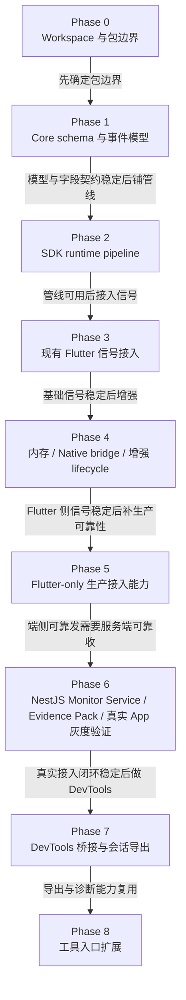

# Flutter Monitor Plan

## 原则

实施顺序应先稳定 workspace 边界和模型，再调整代码，再扩展能力。

阶段验收不只看“事件能发出去”，还要看“事件能否被串成链路并用于定位问题”。

重构过程中必须保留基础信号源的价值：错误、启动、页面加载、API 耗时、卡顿、用户点击、PV、页面停留都应在新模型中找到归属。任何删除都必须有替代方案和验收证明。

## 状态总览

项目主线已经迁入统一 workspace：`flutter_monitor_core` 提供 event envelope、schema、字段注册、privacy、summary 和 export；`flutter_monitor_sdk` 承担 runtime pipeline、context/session/trace/breadcrumb 和 Flutter-only 信号采集；Workbench 消费 raw envelope，提供 session list、session timeline、性能概览、event detail 和 raw JSON 回查。

近期重点是让 Flutter-only SDK 以较低接入成本进入真实 App 验证：输出模式收敛、端侧队列和重试、采样限流、SDK 自监控、Monitor Service ingest、Workbench 回查和压测记录。

| 阶段 | 当前状态 | 说明 |
|---|---|---|
| Phase 0 Workspace 与包边界 | 基本完成 | core、sdk、native、workbench 边界已建立，根目录承担文档和 workspace 配置。 |
| Phase 1 Core schema 与事件模型 | 基本完成，持续维护 | 统一 envelope、字段注册、schema validation、privacy、summary、export 已落地；后续字段变化仍必须先过 docs/core。 |
| Phase 2 SDK runtime pipeline | 基本完成，持续维护 | raw signal -> context/trace snapshot -> envelope -> validation -> privacy -> breadcrumb -> output 主流程已建立。 |
| Phase 3 现有 Flutter 信号接入 | 主链路完成 | 启动、页面、HTTP、错误、行为、交互、卡顿、lifecycle、memory 线索已进入 session timeline。 |
| Phase 4 Memory / Native / Lifecycle | Flutter 侧完成主线，native 暂停 | Flutter/Dart memory sample/growth/lifecycle 已推进；native 保留 optional/experimental，不作为近期主线。 |
| Phase 5 Flutter-only 生产接入能力 | 进行中 | 收敛输出模式、离线队列、重试、采样限流、优先级、SDK 自监控、Workbench 回查和压测。 |
| Phase 6 NestJS Monitor Service、Evidence Pack 与真实 App 灰度验证 | 紧随 Phase 5 | 独立 `services/monitor_service`，搬迁现有 Workbench service，新增 evidence pack，支撑真实 App QA/灰度接入。 |
| Phase 7 DevTools 桥接与会话导出 | 后置 | 等真实 App 接入闭环稳定后再做 Timeline、bridge、export/import。 |
| Phase 8 工具入口扩展 | 后置 | CLI、MCP、独立 DevTools tooling 等只消费 core envelope/export，不承担 runtime 采集。 |

## 近期最高优先级

下一阶段聚焦可验证的生产接入能力：

- Flutter-only production mode：真实 App 默认不依赖 native，native 仅保留 optional/experimental。
- 端侧可靠性：离线队列、batch、flush、重试、采样、限流、优先级、drop reason、SDK self-monitoring。
- Monitor Service：NestJS 独立服务，batch ingest、schema 校验、eventId 幂等、错误码语义、raw envelope 存储、session/trace/event 回查、remote config 最小接口和 evidence pack。
- 真实 App 验证：先 QA/debug 包，再内部灰度包，验证启动、页面、HTTP、错误、行为、交互、卡顿、memory、lifecycle 的 session timeline 价值。
- 压测矩阵：初始化、弱网、断网、后台恢复、长 session、低端机、高频事件、服务不可用、大 payload、隐私过滤、Workbench 查询性能。

## 路线图总览



阶段依赖的核心是先稳定模型和 pipeline，再接入现有信号，然后把 Flutter-only SDK 和独立 Monitor Service 做到可安全接入真实 App，最后扩展 DevTools 和工具入口。

## Phase 0：Workspace 与包边界

目标：

- 将当前仓库规划为官方 Dart pub workspaces。
- 根目录作为 workspace root，不作为发布包。
- 建立三个第一阶段包边界：
  - `packages/flutter_monitor_core`
  - `packages/flutter_monitor_sdk`
  - `packages/flutter_monitor_native`
- 当前 Flutter SDK 代码未来迁入 `packages/flutter_monitor_sdk`。
- `flutter_monitor_native` 作为可选 plugin，不被主 SDK 强依赖。

验收：

- workspace root 的职责清晰：文档、CI、脚本、workspace 配置。
- `flutter_monitor_core` 是唯一 event model/schema/privacy/export schema 来源。
- `flutter_monitor_sdk` 依赖 core。
- `flutter_monitor_native` 依赖 core，并通过 bridge 与 SDK 对接。
- 文档中不再把多包作为未来待评估事项。

## Phase 1：Core Schema 与事件模型

目标：

- 在 `flutter_monitor_core` 中建立统一模型。
- 稳定 event envelope、schema version、field registry、privacy level。
- 建立唯一字段契约，覆盖 public envelope、resource、context、attributes 和 payload。
- 清理同一语义的重复字段，例如 `context.route.*` / `context.module.*`、`resource.device.deviceTier`、`context.lifecycle.*`、`context.native.platform`、`durationMs`、`payload.error.*`、`memory.native_used_mb` 等。
- 定义 session export/import 格式。
- 定义 schema validation 基础能力。
- 同步 `flutter_monitor_core` 的 `FieldPaths`、`FieldRegistry`、context/resource model、schema validation、privacy filtering 和测试。
- 稳定信号采集设计，覆盖采集来源、触发时机、链路关联和降级策略。

验收：

- 所有 signal type 都能映射到统一 event envelope。
- 字段状态、可空性、隐私等级、索引建议明确。
- 一个语义只有一个规范字段路径。
- 任何字段都明确属于 `resource`、`context`、`attributes` 或 `payload` 之一。
- 文档示例不再出现字段契约禁止的旧字段。
- `flutter_monitor_core` 中的字段常量与 `docs/event_model.md` 的唯一字段契约一致。
- 字段注册表包含所有目标字段的类型、隐私等级和索引建议。
- core 测试覆盖字段注册、字段黑名单、schema validation、privacy filtering 和主要 JSON round-trip。
- 冷启动、热启动、页面、网络、行为、卡顿、内存、native、错误、自定义 trace 均有 schema。
- `docs/signal_collection.md` 覆盖启动、页面、网络、错误、行为、卡顿、内存、生命周期、native 和自定义 trace。
- DevTools、server protocol、native package 不定义第二套模型。
- Phase 2 只允许基于统一字段契约构建 pipeline。

## Phase 2：SDK Runtime Pipeline 基础设施

目标：

- 在 `flutter_monitor_sdk` 中建立 runtime 基础设施：
  - raw signal；
  - context snapshot；
  - trace snapshot；
  - context manager；
  - session manager；
  - trace/span manager；
  - breadcrumb store；
  - event pipeline；
  - envelope builder；
  - outputs。
- 将 Reporter 从最终事件分发器升级为标准 SDK 内部上报入口和 pipeline 入口。
- 业务主动埋点使用 `FlutterMonitorSDK.track(...)`；错误、页面、HTTP、卡顿等 SDK 内部采集器直接生成标准 raw signal。
- 接入支撑 session 切分和 hot start 的最小 lifecycle 信号。

本阶段不要求：

- 接入所有现有 collector；
- 完整实现 HTTP 重试、离线缓存和 remote config；
- 完整实现 DevTools 面板；
- 实现 native 深度能力；
- 完成 public API 收敛。

验收：

- SDK 内部采集器和业务 `track` 能生成统一 `EventEnvelope`。
- 任意业务事件至少能带 `sessionId`。
- output 消费统一 event envelope 或 envelope JSON。
- 上下文异步变化时，事件仍使用发生时的 context snapshot。
- Reporter 作为 SDK 内部 pipeline 入口，不对业务侧暴露内部事件结构。
- SDK 能记录 envelope 构建失败、事件丢弃、flush 失败等 self-monitoring 事件。
- 原 SDK example/test 继续通过。

## Phase 3：现有 Flutter 信号接入

目标：

- error 接入 event envelope。
- click/PV/page stay 接入 breadcrumb 或 metric。
- route/page visit/page load 接入 trace/span，其中 `page.visit` 是页面 trace，`page.load` 是页面加载 span。
- cold start、hot start 接入 trace/span。
- Dio 和 `http` 请求接入 `http.client` span。
- jank 接入当前 page trace 和裁剪后的相关 breadcrumbs。
- 最小 lifecycle 事件参与 session 切分、hot start 和 exit flush。
- 控制台默认输出 compact 摘要，而不是完整 JSON。
- 完整 JSON 仍由 pipeline 保留，并可通过 local workbench service 的 SQLite 查询或 session export 获取。
- compact log 的摘要规则沉淀在 core，作为 `EventEnvelope` 的派生视图。
- compact log 不得创建第二套事件模型、第二套服务端协议或第二套字段事实源。
- 业务主动埋点收敛为 `FlutterMonitorSDK.track(...)`，用于记录关键业务动作；普通业务接入不推荐直接使用 `startTrace`、`startSpan`、`addBreadcrumb`、`FieldPaths` 或自定义 `attributes` / `payload`。
- 用户维度排查依赖统一上下文语义。用户、用户类型、用户标签和 cohort 后续应由 `setContext(...)` 一类的通用上下文入口承载。
- `context.module.*` 只作为可选增强上下文，不作为基础接入前置条件；不得要求业务方在每个代码模块或页面频繁手动设置 module。

建议接入顺序：

1. error；
2. behavior / click / PV；
3. route / page load / page stay；
4. startup / hot start；
5. Dio / `http`；
6. jank；
7. compact log / `EventSummary`；
8. local workbench service 本地完整 JSON 查询；
9. SQLite 本地保留策略和 session export。

Phase 3 当前页面事件语义：

- `trace page.visit`：页面活动窗口，进入时 start，离开时 end。
- `span route.push`：路由切换阶段。
- `span page.load`：页面加载阶段，应在首帧或 fallback 首帧时结束。
- `metric page.stay`：页面停留时长，使用 envelope `durationMs`。
- `breadcrumb page.view`：页面访问足迹。

### 输出体验与完整 JSON 获取

Phase 3 的完成标准不只是不丢信号，还包括“开发者能在不被完整 JSON 淹没的情况下判断发生了什么，并能按摘要中的 id 查回完整事件”。

核心原则：

- `EventEnvelope` 是机器事实源。
- `EventSummary` 是从 `EventEnvelope` 派生的人类可读摘要。
- `CompactLog` 是 `EventSummary` 的文本渲染。
- compact 行中的 `kind` 是 core 从 `EventEnvelope.signalType`、`name` 和标准字段推导出的摘要分类，不是 `EventEnvelope` 标准协议字段，采集侧不需要上报或维护该字段。
- compact log 字段不得反向成为第二套协议；SDK、Workbench、DevTools、CLI/MCP 后续都应复用 core 中的摘要规则。

compact log 固定为 key-value 格式，字段顺序应尽量稳定：

```text
[FM] kind=<kind> name=<event.name> status=<status> phase=<event.phase> route=<context.route.name> duration_ms=<durationMs> session=<sessionId> trace=<traceId> span=<spanId> event=<eventId>
```

通用字段顺序：

```text
kind, name, status, phase, route, duration_ms, session, trace, span, event
```

不同事件类型必须暴露的摘要字段：

| kind | 必须字段 |
|---|---|
| `startup` | `start_type`、`duration_ms`、`first_frame_ms`、`session`、`trace`、`event` |
| `page` | `route`、`from`、`duration_ms`、`session`、`trace`、`event` |
| `http` | `method`、`url`、`code`、`success`、`duration_ms`、`route`、`breadcrumbs`、`session`、`trace`、`span`、`event` |
| `jank` | `route`、`frames`、`frame_max_ms`、`frame_avg_ms`、`fps`、`session`、`trace`、`event` |
| `error` | `mechanism`、`message`、`route`、`breadcrumbs`、`session`、`trace`、`event` |
| `lifecycle` | `state`、`previous`、`foreground`、`session`、`trace`、`event` |
| `sdk` | `name`、`status`、`session`、`event` |

示例：

```text
[FM] kind=startup name=app.cold_start status=ok phase=end start_type=cold duration_ms=428 first_frame_ms=428 route=/ session=ses_1779781544808117_0 trace=trace_1779781544987939_0 event=evt_1779781545000000_8
[FM] kind=page name=page.load status=ok phase=end route=/detail from=/ duration_ms=21 session=ses_1779781544808117_0 trace=trace_1779781544987939_9 span=span_1779781545000000_10 event=evt_1779781545000000_22
[FM] kind=http name=http.client status=error phase=instant method=GET url=/users/flutter code=403 success=false duration_ms=612 route=/ breadcrumbs=1 session=ses_1779781544808117_0 trace=trace_1779781544987939_2 span=span_1779781545000000_12 event=evt_1779781545000000_19
[FM] kind=jank name=ui.jank.sequence status=ok phase=instant route=/ frames=13 frame_max_ms=71.4 frame_avg_ms=51.0 fps=40.7 session=ses_1779781544808117_0 trace=trace_1779781544987939_2 event=evt_1779781545000000_17
[FM] kind=error name=error.flutter status=error phase=instant mechanism=flutter message="NoSuchMethodError: The method 'hello' was called on null." route=/ breadcrumbs=3 session=ses_1779781544808117_0 trace=trace_1779781544987939_2 event=evt_1779781545000000_20
```

完整 JSON 获取路径：

- 控制台 compact 行必须包含可回查的 `event`、`session` 和 `trace`，有 span 时包含 `span`。
- `MonitorMode.localLive` / `MonitorMode.production` 将完整 `EventEnvelope` 批量发送到 local workbench service 或正式服务端。
- 只要 SDK 装入真实 App，就不应默认一条事件一个请求。近实时写入 Workbench 可以存在，但必须由初始化配置显式开启，并使用小 batch、短 flush 间隔、关键事件立即 flush 等策略。
- Workbench Web 的实时刷新来自 service 到 web 的 SSE，不代表 SDK 必须逐条 HTTP 实时请求。
- local workbench service 在本地调试阶段至少支持：
  - `POST /api/monitor/v1/events`
  - `GET /api/monitor/v1/events/:eventId`
  - `GET /api/monitor/v1/sessions/:sessionId`
  - `GET /api/monitor/v1/traces/:traceId`
  - `GET /api/monitor/v1/recent?limit=50`
- local workbench service 使用 SQLite 保存最近若干 session 的完整 envelope；session export 可用于交接和离线排查。
- 线上排查不依赖控制台保留完整 JSON，而应通过 `eventId`、`sessionId`、`traceId` 在服务端查回完整 envelope 和 session timeline。
- QA 排查不应要求先知道 `sessionId`。Workbench 应支持从 `context.user.userId + time range`、App 版本、环境、页面、错误和性能问题进入 session list；未提供 `userId` 时仍可按通用维度查询。

验收：

- 现有功能不丢失。
- 上报结构符合 `docs/event_model.md`。
- 示例 App 能展示一条完整 session timeline。
- 启动、热启动、页面加载、API、业务 action、PV、页面停留、卡顿、错误、最小 lifecycle 均可在 session 中看到。
- 根路由和后续 route 的 `page.load` 都能闭合并写入 `page.first_frame_ms`；未拿到首帧时不得把页面停留时长伪装为成功加载耗时。
- 慢页面能关联页面 trace、相关 API 和最近 breadcrumbs。
- 卡顿能关联当前 `context.route.*` / `context.module.*`、当前 page trace、最近相关 breadcrumbs 和 `resource.device.*`。
- 错误能关联当前 `context.route.*` / `context.module.*`、active `traceId` / `spanId` 和最近 breadcrumbs。
- 控制台默认不刷完整 JSON。
- compact 行能看出启动耗时、页面耗时、HTTP 耗时和状态码、卡顿指标、错误摘要。
- compact 行中的 `event`、`session`、`trace` 能查回完整 JSON。
- local workbench service 能按 `eventId`、`sessionId`、`traceId` 查询完整 envelope。
- 成功 HTTP、普通 breadcrumb、`route.push` 不应在默认控制台模式刷屏。
- 普通 breadcrumb payload 不应自动携带用户属性或全局自定义上下文；HTTP/error/jank breadcrumb 快照不得递归携带 breadcrumbs 或长 stacktrace。
- 业务主动埋点统一使用 `FlutterMonitorSDK.track(...)`；example 和新文档不得使用 `FieldPaths`、`addBreadcrumb` 或 `reportEvent(category, data)` 作为普通业务埋点路径。
- `track` 由 SDK 内部映射 `business.action`、`business.result`、`ui.target`、`payload.properties` 等 canonical fields，并自动进入 breadcrumb store。
- `track.properties` 只作为事件详情，默认不作为主要聚合索引。
- 普通业务接入需要用户维度排查时，应通过统一上下文入口写入 `context.user.userId`；没有 userId 时不得阻塞基础采集、页面/错误/性能查询和 session timeline。
- 新文档和 example 应使用 `setContext(...)` 语义表达用户上下文，不扩散多套用户或自定义上下文入口。
- 完整 JSON 仍符合 `docs/event_model.md`。
- core 中的摘要规则可被 SDK、Workbench、未来 CLI/DevTools 复用。
- compact 摘要不形成第二套事件模型或服务端协议。

## Phase 4：内存、Native Bridge 与增强 Lifecycle

目标：

- 接入 Flutter/Dart 可获得的 memory sample、growth、pressure 线索，并保持采样频率克制。
- 增强 lifecycle：foreground/background duration、exit flush 结果、异常生命周期线索。
- 定义并接入 `MonitorNativeBridge`，让 native 信号以 raw signal 形式进入 SDK pipeline。
- 在 `flutter_monitor_native` 中提供可选 Android/iOS native memory snapshot、memory pressure 和 native lifecycle 基础能力。
- 预留 native crash、OOM、ANR schema、bridge 入口和异常生命周期下的离线补全策略。

本阶段不要求：

- 完整、可靠地捕获所有 native crash。
- 完整、可靠地捕获 OOM 或 ANR。
- 实现生产级离线缓存、重试、服务端聚合或告警。
- 建设 Workbench UI 或 DevTools 面板。
- 让主 SDK 强依赖 `flutter_monitor_native` 或要求业务增加强制平台配置。

边界说明：

- 完整 Phase 4 需要把 `packages/flutter_monitor_native` 从占位包推进为可选 Flutter plugin，但主 SDK 必须在没有该包时继续正常运行。
- `flutter_monitor_native` 只负责 Flutter 与 Android/iOS 原生能力之间的 bridge 和 native raw signal 采集，不负责构建最终 envelope、不负责 HTTP 上报、不负责维护 session/trace。
- Native 能力完成后，相比 Phase 3 的增强点是补齐 Flutter-only 视野之外的 native memory、memory pressure、native lifecycle、OOM/ANR/native crash 线索，并把它们关联到当前 session、route、jank、error、HTTP 和 breadcrumbs。
- 未接入 native 包、漏注册 bridge、平台不支持或 channel 初始化失败时，SDK 应降级为 Flutter-only 模式，并通过 `context.native.available = false`、`context.missingReason = native_bridge_unavailable` 或 SDK self-monitoring 事件说明原因。
- 配置 native bridge 时，SDK 应先进入 bootstrap resource resolve 阶段，使用短 deadline 解析一次 native resource snapshot。正常情况下 bootstrap 事件应携带 native context；只有 bridge 未配置、不可用、超时或平台不支持时，才降级为 `context.native.available = false`。

实施边界：

- core 负责字段、枚举、schema validation、summary 和 privacy 契约。
- SDK 负责 Flutter 层 memory/lifecycle collector、`MonitorNativeBridge` 抽象、native raw signal mapper、context snapshot 和 pipeline 接入。
- `flutter_monitor_native` 负责 Android/iOS platform callback、MethodChannel/EventChannel 和 native raw signal 产生。
- no-op/fake bridge 只用于 SDK 内部降级和测试，不作为 example 或业务层主动写入 memory/native 事件的入口。
- example 通过真实内存分配/释放、jank、真实 App 前后台切换和可选 native plugin 接入验证链路，不通过公开 API 伪造 memory/native/lifecycle 日志。
- 使用 raw JSON 验证 Android/iOS 有无 native bridge 四类场景是否都能进入同一 session timeline。

验收：

- 启动边界的 RSS 起止值默认合并到 `app.cold_start` / `app.hot_start` 主 trace end；页面边界的帧数、FPS、稳定性、RSS 起止值默认合并到 `page.visit` 主 trace end。不再额外输出启动内存、页面帧、页面内存独立 trace 或默认 envelope，启动 trace 不承载帧摘要。
- `metric memory.sample` 进入统一 envelope，至少包含可获得的 `memory.*` 字段、`memory.sample_source`、当前 `sessionId`、`context.route.*` / `context.module.*` 和 `resource.device.*`；它用于 session/lifecycle/jank/native 等低频诊断采样，不作为页面切换默认输出形态。
- `metric memory.growth` 进入统一 envelope，必须包含 `memory.growth_mb`、`memory.growth_duration_ms` 和观察窗口上下文；没有足够样本时不得生成增长结论。
- `metric memory.pressure` 进入统一 envelope，必须包含 `memory.pressure_level`，并作为 critical/high 价值线索进入 breadcrumb store，帮助后续 error、jank、OOM 解释上下文。
- `metric memory.leak.suspect` 只能表达疑似线索，必须在 payload 中说明依据，例如采样窗口、页面切换后增长、pressure 信号或 native 补充信息；不得在缺少证据时宣称确定泄漏。
- Flutter/Dart 层拿不到的内存字段必须省略或标记 `context.missingReason = platform_limited`，不得伪造 RSS、native memory 或 heap capacity。
- memory sample 默认低频采集，普通 sample 不应在默认控制台模式刷屏；pressure、growth、suspect leak 可进入 compact 摘要或高价值 breadcrumb。
- page activity 不输出 `memory.sample`，只在 `page.visit` end 写入 `memory.enter_rss_mb`、`memory.exit_rss_mb`、`memory.delta_rss_mb`；同 route 多实例通过 `page.instance_id` 区分。
- `breadcrumb app.lifecycle` 继续表达状态变化，并更新 `context.lifecycle.state`、`context.lifecycle.previousState` 和 `context.lifecycle.isForeground`。
- `metric app.foreground_duration` 和 `metric app.background_duration` 使用 envelope `durationMs` 表达前台/后台持续时间，不新增重复 duration 字段。
- `sdk.lifecycle.flush` 必须使用 `app.exit_flush.success` 表达退出前 flush 结果；成功 flush 可保持 normal priority，失败 flush 应提升为高价值 SDK self-monitoring，但不得污染普通业务 payload。
- hot start trace 由 resumed 生命周期打开，由恢复后首帧、可交互、业务手动标记或超时降级闭合；第一阶段至少实现 `resumed -> next frame`，并写入 `app.start.end_reason = first_frame`。
- `app.background_duration.durationMs` 只表示后台停留间隔；`app.hot_start.durationMs` 只表示热重启耗时，验收时必须验证两者不再使用同一个 duration 值表达。
- SDK 提供 `MonitorNativeBridge` 抽象；主 SDK 只依赖抽象，不强依赖 `flutter_monitor_native`。
- native bridge 输出 native raw signal，不构建最终 envelope，不直接调用 HTTP output，不维护第二套 session/trace id。
- `flutter_monitor_native` 提供 Android/iOS native memory sample、memory pressure 和 native lifecycle 基础信号；未配置或不可用时由 SDK 降级为 Flutter-only。
- `metric native.memory.sample` 和 `metric native.memory.pressure` 复用 `memory.native_used_mb`、`memory.pressure_level`、`memory.sample_source = native`，不得新增 `native.memory.*` 平行字段表达同一语义。
- native 信号必须使用标准层和原始证据层两层表达：标准层只写 `context.native.*`、`context.lifecycle.*`、`native.signal`、`memory.*` 等确定可聚合字段；平台差异、系统回调、通知名、原始状态和等级必须保留在 `payload.native`。raw JSON 中该字段以 `payload["payload.native"]` 形式出现。
- native lifecycle 不得强行映射。只有语义确定时才写 `context.lifecycle.*`；不能确定时只写 `native.signal = lifecycle` 和完整 `payload.native`。
- native crash/OOM/ANR 本阶段至少完成 schema、bridge 入口和 payload 脱敏边界；未实现可靠捕获时文档、example 和日志不得暗示已经完整支持。
- native 信号可关联 `sessionId`、`traceId`、`context.route.*`、`context.module.*` 和 breadcrumbs；无法关联时必须设置 `context.missing = true` 和固定 `context.missingReason`。
- example 能触发并在 raw JSON 中验证 memory sample、memory growth 或 pressure、foreground/background duration、exit flush 结果和 native bridge 信号；pressure 依赖系统 low memory warning，不要求每轮手动测试必然出现。
- Phase 4 完成后仍满足 Phase 3 验收：page/http/error/jank/lifecycle/startup/track 的 raw JSON 链路不退化，breadcrumb 数量裁剪规则不被破坏。

## Phase 5：Flutter-only 生产接入能力

目标是让 Flutter-only SDK 可以以较低心智负担接入真实 App，并在弱网、后台、退出、高频事件和服务不可用时保持可控。Native 继续作为可选增强层，不作为基础接入前置条件。

### 接入模式

普通使用者只需要选择输出模式：

| 模式 | 场景 | 行为 |
|---|---|---|
| `consoleOnly` | 本地开发 | 输出 compact log 或自定义本地 output |
| `localLive` | QA / 本地复现 | 批量写入 Workbench service，使用短 flush 间隔和关键事件快速 flush |
| `production` | 灰度 / 线上 | 使用 SDK 内置队列、batch、retry、采样限流、优先级和自监控 |

高级使用者可以通过单一 `MonitorProductionPolicy` 覆盖队列、batch、retry、采样和限流参数。普通业务不需要手动组合多个 output，也不需要理解内部队列实现。

### 可靠性策略

- 队列只保存完成 schema validation 和 privacy filtering 的 `EventEnvelope` JSON，不保存未过滤 raw signal。
- 队列按 priority、大小上限、TTL 和重试状态管理待发送事件；critical/high、错误、失败 HTTP、严重卡顿、memory pressure 和 SDK self-monitoring 优先保留。
- `localLive` 和 `production` 默认 batch，不把一事件一请求作为真实 App 默认发送方式。
- flush 触发来自 batch size、flush interval、background、app exit、critical/high 事件短延迟和业务主动 `FlutterMonitorSDK.flush(...)`。
- 2xx ack 删除；400/401/403 按不可重试拒绝处理；413 触发拆分或裁剪；429 使用 `Retry-After` 或退避；5xx、超时、断网进入退避重试。
- memory sample、成功 HTTP、低价值 low priority event 可采样；高频 `track` 按配置限流。
- 采样、限流、队列满、payload 过大、不可重试拒绝、store 损坏和 flush 失败都通过 `sdk.*` self-monitoring envelope 留下证据。
- Remote config 只修改 mode、collector 开关、采样、限流、queue、batch、flush 和 retry 参数，不改变事件模型。

### 接入最小集

真实 App 首轮接入只启用 Flutter-only 最小闭环：

- 启动：`app.cold_start`、`app.hot_start`、`sdk.init`。
- 页面：`page.visit`、`page.load`、`page.stay`、`page.view`。
- 网络：Dio 或 `http` 的 `http.client` span。
- 错误：Flutter framework error、Dart uncaught error、业务手动 `recordError`。
- 行为：`FlutterMonitorSDK.track(...)`。
- 交互性能：`FlutterMonitorSDK.measure(...)`。
- 卡顿：保守配置启用，关联 route、page trace、frame summary 和 breadcrumbs。
- 内存：低频 RSS sample、页面/启动边界 RSS delta、growth 线索。
- lifecycle：前后台切换、background/foreground duration、退出前 flush。

接入顺序建议：

1. 先接 QA/debug 包，再接内部灰度包。
2. 先选择 1-2 条高价值业务链路，例如启动 -> 首页 -> 详情页 -> 关键请求 -> 用户操作 -> 返回。
3. 确认 Workbench 能看到 session timeline、页面区段、HTTP、行为、错误/卡顿上下文和 raw envelope。
4. 控制真实 App 代码侵入面：初始化、Navigator observer、HTTP interceptor/client、少量 `track` / `measure` / `setContext`。

### 压测矩阵

| 场景 | 验证目标 |
|---|---|
| 初始化 | Flutter-only 初始化 P50/P95、冷启动影响 |
| 高频事件 | 高频 HTTP、track、breadcrumb 下队列是否稳定 |
| 弱网/断网 | 断网、弱网恢复后关键事件是否可送达 |
| 后台/恢复 | background duration、hot start、exit flush 是否准确 |
| 长 session | 内存、磁盘、队列是否稳定 |
| 低端机 | CPU、内存、帧耗时和掉帧影响 |
| 大 payload | 错误栈、breadcrumbs、属性 map 是否被裁剪 |
| 服务不可用 | 5xx、超时、429 下是否退避，是否影响 App 主流程 |
| 查询性能 | Workbench 对数千/数万 envelope 的 session、trace、event 查询是否可用 |
| 隐私过滤 | token、cookie、body、手机号等敏感字段是否不会进入 output 和离线队列 |

建议目标：

- Flutter-only SDK 初始化 P50 < 5ms，P95 < 10ms；无法满足时需要记录原因和优化计划。
- SDK 采集对页面切换、滑动和关键交互无肉眼可感影响。
- 弱网或服务不可用时，SDK 不持续刷请求、不阻塞 UI、不导致内存持续增长。
- 队列达到上限时，保留关键事件并记录丢弃原因。
- Workbench 能从 `userId + 时间范围`、sessionId、eventId、traceId、页面、错误、失败 HTTP、卡顿进入排查。

### Workbench 职责

- 作为 QA/灰度验证的本地诊断入口。
- 只消费统一 envelope，不补写 SDK 字段，不成为第二套协议。
- 在 Overview 展示 SDK self-monitoring：队列长度、丢弃数、重试数、flush 失败、采样/限流原因。
- 支持按 appKey、environment、version、device、route、userId、problem type 过滤 session。
- 区分业务问题和 SDK 自身可靠性问题。

### 待办

| 项目 | 说明 |
|---|---|
| Remote config / kill switch | 补齐远程开关、采样、限流、队列、batch、flush、retry 参数下发和过期降级 |
| 退出 flush | 收紧 background / detached / dispose 下的短超时和失败证据 |
| 压测脚本 | 建立可重复的高频、弱网、断网、长 session、大 payload 和服务不可用验证 |
| 真实 App checklist | 固化初始化、Navigator、HTTP、track、measure、context、回滚和隐私检查 |
| 灰度记录 | 输出 SDK 开销、队列行为、丢弃原因、服务端接收和 Workbench 回查结果 |

验收：

- 不启用 native 时，Flutter-only SDK 的启动、页面、HTTP、错误、行为、交互、卡顿、内存和 lifecycle 能形成完整 session timeline。
- `production` 下默认 batch，支持离线队列、重试、采样、限流、优先级和退出前 flush。
- SDK 能处理 2xx、4xx、413、429、5xx、超时和断网，不因服务不可用影响 App 主流程。
- 队列满、采样、限流、payload 裁剪、隐私过滤、flush 失败都有可回查的 self-monitoring 证据。
- 远程配置最小集可控制全局开关、collector 开关、采样率、限流、队列、batch、flush 和 retry 参数。
- 接入 checklist、回滚策略和压测记录足以支撑进入 Monitor Service + 真实 App QA/灰度验证。
- 文档和 example 明确 native 是 optional/experimental，不把 native 作为 Flutter-only 接入前置条件。

## Phase 6：NestJS Monitor Service、Evidence Pack 与真实 App 灰度验证

目标：

- 新建独立 `services/monitor_service`，采用 NestJS 技术栈，承接现有 `workbench/service` 的 ingest、storage、query、SSE、performance overview 和 smoke test。
- 明确 SDK 职责减轻：SDK 只采集、组装、过滤和上报 raw `EventEnvelope`，不生成聚合类证据，不生成 issue group，不承担 agent-oriented diagnostics。
- 将 Workbench 降级为独立 Web UI，后续迁出 `workbench/web` 到 `web`，只消费 `services/monitor_service` API，不再持有服务端诊断逻辑。
- 与端侧可靠上报策略对齐，验证 SDK 能可靠发送、Monitor Service 能可靠接收、Workbench 或查询 API 能可靠回查。
- 新增一个 evidence pack 接口，把 raw envelope 派生为可追溯的问题索引和证据包，用于人 review、Workbench 展示和未来 Agent 辅助定位代码上下文。
- 接入一个真实中大型 App 或同等级业务工程的 QA/灰度包，验证启动、页面、HTTP、错误、行为、交互、卡顿、内存和 lifecycle 在真实业务流中的链路价值。
- 输出端到端灰度验证结果，用数据证明 SDK 的开销、可靠性、丢弃策略、服务端接收语义、evidence pack 质量和排查价值。

范围：

- batch ingest：接收统一 `EventEnvelope` batch。
- schema 校验：按 core/docs 的 envelope 语义校验 required 字段、signal type、priority、event phase 和字段注册。
- eventId 幂等：重复 eventId 不重复写入，返回明确幂等结果。
- 错误码语义：稳定表达 2xx、400/401/403、413、429、5xx，供 SDK retry/drop policy 消费。
- raw envelope 存储：保留完整 envelope，支持 `eventId`、`sessionId`、`traceId` 回查。
- 基础查询：session list、session detail、trace detail、event detail、recent events、problem filters。
- 基础聚合：启动耗时、页面耗时、HTTP 耗时/失败、错误数、卡顿数、内存趋势线索和影响 session 数。
- evidence pack：从 raw envelope 派生单一诊断证据接口，输出 issue groups、关键 timeline、raw refs 和 agent hints。
- remote config 最小接口：全局开关、collector 开关、采样率、限流、队列、batch、flush、retry 参数。
- SDK self-monitoring 查询：队列长度、丢弃数、重试数、flush 失败、采样/限流原因。

本阶段不要求：

- 完整告警、多租户、权限、审计、计费、SLA、长期冷热存储分层。
- 完整生产 BI 或质量治理大盘。
- RAG、LangChain/LangGraph、向量检索或自动修复 workflow；这些只预留边界，方案待定。
- MCP 正式设计；MCP 后续只应作为 service diagnostics API 的薄消费层。
- native crash/OOM/ANR 可靠捕获。
- DevTools Timeline 集成；DevTools 顺延到 Phase 7。

真实 App 灰度验证：

- 先接 QA/debug 包，再接内部灰度包，不直接全量线上开启。
- 首轮只接 1-2 条关键业务链路，例如启动 -> 首页 -> 详情页 -> 关键请求 -> 用户操作 -> 返回。
- 默认关闭 native，仅启用 Flutter-only 最小集。
- 使用 remote config 保留 kill switch 和采样/限流调节能力。
- 灰度期间必须记录绝对操作时间、SDK config version、App version/build、设备信息、网络状态和 Workbench/server 查询结果。
- 验证 Workbench 或 server query 能从 `userId + 时间范围`、sessionId、eventId、traceId、页面、错误、失败 HTTP、卡顿进入排查。

验收：

- SDK production mode 可以向 Monitor Service batch 上报，server 能校验、幂等写入、返回稳定错误码。
- SDK 能正确消费 server 的 2xx、4xx、413、429、5xx、超时和断网语义，并执行 retry/drop/self-monitoring。
- server 能按 `eventId`、`sessionId`、`traceId` 回查完整 raw envelope。
- server 或 Workbench 能按 appKey、environment、version、device、route、userId、problem type 查询真实 App session。
- remote config 最小接口能控制全局开关、collector 开关、采样率、限流、队列、batch、flush 和 retry 参数。
- evidence pack 能从 raw envelope 派生错误、失败 HTTP、慢 HTTP、慢页面、慢交互、卡顿、memory 线索和 lifecycle/session 异常的 issue groups，每个 issue 都能回指 raw eventId/sessionId/traceId。
- 真实 App QA/灰度包至少完成一条关键业务链路接入，并能还原用户路径、页面区段、请求、行为、错误/卡顿/内存上下文和 raw JSON。
- 灰度报告覆盖初始化、弱网、长 session、低端机、高频事件、服务不可用、隐私过滤和查询性能。

## Phase 6 详细实施方案

本章是 Phase 6 的执行细则。目标不是一次性做完整 APM 后端，而是把当前本地 Workbench service 升级为独立 Monitor Service：它接收 raw envelope，保存 raw envelope，提供查询和基础聚合，并额外产出一个可追溯的 evidence pack。Workbench Web 和未来 Agent/MCP 都消费这个服务，而不是各自重新解析 raw JSON。

### 目录与边界

目标目录：

```text
services/
  monitor_service/
    package.json
    tsconfig.json
    src/
      main.ts
      app.module.ts
      ingest/
      store/
      query/
      diagnostics/
      config/
      stream/
      health/
    test/
    docs/

web/
  package.json
  src/
  docs/
```

边界：

- `packages/flutter_monitor_sdk`：只负责 Flutter runtime 采集、raw envelope 构建、隐私过滤、采样限流、离线队列和可靠上报。
- `services/monitor_service`：负责接收、存储、查询、聚合、evidence pack 和 remote config。
- `web`：负责人类 review 的 UI，不拥有 ingest、storage、diagnostics 规则。
- `packages/flutter_monitor_core`：继续承载 Dart 侧唯一模型、字段注册、schema validation、privacy、summary 和 export。
- `packages/flutter_monitor_mcp` 或未来 MCP：暂定，不在 Phase 6 实施；后续只能消费 Monitor Service API，不直接读数据库或复制 diagnostics 规则。

迁移约束：

- 先搬迁服务，再做 evidence pack；不要在搬迁期间同时重写所有查询规则。
- 保持端口默认值：Monitor Service `3700`，Web `4700`。
- 迁移后旧 `workbench/service` 不再作为事实服务端；如需要兼容，最多保留短期转发或文档说明。
- raw envelope 仍是唯一事实源，evidence pack 只是可回溯的派生索引。

### NestJS 模块规划

建议模块：

```text
src/
  main.ts
  app.module.ts

  ingest/
    ingest.controller.ts
    ingest.service.ts
    normalize-events.ts

  store/
    monitor-store.ts
    sqlite-monitor-store.ts
    event-accessors.ts
    event-types.ts

  query/
    query.controller.ts
    query.service.ts
    request-filters.ts

  diagnostics/
    diagnostics.controller.ts
    diagnostics.service.ts
    evidence-pack.ts
    issue-group.ts
    rules/
      error-rule.ts
      http-rule.ts
      page-performance-rule.ts
      interaction-rule.ts
      jank-rule.ts
      memory-rule.ts
      lifecycle-rule.ts

  config/
    config.controller.ts
    config.service.ts

  stream/
    sse-hub.ts

  health/
    health.controller.ts
```

模块职责：

- `ingest`：接收 batch、normalize、校验、幂等写入、发布 SSE。
- `store`：封装 SQLite 和未来数据库，提供 raw envelope 读写能力。
- `query`：提供 session、trace、event、recent、dimensions、performance overview 和 search。
- `diagnostics`：只读 raw envelope，派生 evidence pack，不回写 raw envelope，不创造第二套事实。
- `config`：提供 remote config 最小接口，覆盖 SDK 生产接入参数。
- `stream`：继续提供本地/QA live refresh。
- `health`：服务状态、storage 状态、ingest 统计、SSE client 统计。

### API 兼容与新增接口

第一阶段必须保持现有 Workbench service API 行为尽量兼容：

```text
POST /api/monitor/v1/events
GET  /api/monitor/v1/health
GET  /api/monitor/v1/stream
GET  /api/monitor/v1/recent
GET  /api/monitor/v1/dimensions
GET  /api/monitor/v1/sessions
GET  /api/monitor/v1/search
GET  /api/monitor/v1/performance/overview
GET  /api/monitor/v1/performance/pages
GET  /api/monitor/v1/performance/http
GET  /api/monitor/v1/events/:eventId
GET  /api/monitor/v1/sessions/:sessionId
GET  /api/monitor/v1/traces/:traceId
```

Phase 6 新增一个 diagnostics 主入口：

```text
GET /api/monitor/v1/diagnostics/evidence
```

参数：

| 参数 | 说明 |
|---|---|
| `sessionId` | 生成指定 session 的 evidence pack |
| `traceId` | 生成指定 trace 的 evidence pack |
| `eventId` | 围绕指定事件生成局部 evidence pack |
| `focus` | `all`、`error`、`performance`、`network`、`memory`、`lifecycle` |
| `profile` | `human` 或 `agent`，决定输出是否偏 UI 或偏结构化索引 |
| `limit` | 限制 issue groups 和 timeline 节点数量 |

约束：

- 至少提供 `sessionId`、`traceId`、`eventId` 之一。
- 所有 evidence 结论必须包含 raw refs。
- `profile=agent` 应更短、更结构化，包含 search terms 和 code hints，但不得输出未经代码验证的 root cause。

remote config 最小接口：

```text
GET  /api/monitor/v1/config
POST /api/monitor/v1/config
```

第一版只要求本地/QA 可用，不要求完整鉴权、多租户或管理后台。

### Schema 与类型同步

当前 Dart core 类型无法直接在 NestJS 中复用。Phase 6 不应依赖人工记忆同步字段，建议采用“三层事实”：

1. `docs/event_model.md`：人读语义，解释字段状态、隐私等级、signal mapping 和示例。
2. `schemas/event_envelope.schema.json`：机器校验，用于 NestJS ingest validation 和后续 TS 类型生成。
3. `packages/flutter_monitor_core`：Dart runtime 类型和 SDK/core 测试事实源。

Phase 6 第一版可以先手写 `schemas/event_envelope.schema.json` 的核心字段，覆盖：

- required public fields；
- signal type / level / status / priority enum；
- trace/span 必填条件；
- `resource`、`context`、`attributes`、`payload` object 类型；
- forbidden/deprecated 字段基础校验；
- `event.phase` 合法值。

后续可增加自动化脚本：

```text
dart run tools/export_schema.dart
```

从 `FieldRegistry`、`FieldPaths`、`ProtocolValues` 导出 schema 草案，减少 Dart/TS 双维护。是否做 codegen 取决于 Phase 6 第一版迁移成本，不作为第一步阻塞项。

TS 侧建议：

- ingest validation 使用 Ajv 或 Zod。
- service 内部类型可以由 schema 生成，或先维护 `MonitorEvent` TS interface。
- evidence pack 的 schema 应独立为 `schemas/evidence_pack.schema.json`，避免和 raw envelope 混在一起。

### Evidence Pack 设计

第一版 evidence pack 是确定性规则输出，不引入 RAG、向量检索或 LLM 推理。

顶层结构建议：

```json
{
  "schemaVersion": "1.0",
  "packId": "pack_ses_001",
  "generatedAt": "2026-06-10T00:00:00.000Z",
  "ruleVersion": "diagnostics-0.1.0",
  "scope": {
    "type": "session",
    "sessionId": "ses_001",
    "traceId": null,
    "eventId": null,
    "timeRange": {
      "start": "2026-06-10T00:00:00.000Z",
      "end": "2026-06-10T00:10:00.000Z"
    }
  },
  "summary": {
    "severity": "error",
    "eventCount": 136,
    "issueCount": 5,
    "primaryRoute": "/detail",
    "appVersion": "1.0.0",
    "device": "android 25113PN0EC"
  },
  "issueGroups": [],
  "timeline": [],
  "rawRefs": [],
  "limitations": []
}
```

Issue group 结构建议：

```json
{
  "id": "issue_error_flutter_001",
  "kind": "error",
  "severity": "error",
  "title": "Flutter error on /detail",
  "summary": "A Flutter framework error happened after detail.cart.add.",
  "confidence": "high",
  "route": "/detail",
  "eventCount": 1,
  "firstSeenAt": "2026-06-10T00:00:00.000Z",
  "lastSeenAt": "2026-06-10T00:00:00.000Z",
  "metrics": {
    "breadcrumbsBeforeError": 3
  },
  "evidence": [
    {
      "eventId": "evt_001",
      "sessionId": "ses_001",
      "traceId": "trace_001",
      "reason": "primary_error_event"
    }
  ],
  "agentHints": {
    "routes": ["/detail"],
    "actions": ["detail.cart.add"],
    "filesFromStack": ["detail_page.dart"],
    "searchTerms": ["DetailPage", "cart.add", "NoSuchMethodError"]
  },
  "limitations": [
    "Evidence is derived from monitor events; inspect code before applying fixes."
  ]
}
```

规则：

- `error`：按 `name + error.mechanism + normalized message + top stack frame + route` 聚合。
- `failed_http`：按 `http.method + http.url.normalized + statusCode/errorType + route` 聚合。
- `slow_http`：按 normalized URL、duration threshold、route 聚合。
- `slow_page`：按 route、`page.load`、`page.visit`、frame summary、memory delta 聚合。
- `slow_interaction`：按 `business.action + target + route` 聚合 `interaction.measure`。
- `jank`：按 route、page.instance_id、jank sequence 聚合。
- `memory`：按 session/route 聚合 memory sample、growth、suspect leak，只输出线索。
- `lifecycle`：检测 session 首事件缺失、cold start 缺失、短间隔 hot start/lifecycle 抖动、event id 异常。

Agent 边界：

- Agent 可以使用 evidence pack 缩小代码搜索范围。
- evidence pack 只能输出 `agentHints`、`searchTerms`、`filesFromStack`，不得输出“确定根因”。
- 最终判断必须回到 App 代码和上下文，不能只凭 evidence pack 自动修复。

### Workbench Web 迁移

目标：

- `workbench/web` 迁移为独立 `web`。
- 去除 `workbench` workspace 配置。
- Web datasource 指向 `services/monitor_service`。
- UI 产品名仍可叫 Flutter Monitor Workbench，但代码目录不再承担 service 职责。

迁移步骤：

1. 移动 `workbench/web` 到 `web`。
2. 如 `workbench/shared` 只被 Web 使用，合并到 `web/src/shared`。
3. 更新 `package.json`、Vite proxy、端口和脚本。
4. 更新 README、AGENTS、SKILL、workbench/docs 和 plan 引用。
5. 保持 Web 默认端口 `4700`，service 默认端口 `3700`。

### Phase 6 分阶段交付

#### 6.1 服务迁移基线

目标：

- 新建 `services/monitor_service` NestJS 项目。
- 无行为变化地搬迁现有 ingest、SQLite store、query、SSE、performance overview 和 smoke test。
- 保持现有 Web 能通过配置切换到新 service。

交付物：

- `services/monitor_service/src/main.ts`、`app.module.ts` 和基础模块目录。
- 等价的 `POST /api/monitor/v1/events`、`GET /recent`、`GET /sessions`、`GET /events/:eventId`、`GET /traces/:traceId`、`GET /stream`。
- service smoke test 覆盖 ingest -> query -> SSE publish 的基础链路。

验收结果：

- 同一份 sample raw envelope 写入旧 service 和新 Monitor Service，session/event/recent 查询结果语义一致。
- Web datasource 指向新 Monitor Service 后，现有 session list、timeline、raw JSON、performance overview 不退化。
- 旧 `workbench/service` 不再新增功能；后续仅做迁移兼容或删除。

#### 6.2 协议校验与可靠接收

目标：

- 为 Monitor Service 增加 ingest validation、eventId 幂等、batch 处理和稳定错误码。
- 与 SDK retry/drop policy 对齐，让端侧能根据服务端响应做确定动作。

交付物：

- `schemas/event_envelope.schema.json` 第一版。
- ingest validation 错误结构，例如 `code`、`message`、`eventId`、`index`、`retryable`。
- eventId 唯一索引和重复写入统计。
- 413、429、4xx、5xx 的明确返回语义。

验收结果：

- 合法 batch 可写入并返回 accepted count。
- 重复 eventId 不重复入库，返回幂等结果。
- 缺少 required field、非法 signal type、超大 payload、非法 phase 能被拒绝并给出可定位错误。
- SDK 在 2xx、4xx、413、429、5xx、超时、断网下的行为与 retry/drop 设计一致。

#### 6.3 查询、聚合与 SDK Health

目标：

- 补齐真实 App QA/灰度排查需要的查询入口。
- 能同时看到业务问题和 SDK 自身可靠性问题。

交付物：

- session list 支持 appKey、environment、version、device、route、userId、problem type、time range。
- session detail 支持 timeline、trace、event、breadcrumb、raw refs。
- performance overview 支持启动、页面、HTTP、错误、卡顿、memory 线索和影响 session 数。
- SDK self-monitoring 查询支持 queue length、drop reason、retry count、flush failure、sample/rate limit。

验收结果：

- QA 不知道 sessionId 时，仍能通过 userId/time range、App version、route、错误、失败 HTTP 或卡顿进入 session。
- 每个聚合指标都能下钻到 raw eventId/sessionId/traceId。
- SDK 可靠性问题不会和业务性能问题混在一起展示。

#### 6.4 Evidence Pack

目标：

- 增加唯一 diagnostics 主入口 `GET /api/monitor/v1/diagnostics/evidence`。
- 把 raw envelope 派生为可回溯的问题索引，帮助人和未来 Agent 快速缩小排查范围。

交付物：

- `diagnostics` 模块、evidence pack DTO、issue group DTO 和规则版本号。
- 第一批规则：error、failed HTTP、slow HTTP、slow page、slow interaction、jank、memory、lifecycle/session anomaly。
- `schemas/evidence_pack.schema.json`。
- Web session detail 或 event detail 中的 evidence panel。

验收结果：

- evidence pack 支持 sessionId、traceId、eventId 三种 scope。
- 每个 issue group 至少包含 kind、severity、summary、confidence、metrics、evidence raw refs、agentHints、limitations。
- Agent hints 只给 route、action、stack file、search terms，不直接声明确定根因。
- evidence pack 生成结果可稳定复现，同一批 raw envelope 在同一 ruleVersion 下输出一致。

#### 6.5 Web 独立化

目标：

- 将 `workbench/web` 迁移为独立 `web`。
- 移除 Workbench 前后端 workspace 耦合。
- Web 只通过 Monitor Service API 读取数据。

交付物：

- `web` 独立 package、Vite 配置、API client、datasource。
- 根 README、AGENTS、SKILL 和 docs 引用更新。
- 启动脚本分别管理 Monitor Service 和 Web，默认端口仍为 `3700` 和 `4700`。

验收结果：

- 单独启动 service 或 web 都不会依赖旧 `workbench` workspace。
- Web build/typecheck 通过。
- Web 中没有直接数据库访问、diagnostics 规则复制或第二套 envelope 类型事实源。

#### 6.6 真实 App QA/灰度验证

目标：

- 接入真实中大型 App 或同等级业务工程的一条关键链路。
- 验证端侧可靠性、服务端接收、查询、evidence pack 和 Web review 是否能闭环。

交付物：

- 真实 App 接入 checklist：初始化、Navigator observer、HTTP interceptor/client、track、measure、setContext、remote config、回滚开关。
- 灰度操作记录：操作时间、App version/build、config version、设备、网络、测试账号或匿名 user key。
- 原始 raw envelope 样本、evidence pack 样本、Web 截图或查询结果、SDK health 记录。
- 灰度报告。

验收结果：

- 至少一条关键业务链路可还原：启动 -> 页面 -> HTTP -> 用户行为 -> 交互性能 -> 错误/卡顿/内存线索 -> lifecycle。
- 弱网、断网恢复、后台恢复、长 session、高频事件、服务不可用、大 payload、隐私过滤都留下可回查结果。
- 对真实问题或人工制造问题，evidence pack 能把排查范围缩小到相关 route、action、HTTP、stack file 或 raw event。
- 如果发现无法定位的问题，报告中必须说明缺失的字段、链路断点或采集策略，并回写后续 backlog。

### 实施顺序

1. 新建 `services/monitor_service` NestJS 项目，保留当前 Node/TS 生态。
2. 搬运 `workbench/service` 的 store、ingest、query、SSE、performance overview 和 smoke test，不改变 API 语义。
3. 建立 `schemas/event_envelope.schema.json` 第一版，并在 ingest 中执行 schema 校验。
4. 保持现有 Workbench API 兼容，确保原 Web 可以切到新 service。
5. 将 `workbench/web` 迁移为独立 `web`，移除 workspace 配置。
6. 更新 scripts，使本地开发能分别启动 `services/monitor_service` 和 `web`，并保留端口复用规则。
7. 新增 `diagnostics/evidence` 接口和 evidence pack DTO。
8. 实现第一批确定性 issue group 规则：error、failed HTTP、slow HTTP、slow page、slow interaction、jank、memory、lifecycle。
9. 在 Web 中增加 evidence pack 入口，先用于 session detail 或 event detail 的“诊断证据”面板。
10. 接入真实 App QA/debug 包，使用 `production` mode 向 Monitor Service 上报。
11. 输出灰度验证报告，覆盖端侧、服务端、evidence pack 和 Web 查询。

### 最终验收结果

Phase 6 完成时应满足：

- `services/monitor_service` 成为唯一服务端入口，当前 `workbench/service` 的能力已迁移或明确废弃。
- `web` 成为独立 UI 应用，不再通过 workspace 与 service 绑定。
- 旧 API 行为保持兼容，现有 raw envelope、session、trace、event、recent、dimensions、performance overview 查询可用。
- ingest 支持 schema validation、eventId 幂等、batch 写入、明确错误码和 SSE publish。
- raw envelope 存储和回查稳定，raw JSON 仍是唯一事实源。
- `GET /api/monitor/v1/diagnostics/evidence` 可按 sessionId/traceId/eventId 生成 evidence pack。
- evidence pack 至少覆盖 error、failed HTTP、slow HTTP、slow page、slow interaction、jank、memory、lifecycle/session anomaly。
- 每个 issue group 都有 raw refs，可回查 eventId/sessionId/traceId。
- evidence pack 输出 `agentHints`，但不宣称确定 root cause。
- remote config 最小接口可为 SDK 提供开关、采样、限流、队列、batch、flush 和 retry 参数。
- 真实 App QA/灰度包至少完成一条关键业务链路接入，并能通过 Monitor Service 和 Web 还原 session timeline、raw envelope 和 evidence pack。
- 验证命令覆盖 service smoke、web typecheck/build，以及旧引用清理。

## Phase 7：DevTools 桥接、Timeline 与会话导出

目标：

- 将 SDK trace/span 写入 Flutter Timeline。
- 将启动、页面、HTTP、卡顿、错误、memory、native 和关键业务事件以 Timeline mark/instant/flow 形式接入官方 DevTools Performance。
- 提供 SDK bridge，用于读取当前 session、event stream、SDK health 和导出数据。
- 支持 session export/import。
- 保持导出、bridge、HTTP 上报和 Workbench 消费的数据语义一致。
- DevTools 集成只承担官方 DevTools runtime 调试入口的桥接，不重复建设完整 session timeline 工作台。

验收：

- 开发者能在 DevTools Performance 中看到关键 trace/span。
- Timeline 中的 SDK trace/span/mark 能回查到 `eventId`、`sessionId` 和 `traceId`。
- QA 能导出 session payload，开发者能导入后基于统一 envelope 查看事件顺序和详情。
- 导出的 session payload 使用统一 `EventEnvelope` 和 session export 格式。
- 导出前已执行隐私过滤。
- SDK bridge 输出的事件与 HTTP 上报事件语义一致。
- native、memory、jank、error 和 HTTP signals 在 DevTools 集成中只通过统一 envelope 和 Timeline 标记表达，不单独建模。
- DevTools 集成不复制 Workbench 的完整 session timeline、trace detail、event detail 和 breadcrumb detail UI。
- Workbench 可消费 Phase 7 export/bridge 数据，但两者不共享第二套协议。

## Workbench：本地调试、QA 复现与统一排查入口

Workbench 是横跨本地调试、QA 复现和灰度验证的消费侧能力，但不等同于 DevTools extension，也不等同于生产服务端。当前决策是先暂停继续推进完整 DevTools 体验，优先把 Workbench 从“前后端一体工作台”收敛为独立 Web UI，用于本地调试、QA 复现、session timeline、raw JSON 回查和 evidence pack review。

目标：

- 使用同一套 UI 消费 `services/monitor_service`、SSE live、session export、LocalStore 和未来远端查询 datasource。
- 将现有 `workbench/service` 的服务端能力迁移到 `services/monitor_service`；将现有 `workbench/web` 迁移为独立 `web`。
- 保持所有数据为统一 `EventEnvelope` 或 core 定义的 session export，不定义第二套工作台协议。
- 支持 session list、session timeline、trace detail、event detail、breadcrumb viewer、raw JSON、轻量性能概览和 evidence pack 面板。

边界：

- Web 可以近实时显示，但 SDK 到 Monitor Service 的写入仍必须遵守 batch 和 flush 策略。
- 近实时写入必须通过初始化配置显式开启，不能成为真实 App 默认行为。
- `web` 不承担 ingest、storage、diagnostics 规则、remote config 或 SDK 可靠性策略。
- `services/monitor_service` 在 Phase 6 承担本地/QA/灰度服务端职责，但不要求一次性完成多租户、权限、告警和长期治理平台。
- Web UI 不直接读取数据库，不复制 evidence pack 规则；所有诊断数据从 Monitor Service API 获取。

完整目录规划、技术选型、脚本编排、Service/Web MVP、实施顺序和验收标准需要在 Phase 6 随迁移更新到 `web/docs` 或新的 service docs。历史 `workbench/docs/workbench_plan.md` 只作为迁移前资料，不再作为新架构事实源。

## 当前待办与验证清单

本节合并历史待办中的有效内容，只保留仍需跟踪的增强项和待验证问题。所有条目都必须回到统一 envelope、core 字段契约、SDK pipeline 和 Workbench 消费边界，不允许形成第二套协议。

### 后续增强：长停留页面性能切片

目标：

- 页面不切路由时，也能观察长列表、图表、TabBar 容器页、仪表盘等长停留场景的中间性能表现。

设计方向：

- 优先复用 `page.visit` 主链路，在页面 trace 的 payload 或 summary 中追加有界切片摘要。
- 切片只保存聚合结果，不逐帧上报。
- 默认不开启全局定时切片；需要时通过明确配置开启，并设置较低频率和样本数门槛。
- 同一页面实例下的多个切片使用 `page.instance_id` 和切片序号关联，避免重新引入独立 frame window 协议。
- Workbench 可在页面详情内展示切片曲线，但 raw envelope 主链路仍以 `page.visit` 为入口。

待设计：

- `MonitorPerformanceConfig` 中的页面切片开关、间隔、最小样本数和最大切片数。
- `page.visit` payload 中切片结构的字段、大小上限和裁剪策略。
- 长停留切片与 `ui.jank.sequence` 的关系：切片描述普通性能画像，卡顿序列仍是问题事件。

优先级：

- 放在 production mode、离线队列、server ingest 和真实 App 灰度验证之后。

### 待补展示：业务交互性能窗口

`FlutterMonitorSDK.measure(...)` 用于业务主动标记 TabBar 切换、图表缩放、图表渲染、复杂滚动、筛选刷新等不切路由的关键交互，并把交互期间的帧表现回连到 session、route 和 `page.instance_id`。

推荐 API：

```dart
FlutterMonitorSDK.measure(
  action: 'chart.zoom',
  target: 'revenue_chart',
  properties: {'chart.type': 'line'},
);
```

阶段型 API：

```dart
final measure = FlutterMonitorSDK.measure(
  action: 'sheet.open',
  mode: MonitorMeasureMode.stage,
);

// 业务自己的展开、渲染、异步加载或动画逻辑保持原样。
measure.finish();
```

模式语义：

- `common`：业务只标记一个交互点，SDK 以该时刻为锚点观察前后短窗口。适合 TabBar 切换、图表缩放、轻量点击、没有可靠完成回调的局部 UI 变化。
- `stage`：业务标记明确开始与结束，SDK 从 `measure(...)` 观察到 `finish()`，再追加短 settle 窗口。适合弹层展开、筛选刷新、图表渲染、复杂异步加载等有明确完成点的交互。

设计原则：

- `action` 必须低基数、可聚合，不允许包含用户输入、URL query、订单号等动态值。
- 交互窗口可以和页面窗口同时存在，同一批 `FrameTiming` 可进入多个内存聚合器。
- 必须限制并发数量，并提供 timeout，避免业务忘记 finish 后长期持有状态。
- 输出形态为稳定 `span interaction.measure`，默认挂到当前 `page.visit` trace；业务动作名写入 `business.action`。
- `measure` 完成事件应进入 breadcrumb store，使后续 error、jank、failed HTTP 能携带最近交互上下文。
- Workbench 在页面详情或业务动作详情内展示交互窗口，不把它和 `ui.jank.sequence` 混成同一类问题。

待补：

- Workbench 页面详情中的 interaction 列表与聚合筛选。
- interaction 与附近 HTTP/error/jank 的时间重叠提示。
- 更细的 before/settle frame summary payload 裁剪策略。

### 能力边界：Memory 线索

当前状态：

- example 的内存按钮只负责制造真实分配、释放和卡顿场景；生命周期链路通过真实 App 前后台切换调试 SDK 自动采集。
- SDK 默认启用基础 memory collector：初始化后采 `memory.sample`，`paused/hidden` 采样，`resumed` 和 jank sequence 后基于 `ProcessInfo.currentRss` 做增长判断。
- `memory.growth` 和 `memory.leak.suspect` 主要基于进程 RSS 增长判断，能定位到 session、route、module、scene 和 breadcrumbs，但不能区分 Dart heap、native heap、图片缓存、纹理或 mmap 等具体来源。
- `native.memory.sample` 当前是旁路证据；native 主线暂停后，不作为近期真实 App 基础接入能力。
- 当前能力只能形成疑似线索，不是对象级泄漏检测器；不能自动指出具体 Dart 对象、Widget、页面实例、图片缓存、纹理或 native 资源根因。

要求：

- 文档、Workbench 和 compact log 必须使用“growth”“suspect”“evidence”等措辞，不得把 RSS 增长宣称为确定泄漏。
- 压测必须覆盖 memory sample 频率、队列影响和长 session 内存稳定性。

### 待验证：Lifecycle、热重启与 Session 边界

背景：

- 一次本地 Workbench raw 数据中，用户操作路径预期为启动 App 后停留在 `/`，随后进入后台、恢复前台，再次进入后台。Workbench 中第二个 session 的首段显示为页面活动或会话活动，节点包含生命周期 `hidden -> paused`、退出前 flush、后台停留、前台恢复、热重启、前台停留等，并出现多轮热重启观感。
- 当前证据还不够充分，以下内容只作为待验证线索，不作为最终结论。后续需要多次复现，保留 raw envelope、控制台 compact log、Workbench SQLite 数据和操作时间点，再决定定位和修复方案。

观察到的 raw 现象：

- Workbench 中可见两个 session，第二个 session 的第一条已入库事件不是 `app.cold_start` 或 `sdk.init`，而是 `app.lifecycle` 的 `hidden/paused` 相关事件。
- 第二个 session 的首条可见事件 event id 计数已经不是 `_0`，说明该 SDK 实例在此之前可能生成过更早事件，但 Workbench 当前数据中没有看到这些早期事件。
- 第二个 session 内可见多次 `app.hot_start`，但本轮 raw 中这些 `app.hot_start` 的 `payload.session.started_new` 均为 `false`；因此不能仅凭当前数据断定“第一次热重启开启了新 session”。
- `app.foreground_duration` 当前语义应理解为上一段前台 activity window 的持续时间，即从上一次 `resumed` 到后续 `hidden/paused/detached` 的间隔。

需要继续采证的问题：

- 第二个 session 的早期 `app.cold_start`、`sdk.init`、`memory.sample(session.start)`、初始 `page.visit` 是否真实生成但没有入库，还是 SDK 在该场景下没有生成。
- session 边界是由 App 进程重启、Flutter isolate/SDK 重新初始化、`backgroundSessionTimeout`，还是 lifecycle 恢复逻辑触发。
- 多次短间隔 `paused -> resumed` 是否来自 Android lifecycle 抖动、系统权限/任务切换行为、热重载/调试器影响，还是 SDK lifecycle listener 重复触发。
- 弱网、后台和退出 flush 失败时，batch 是否正确保留、重试或记录 drop reason。
- Workbench timeline 在缺失 session 早期启动事件时，是否应明确提示“该 session 起始事件缺失”，避免把缺失数据误读为真实链路起点。

复现建议：

- 每轮复现前清空或标记 Workbench/server 数据，记录绝对操作时间：启动、首次进入后台、首次恢复、第二次进入后台、第二次恢复。
- 同时保留 Workbench/server raw 查询结果和控制台 compact log，重点对比 `eventId` 计数是否连续、`sessionId` 生成时间、`app.hot_start.payload.session.started_new`、`app.background_duration.durationMs`、`app.foreground_duration.durationMs`。
- 分别测试：`consoleOnly`、`localLive`、`production`；`MonitorProductionPolicy.flushOnBackground` 开关；生产策略中的 batch 上限与较短 flush 间隔。
- 用明确的 `backgroundSessionTimeout` 做对照：短阈值验证 session 切分，长阈值验证普通热恢复是否保持同一 session。

候选修复方向，待证据确认后再实施：

- 为 `app.hot_start` 增加最小后台间隔或 debounce，避免几十毫秒级 lifecycle 抖动被展示为完整热重启。
- 如果 resume 后确实切分新 session，确认 `app.background_duration`、`app.hot_start`、恢复后的 lifecycle breadcrumb 都绑定到一致且正确的 session。
- Workbench 对 session 首事件缺失、event id 不连续或缺少 cold start 的 session 增加诊断提示，不在 UI 层伪造启动事件。

## Phase 8：工具入口扩展

目标：

- 预留 CLI、MCP、独立 DevTools tooling 的包边界。
- 工具入口复用 `flutter_monitor_core`。
- 工具入口消费 session export 和 event envelope。
- `flutter_monitor_devtools` 如出现，应定位为自定义 DevTools extension/UI 包，消费 SDK bridge/export 数据，不承担 runtime 采集。

验收：

- CLI/MCP 不定义第二套 event model。
- CLI/MCP 不要求 SDK 生成另一套导出格式。
- 工具入口可以读取 DevTools export 或服务端导出的 session payload。
- workspace 包边界不需要再次推翻。

## 重构前检查清单

开始代码重构前，应确认：

- `docs/architecture.md` 中 workspace 包边界清晰。
- `docs/event_model.md` 中 envelope 字段足够支撑第一阶段代码。
- `docs/signal_collection.md` 中各类信号采集来源和降级策略清晰。
- `docs/server_protocol.md` 不要求 SDK 上报另一套结构。
- `docs/devtools_integration.md` 不要求 DevTools 使用独立模型。
- `AGENTS.md` 不包含与 workspace 目标冲突的约束。
- 每个现有信号源都有目标归属。

## 每轮重构完成检查清单

每轮重构完成后，应检查：

- 是否仍能捕获原有信号；
- 是否能生成统一 event envelope；
- 是否能关联 session；
- 是否能关联 `context.route.*` / `context.module.*`；
- 是否能携带 breadcrumbs；
- 是否能被 log/custom/http/devtools/file output 和 Workbench 消费；
- 是否有测试或示例证明链路可还原；
- 是否没有引入新的孤立指标结构；
- 是否没有让 native、DevTools、CLI、MCP 形成第二套协议；
- 是否保持 `flutter_monitor_core` 作为唯一模型来源。
