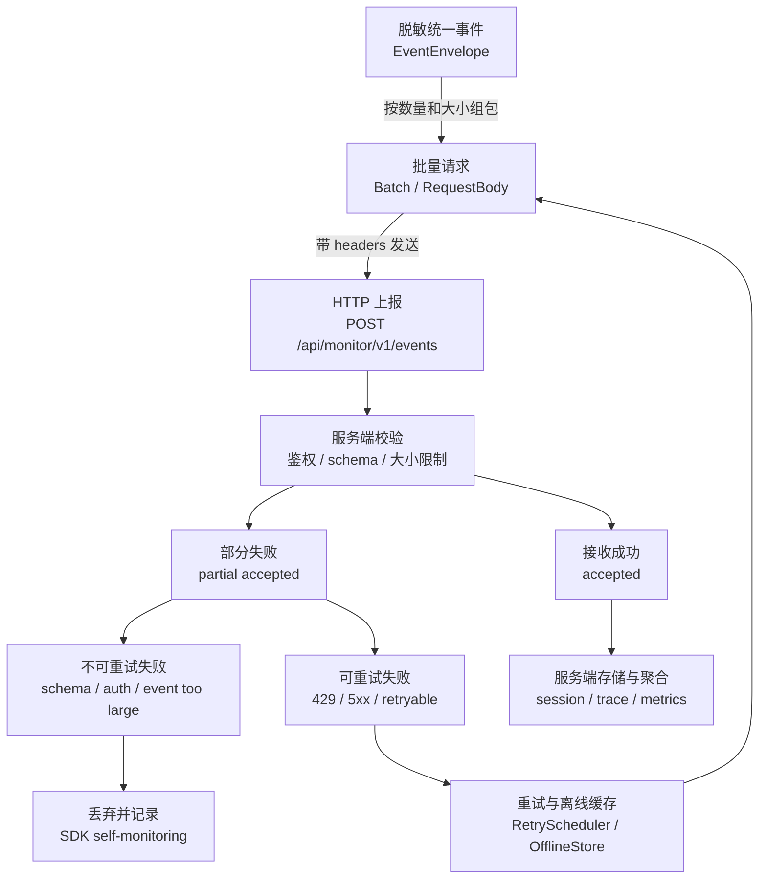

# 服务端协议

## 目标

服务端协议负责接收 SDK 统一 event envelope，并支持批量上报、鉴权、兼容、重试、聚合、告警和企业质量治理。

协议基于 `flutter_monitor_core` 定义的事件模型。`flutter_monitor_sdk`、`flutter_monitor_native`、DevTools 导出、CLI/MCP 工具入口都不得定义另一套服务端协议。

服务端不应要求不同模块发送不同结构。所有 Flutter 信号、native 信号、SDK self-monitoring 信号都应通过统一 envelope 表达。

本文档描述 Phase 6 Monitor Service 的服务端协议与稳定性要求。本地 Monitor Service 实现位于 `platform/services/monitor-service`。

- **API 文档（主）**：启动 service 后访问 `http://localhost:3700/docs`（Swagger UI），或 `http://localhost:3700/docs-json`（OpenAPI JSON）。
- **数据边界（辅）**：`platform/services/monitor-service/docs/boundaries.md`（raw envelope 边界、query summary 口径等 Swagger 不便表达的内容）。

Workbench Web 通过 Vite proxy 访问 `:3700/api/*`；SDK example 直连同一 API。

服务端能力应拆成两条链路：

- 写入链路：SDK 批量上报完整 `EventEnvelope`，服务端负责鉴权、schema 校验、大小限制、幂等、重试语义和接收结果。
- 查询链路：Workbench 或工具入口按 userId、time range、sessionId、traceId、route、版本、错误和性能问题回查 session、trace、event 和聚合结果。

真实 App 默认不应无策略实时逐条上报。近实时写入本地 Workbench 或测试环境可以通过 SDK 初始化配置显式开启，但仍应使用 batch、优先级、关键时机 flush 和请求大小控制。

## Endpoint

建议默认接口：

```text
POST /api/monitor/v1/events
```

版本号位于 URL 中，event schema version 位于 header 和 body 中。URL version 表示服务端 API 版本，`schemaVersion` 表示事件模型版本。

## Headers

| Header | 必填 | 说明 |
|---|---:|---|
| `Content-Type: application/json` | 是 | 请求格式 |
| `X-App-Key` | 是 | 应用标识 |
| `X-SDK-Name` | 是 | SDK 名称 |
| `X-SDK-Version` | 是 | Flutter SDK 版本 |
| `X-Core-Version` | 是 | `flutter_monitor_core` 版本 |
| `X-Native-Version` | 否 | native plugin 版本 |
| `X-Schema-Version` | 是 | event schema 版本 |
| `X-Request-Id` | 是 | 上报请求 ID |
| `Authorization` | 否 | 服务端鉴权 |
| `Content-Encoding` | 否 | gzip 等压缩方式 |

## Request Body

```json
{
  "schemaVersion": "1.0",
  "requestId": "req_001",
  "sentAt": "2026-05-24T12:00:10.000+08:00",
  "appKey": "app_xxx",
  "sdk": {
    "name": "flutter_monitor_sdk",
    "version": "1.0.0",
    "coreVersion": "1.0.0",
    "nativeVersion": "1.0.0"
  },
  "events": [
    {
      "schemaVersion": "1.0",
      "eventId": "evt_001",
      "timestamp": "2026-05-24T12:00:00.000+08:00",
      "signalType": "span",
      "name": "http.client",
      "level": "info",
      "status": "ok",
      "priority": "normal",
      "sessionId": "ses_001",
      "traceId": "trace_001",
      "spanId": "span_001",
      "parentSpanId": null,
      "resource": {},
      "context": {},
      "attributes": {
        "http.method": "GET",
        "http.url.normalized": "/api/product/{id}",
        "http.status_code": 200
      },
      "payload": {}
    }
  ]
}
```

`events` 中的每一项必须符合 `docs/event_model.md` 定义的 event envelope。

请求级 `appKey`、`sdk` 和 headers 只用于鉴权、路由、兼容校验和排查，不替代单个 event envelope 内的 `resource.app.*` 与 `resource.sdk.*`。每个事件仍应能脱离 batch 独立解析。

如果请求级元信息与事件级 `resource` 冲突，服务端应以事件级 envelope 作为事件事实源，并将冲突作为协议校验问题记录；是否拒绝整个 batch、拒绝冲突事件或仅记录 warning，由服务端兼容策略决定，但不得用请求级字段静默覆盖事件级字段。



服务端协议只接收统一 event envelope。可重试失败回到重试/离线缓存，不可重试失败必须记录 SDK 自监控，避免静默丢失。

## 批量边界

SDK 应支持按事件数量和请求体大小拆包。建议配置项：

| 配置 | 建议默认 | 说明 |
|---|---:|---|
| `maxEventsPerBatch` | 50 | 单批最大事件数 |
| `maxBytesPerBatch` | 512 KB | 单批最大请求体 |
| `maxEventBytes` | 64 KB | 单事件最大大小 |
| `compressionThresholdBytes` | 16 KB | 超过后启用 gzip |

单个事件超过 `maxEventBytes` 时，应优先裁剪 `payload` 中可裁剪字段，并记录 SDK self-monitoring。仍然超限时丢弃该事件，不应无限重试。

请求体超过服务端限制并收到 `413` 时，SDK 应拆分 batch 后重试。若拆分到单事件仍失败，应按不可重试失败处理。

## 幂等语义

`eventId` 是事件幂等键。服务端应允许同一 `eventId` 重复上报，并按幂等语义去重。

SDK 重试时不得为同一事件重新生成 `eventId`。`requestId` 只表示一次 HTTP 上报请求，不参与事件去重。同一个 batch 拆包或重试时可以使用新的 `requestId`，但事件自身的 `eventId` 必须保持不变。

## Response Body

### 成功

```json
{
  "code": 0,
  "message": "ok",
  "accepted": 10,
  "rejected": 0,
  "retryAfterMs": null,
  "errors": []
}
```

### 部分成功

```json
{
  "code": 207,
  "message": "partial accepted",
  "accepted": 8,
  "rejected": 2,
  "retryAfterMs": null,
  "errors": [
    {
      "eventId": "evt_invalid",
      "code": "SCHEMA_INVALID",
      "message": "missing sessionId",
      "retryable": false
    },
    {
      "eventId": "evt_retry",
      "code": "SERVER_BUSY",
      "message": "temporary shard unavailable",
      "retryable": true
    }
  ]
}
```

### 限流

```json
{
  "code": 429,
  "message": "rate limited",
  "accepted": 0,
  "rejected": 10,
  "retryAfterMs": 30000,
  "errors": []
}
```

### Schema 不兼容

```json
{
  "code": 400,
  "message": "unsupported schema major version",
  "accepted": 0,
  "rejected": 10,
  "errors": [
    {
      "code": "SCHEMA_UNSUPPORTED_MAJOR",
      "message": "schemaVersion 2.0 is not supported",
      "retryable": false
    }
  ]
}
```

### 鉴权失败

```json
{
  "code": 401,
  "message": "auth failed",
  "accepted": 0,
  "rejected": 10,
  "errors": [
    {
      "code": "AUTH_FAILED",
      "message": "invalid token",
      "retryable": false
    }
  ]
}
```

## 错误码

| 错误码 | 是否重试 | 说明 |
|---|---:|---|
| `SCHEMA_INVALID` | 否 | 事件结构或字段不符合 schema |
| `SCHEMA_UNSUPPORTED_MAJOR` | 否 | 服务端不支持该 major schema |
| `AUTH_FAILED` | 否 | 鉴权失败 |
| `RATE_LIMITED` | 是 | 服务端限流，按 `retryAfterMs` |
| `PAYLOAD_TOO_LARGE` | 条件 | batch 过大，拆包后重试 |
| `EVENT_TOO_LARGE` | 否 | 单事件过大，裁剪失败后丢弃 |
| `SERVER_BUSY` | 是 | 服务端临时不可用 |
| `SERVER_ERROR` | 是 | 服务端错误 |

## HTTP 状态码

| HTTP 状态码 | 处理方式 |
|---|---|
| 2xx | 成功或部分成功，按 body 判断事件级结果 |
| 400 | 请求或 schema 错误，不重试 |
| 401/403 | 鉴权失败，不重试，记录 SDK self-monitoring |
| 413 | 请求过大，拆包后重试 |
| 429 | 限流，按 `retryAfterMs` 重试 |
| 5xx | 服务端异常，可重试 |

若服务端使用 HTTP `207` 表示部分成功，response body 仍应使用本文档的部分成功结构。若服务端统一使用 HTTP `200` 表示接收成功但部分事件被拒绝，也必须通过 `accepted`、`rejected` 和 `errors` 表达事件级结果。

## 重试策略与事件优先级

SDK 应支持：

- 指数退避；
- 最大重试次数；
- 最大队列长度；
- 最大离线缓存大小；
- 事件优先级，即 event envelope 的 `priority` 字段；
- App 退出前尽力 flush；
- 网络恢复后重试；
- partial failure 只重试 `retryable = true` 的事件。

重试边界：

- 网络错误、超时、429、5xx 和事件级 `retryable = true` 可以重试。
- 400、401、403、schema invalid、鉴权失败和单事件超限默认不重试。
- 重试必须保持原始 `eventId`。
- 重试队列达到上限时，应优先保留高优先级事件，并记录丢弃计数。
- App 退出前 flush 是尽力语义，不保证所有低优先级事件都成功上报。

客户端侧的具体默认参数（队列上限、批量大小、flush 间隔、退避区间、采样率等）由 `MonitorProductionPolicy` 定义，三种预设（default / localLive / conservative）的完整取值表见 `docs/signal_collection.md` 的"输出模式行为与接入配置"章节，本文不重复维护。

`priority` 来自统一 event envelope，服务端和 SDK 队列都不应使用另一套优先级协议。采集器可以提供 priority suggestion，但最终值应由 pipeline 写入 envelope。

优先级建议：

| 优先级 | 事件 |
|---|---|
| critical | fatal error、native crash、OOM、ANR、SDK self-monitoring critical |
| high | error、关键卡顿、关键慢启动、关键慢页面、memory pressure、native memory pressure、失败的 SDK lifecycle flush |
| normal | page trace、http span、custom trace、成功的 SDK lifecycle flush |
| low | 普通 breadcrumb、普通 log、普通 memory sample |

采样和限流不应破坏 critical/high 事件的问题定位链路。

## Schema 兼容

服务端必须识别 `schemaVersion`。

兼容策略：

- patch version 不破坏字段语义；
- minor version 可新增字段；
- major version 可改变结构；
- 服务端应能拒绝不支持的 major version；
- SDK 应能记录协议拒绝原因。

服务端拒绝不支持的 schema major version 时，应返回 `SCHEMA_UNSUPPORTED_MAJOR`。SDK 收到后不应重试同一批事件，但应记录 SDK self-monitoring，便于开发者发现版本不兼容。

## 隐私与安全

协议层应支持：

- HTTPS；
- 鉴权 token；
- 敏感字段脱敏；
- URL normalize；
- request/response body 默认不上报；
- payload 大小限制；
- payload 裁剪标记应使用 `payload.truncated` 和 `payload.truncated.reason`；
- 用户标识匿名化；
- 环境隔离；
- native crash payload 脱敏。

服务端协议不应依赖未脱敏字段完成核心聚合。聚合字段应来自 `docs/event_model.md` 的字段注册表，例如 `http.url.normalized`、`context.route.name`、`context.module.name`、`resource.app.appVersion`、`resource.device.deviceTier` 和 `context.network.type`。

服务端默认不应把未注册 `attributes` 当作索引字段。若未来需要扩展字段索引，必须先进入字段注册和兼容策略，而不是由 SDK、native plugin 或工具入口临时约定。

## Native 信号上报

Native 信号必须通过统一 envelope 上报。

特殊要求：

- native crash、OOM、ANR 可能发生在异常生命周期，SDK 应尽力写入离线缓存。
- native plugin 不得绕过 `flutter_monitor_sdk` pipeline 使用独立 HTTP 协议。
- 如果异常发生时无法拿到完整 context，应提供 `context.missing = true` 和 `context.missingReason`。
- native 信号应保留 `sessionId`、`traceId` 和 breadcrumbs；无法保留时必须说明原因。
- `payload.breadcrumbs` 中的 breadcrumb item 可以携带 `eventId`、`sessionId`、`traceId`、`spanId` 和 `route`，服务端可用这些 ID 回查完整 envelope，但不应依赖 breadcrumb payload 中的长错误文本、堆栈或嵌套 breadcrumbs。

## Remote Config 预留

服务端可在成功响应中预留远程配置：

```json
{
  "code": 0,
  "message": "ok",
  "accepted": 10,
  "rejected": 0,
  "remoteConfig": {
    "version": "cfg_001",
    "sampling": {
      "defaultRate": 0.1,
      "errorRate": 1.0,
      "nativeCrashRate": 1.0
    },
    "rateLimit": {
      "maxEventsPerMinute": 120
    },
    "privacy": {
      "allowRawUrl": false,
      "allowRequestBody": false
    },
    "signals": {
      "memory.sample": true,
      "native.anr": true,
      "native.crash": true
    }
  }
}
```

Remote config 是可选能力。SDK 不应依赖 remote config 才能安全运行；默认配置必须隐私安全、流量克制。

客户端只暴露三种输出模式：`consoleOnly`、`localLive` 和 `production`。服务端 remote config 可以修改模式、collector 开关、采样、限流、queue、batch、flush 和 retry 参数，但这些参数仍是 SDK production policy 的输入，不是新的事件模型。配置必须包含版本号；如设置过期时间，SDK 应在过期后回退到本地默认或上一套仍有效配置，并记录 `sdk.config.applied`。

生产上报必须使用 batch。SDK 根据服务端响应执行确定动作：

- 2xx：ack 已接受事件；
- 400/401/403：不可重试，按 `non_retryable_rejected` 记录 drop；
- 413：先拆分 batch 或裁剪单事件 payload，仍失败则按 priority/drop policy 丢弃；
- 429：按 `retryAfterMs` 或 `Retry-After` 计划重试；
- 5xx、超时、断网：指数退避加 jitter，保留队列。
- 超过 `maxRetryAttempts`：按事件各自的累计重试次数判定，ack 后按 `retry_exhausted` 记录 drop；同一 batch 中重试次数未超限的事件应重新入队，不得被旧事件连坐；
- 超过 `maxEventAge`：从队列移除，并按 `expired` 记录 drop。

SDK self-monitoring 使用统一 `sdk.*` envelope 上报，字段包括 `sdk.output.mode`、`sdk.queue.*`、`sdk.batch.*`、`sdk.flush.*`、`sdk.retry.*`、`sdk.drop.*`、`sdk.health.*` 和 `sdk.config.*`。drop/retry/flush 默认以 `sdk.health.report` 周期摘要 + 边沿事件表达，见 `docs/event_model.md`。服务端和 Workbench 不应根据 HTTP 响应或 UI 状态重新发明另一套 drop/retry/queue 协议。

## 服务端聚合维度

服务端应支持按以下维度查询和聚合：

- `context.user.userId` + time range，用于 QA/用户维度 session 检索；
- `resource.app.appVersion`；
- `resource.app.buildNumber`；
- `resource.app.environment`；
- `resource.app.channel`；
- `resource.app.flavor`；
- `context.release.featureFlags`；
- `context.route.name`；
- `context.module.name`；
- `context.module.scene`；
- `resource.device.deviceTier`；
- `resource.device.osVersion`；
- `context.network.type`；
- `context.user.cohort`；
- `sessionId`；
- `traceId`；
- `context.native.platform`；
- `memory.pressure_level`。

`context.user.userId` 是推荐增强上下文。未提供 userId 的 App 仍应能按时间、版本、页面、错误、慢请求、卡顿、启动问题、sessionId、traceId 和 eventId 查询；服务端不得伪造用户维度。

## 服务端派生指标

服务端应基于统一事件模型派生：

- 冷启动/热启动耗时分位数；
- 页面耗时分位数；
- API 耗时分位数；
- 页面卡顿率；
- 错误率；
- native crash / ANR / OOM rate；
- crash/session impact；
- 内存增长趋势；
- 影响用户数；
- 版本退化；
- `context.release.featureFlags` 差异；
- 弱网失败率；
- 低端设备性能表现。

服务端不应要求 SDK 上报另一套独立聚合指标。
