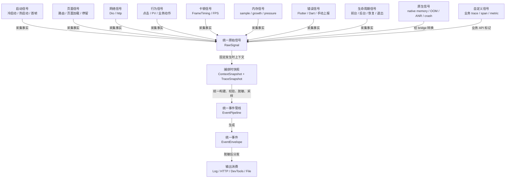

# 信号采集设计

## 目标

本文档定义 Flutter Monitor 各类信号的采集来源、触发时机、链路关联、字段映射、限制和降级策略。

职责边界：

- `docs/architecture.md` 定义代码架构和模块边界。
- `docs/event_model.md` 定义事件 schema 和字段规范。
- 本文档定义信号如何被采集并转换为 raw signal。

采集器只负责捕获事实，不直接构建最终 event envelope，不直接上报，不做采样、重试、隐私过滤和服务端协议适配。最终 envelope 由 pipeline 统一构建。

## 总流程

```text
Flutter / Native source
  -> Collector / NativeBridge
  -> RawSignal
  -> ContextSnapshot
  -> TraceSnapshot
  -> EventPipeline
  -> EventEnvelope
  -> Outputs
```



所有信号都先归一为 raw signal，再由 pipeline 统一补上下文、链路关系和协议字段。采集器不直接上报，也不自行生成最终 envelope。

采集设计必须回答：

- 信号从哪里来？
- 何时触发？
- 生成 trace、span、metric、breadcrumb、error 还是 sdk event？
- 如何关联 `sessionId`、`traceId`、`spanId`、`context.route.*`、`context.module.*` 和 `payload.breadcrumbs`？
- 哪些字段进入 attributes，哪些进入 payload？
- 采不到时如何降级？
- 对性能、隐私和稳定性有什么影响？

## Collector 通用契约

所有 collector 都应遵守：

- 输出 raw signal，不输出最终 event envelope。
- 捕获时记录发生时间和必要原始数据。
- 捕获时请求 context snapshot 和 trace snapshot，避免异步 flush 时上下文漂移。
- 不读取或保存 forbidden 隐私数据。
- 不直接调用 HTTP output。
- 不自行生成第二套 session、trace 或 span ID。
- 采集失败时生成 SDK self-monitoring raw signal。

Raw signal 至少应包含：

```text
source
name
signalType suggestion
timestamp
duration / start / end
level / status
attributes
payload
context snapshot
trace snapshot
priority suggestion
```

`priority suggestion` 不是采集器私有协议；它应由 pipeline 映射为统一 event envelope 的 `priority` 字段，默认值为 `normal`。

## 启动采集

### 采集来源

Flutter 层启动采集来源：

- 调用方传入的 `appStartTime`。
- `WidgetsFlutterBinding.ensureInitialized()` 之后的 SDK 初始化时间。
- `WidgetsBinding.instance.addPostFrameCallback` 观察首帧。
- 可选业务 API 标记页面可交互时间。
- lifecycle resumed 事件用于热启动。

Native 增强来源：

- Android/iOS 进程启动时间。
- native app lifecycle 回调。
- native 首屏或 engine attach 相关时间点，视平台能力而定。

### 触发时机

冷启动：

- App 进程创建到 Flutter 首帧/可交互。
- SDK 应在 `FlutterMonitorSDK.init` 时接收或记录启动起点。
- 首帧在第一个 `addPostFrameCallback` 中标记。

热启动：

- App 从后台恢复到前台。
- 通过 lifecycle paused/resumed 或 native lifecycle 识别。
- 恢复后首个可交互点可由 SDK heuristic 或业务 API 标记。

### 生成事件

- `trace app.cold_start`
- `trace app.hot_start`
- `span sdk.init`
- `span app.first_frame`
- `span app.interactive`
- `breadcrumb app.lifecycle`

### 链路关联

- 冷启动 trace 应归属于当前 session。
- 热启动 trace 应关联恢复后的 session 或当前 session activity window。
- 页面首屏相关 span 可作为启动 trace 和首个 page trace 的关联点。
- 启动期间的 HTTP、错误、卡顿、内存采样应关联 active startup trace。

### 字段映射

推荐字段：

- `app.start.type`
- `event.phase`
- `app.first_frame_ms`
- `app.interactive_ms`
- `sdk.init.duration_ms`
- `context.lifecycle.previousState`
- `native.start.elapsed_ms`

### 限制与降级

- Flutter 层无法完整覆盖进程最早 native 阶段。
- 如果业务没有标记 interactive，只能提供 first frame 或 SDK heuristic。
- 如果 `appStartTime` 缺失，应生成 `context.missingReason = app_start_time_missing`。
- Native 启动时间是增强能力，不应成为基础 SDK 必需依赖。

## 页面与路由采集

### 采集来源

- `NavigatorObserver` / `RouteObserver`。
- `Route.settings.name`。
- 页面级 wrapper，例如 `PageRenderMonitor`。
- 未来可支持 GoRouter、AutoRoute、GetX 等 router integration。
- 可选统一上下文入口补充 module/scene；该能力不作为基础接入前置条件。

### 触发时机

- route push / pop / replace。
- 页面首帧。
- 页面可交互。
- 页面停留结束。
- route stack 变化。

### 生成事件

- `trace page.visit`
- `span route.push`
- `span page.load`
- `span page.first_frame`
- `span page.interactive`
- `metric page.stay`
- `breadcrumb page.view`

### 链路关联

- route push 创建或更新当前 route context。
- page visit trace 作为页面活动窗口，page load span 作为页面加载阶段。
- 页面依赖的 HTTP、jank、error、memory sample 应关联当前 page trace。
- route pop/replace/page stay 应结束页面 activity window。

### 字段映射

推荐字段：

- `context.route.name`
- `context.route.source`
- `context.module.name`
- `context.module.scene`
- `page.instance_id`
- `page.from`
- `page.to`
- `page.load_ms`
- `page.first_frame_ms`
- `page.interactive_ms`

页面停留时长使用 `metric page.stay` 的 `durationMs`，不再使用独立 attributes 字段。

### 限制与降级

- 匿名路由可能没有稳定 route name。
- 嵌套路由、tab 页面和业务态可能无法仅靠 route name 区分。
- module/scene 属于可选增强上下文。SDK 不应要求业务方在每个页面或代码模块手动设置 module 才能获得基础链路。
- 如果未来提供 `setContext(module: ..., scene: ...)` 一类能力，应定位为增强检索维度，而不是普通接入必填步骤。
- route stack 不可用时应保留当前 route 和 missing reason。

## 网络采集

### 采集来源

- Dio interceptor。
- `http.Client` wrapper。
- 未来可选 native/network plugin。

### 触发时机

- request start。
- response received。
- error thrown。
- retry / cache 命中，视接入能力而定。

### 生成事件

- `span http.client`
- 可选 breadcrumb：`http.request.start`、`http.request.end`

### 链路关联

- 如果有 active page trace，HTTP span 应作为 page trace 的子 span。
- 如果由用户 action 触发，应优先关联 action trace。
- 冷启动期间请求应关联 startup trace。
- 请求错误可追加 breadcrumb，并与后续 error 关联。

### 字段映射

推荐字段：

- `http.method`
- `http.url.normalized`
- `http.status_code`
- `http.success`
- `http.error_type`
- `http.retry_count`
- `http.cache_status`
- `request.size_bytes`
- `response.size_bytes`

### 限制与降级

- `http.error_type` 必须由 SDK 归一为 `http_status`、`connection_error`、`timeout`、`cancelled`、`bad_certificate`、`unknown_network` 等 canonical 值，不得透传具体网络库 enum。
- 原始 URL、query、body 默认禁止上报。
- 失败请求的原始错误文本必须有界裁剪；payload 可保留短摘要、`error.truncated` 和 `error.original_length`，不能把 Dio/http 的长异常文本完整写入 raw JSON。
- normalized URL 可能需要业务配置 route template。
- streaming body 大小可能不可得。
- retry/cache 信息依赖具体网络库能力。
- 网络采集不应修改业务请求语义。

## 错误采集

### 采集来源

- `FlutterError.onError`。
- `PlatformDispatcher.instance.onError`。
- `runZonedGuarded`，如果 SDK 接管或提供建议接入。
- 手动上报 error API。
- Native crash bridge。

### 触发时机

- Flutter framework error。
- Dart uncaught error。
- 手动捕获业务异常。
- native crash / OOM / ANR 信号进入 bridge。

### 生成事件

- `error error.flutter`
- `error error.dart`
- `error native.crash`
- `error native.oom`
- `error native.anr`

### 链路关联

- 错误必须尽量关联当前 `sessionId`、`context.route.*` / `context.module.*`、active `traceId` / `spanId`。
- 错误 payload 应携带 recent breadcrumbs。
- native 异常若无法获取完整上下文，应保留可用 `sessionId` / `context.*` 并标记 missing reason。

### 字段映射

推荐字段：

- `error.type`
- `error.mechanism`
- `error.handled`
- `error.fatal`
- `error.thread`
- `native.crash.type`
- `native.oom.reason`
- `native.anr.duration_ms`

推荐 payload：

- message；
- stack；
- library/framework context；
- breadcrumbs；
- native details，脱敏后可选。

### 限制与降级

- 不能吞掉 Flutter 默认错误输出。
- 同一错误需要去重或限流，避免错误风暴。
- crash 时异步上报不可靠，应优先写离线缓存。
- native crash dump 可能包含敏感信息，默认不上传原始 dump。

## 行为采集

### 采集来源

- 页面访问/PV。
- 业务主动埋点 API：`FlutterMonitorSDK.track(...)`。

### 触发时机

- tap。
- scroll。
- tab switch。
- dialog show/dismiss。
- 业务关键动作，例如 checkout、profile save、search、share。

### 生成事件

- `breadcrumb ui.scroll`
- `breadcrumb business.action`

### 链路关联

- 普通行为进入 breadcrumb store。
- 行为应关联当前 `context.route.*`，并在可用时携带可选 `context.module.*` / `context.module.scene`。
- 后续 HTTP、jank、error 可使用 recent breadcrumbs 还原上下文。
- 普通 breadcrumb 的 payload 不应自动继承用户属性或全局自定义上下文；用户和业务上下文应保留在 `context` 或显式业务字段中。

### 字段映射

推荐字段：

- `ui.target`
- `ui.action`
- `business.action`
- `business.result`

### 限制与降级

- 不应默认全量采集所有点击。
- 控件标识应由业务显式传入，避免从 widget tree 推断敏感文本。
- 普通业务接入不应直接调用 `addBreadcrumb` 或使用 `FieldPaths`；SDK 内部负责将 `track` 参数映射到 canonical fields。
- 高频行为需采样或限流。

## 卡顿与帧采集

### 采集来源

- `SchedulerBinding.instance.addTimingsCallback`。
- `FrameTiming`。
- 设备刷新率 / frame budget。
- 可选 native frame/render 信号。

### 触发时机

- 每批 frame timing 回调。
- 连续慢帧达到阈值。
- FPS 或 stability 低于阈值。
- 页面加载或关键 action 期间出现慢帧。

### 生成事件

- `metric ui.jank.sequence`
- 可选 breadcrumb：`ui.jank.sequence`
- 可选 span：关键 trace 内的 `ui.render_block`

### 链路关联

- 卡顿应关联当前 `sessionId`、`context.route.*` / `context.module.*`、active page trace 或 action trace。
- 卡顿事件应携带裁剪后的相关 breadcrumbs，优先选择同 trace / 同 route 足迹。
- 卡顿前后的 HTTP、memory、native signals 可用于定位原因。

### 字段映射

推荐字段：

- `jank.count`
- `frame.max_ms`
- `frame.avg_ms`
- `frame.budget_ms`
- `frame.fps`
- `frame.stability`
- `frame.p50_ms`
- `frame.p90_ms`
- `frame.p99_ms`
- `resource.device.deviceTier`

### 限制与降级

- Flutter frame timing 可能无法覆盖所有平台渲染问题。
- 主线程长时间阻塞时，回调可能延后，只能看到阻塞后的超长帧。
- 高频 frame 数据不能全量上报，应聚合为序列或窗口统计。
- 阈值应考虑刷新率和设备等级。

## 内存采集

### 采集来源

Flutter/Dart 层：

- Dart/Flutter 可获得的 heap/external 线索，视运行环境能力而定。
- 页面切换、生命周期变化、关键 trace 前后采样。
- SDK 自身队列、缓存和 offline store 状态。

Native 层：

- Android/iOS 进程 RSS。
- native heap / graphics / VM 相关内存，视平台能力而定。
- low memory warning / memory pressure。

### 触发时机

- session start。
- route enter/leave。
- app foreground/background。
- jank sequence 后。
- error/native crash/OOM 前后，尽力采集。
- 固定低频采样窗口。
- memory pressure signal。

### 生成事件

- `metric memory.sample`
- `metric memory.growth`
- `metric memory.pressure`
- `metric memory.leak.suspect`
- `metric native.memory.sample`
- `metric native.memory.pressure`

### 链路关联

- memory sample 应关联当前 `sessionId` 和 `context.route.*` / `context.module.*`。
- 页面退出后持续增长可关联上一页面 activity window。
- memory pressure 应进入统一 metric 或 error 链路，并可被保存到 recent breadcrumbs 快照中帮助解释后续卡顿、错误或 OOM。
- native memory 通过 bridge 进入同一 pipeline。

### 字段映射

推荐字段：

- `memory.rss_mb`
- `memory.heap_used_mb`
- `memory.heap_capacity_mb`
- `memory.external_mb`
- `memory.native_used_mb`
- `memory.growth_mb`
- `memory.growth_duration_ms`
- `memory.pressure_level`
- `memory.sample_source`

Native plugin 采集到的内存也使用 `memory.native_used_mb` 和 `memory.pressure_level`，并通过 `memory.sample_source = native`、`name = native.memory.sample` / `native.memory.pressure` 或 `context.native.*` 表明来源。采集器不应新增 `native.memory.*` 平行字段表达同一个数值。

### 限制与降级

- Flutter 层内存能力有限，不能保证跨平台一致。
- 内存泄漏只能表达为 suspect。
- 业务层不得主动上报 `memory.growth`、`memory.pressure` 或 `memory.leak.suspect`；这些事件必须由 SDK collector/native bridge 根据采样、平台 warning 或阈值判断生成。
- example 只能制造真实内存压力、持有、释放、jank 或 lifecycle 场景来验证自动采集，不应通过 SDK public API 直接写入 memory 事件。
- 内存采样频率必须克制，避免 SDK 自身增加性能负担。
- native memory 依赖可选 native plugin，基础 SDK 不强依赖。
- OOM 前可能无法完整 flush，应依赖离线缓存和 native bridge 尽力保存。

## 生命周期采集

### 采集来源

- `AppLifecycleListener`。
- `WidgetsBindingObserver`。
- Native lifecycle bridge。

### 触发时机

- resumed。
- inactive。
- paused。
- detached。
- hidden。
- app exit flush。

### 生成事件

- `breadcrumb app.lifecycle`
- `span app.resume`
- `span app.exit_flush`
- `metric app.foreground_duration`

### 链路关联

- lifecycle 影响 session 切分。
- resumed 可创建 hot start trace。
- paused/detached 应触发尽力 flush。
- lifecycle breadcrumb 应帮助解释请求中断、错误、卡顿和 native 信号。

### 字段映射

推荐字段：

- `context.lifecycle.state`
- `context.lifecycle.previousState`
- `durationMs`
- `app.exit_flush.success`

### 限制与降级

- 移动平台退出时机不稳定，exit flush 只能尽力。
- 后台限制可能导致上传失败，应依赖离线缓存。
- native lifecycle 可补充 Flutter lifecycle 缺口。

## Native 信号采集

Native 信号采集是 Flutter-only 链路的增强，不是主 SDK 的基础依赖。完成启动、页面、HTTP、错误、卡顿、行为和基础 lifecycle 后，Flutter 层仍存在一些天然盲区：

- Flutter/Dart 层难以稳定获得进程 RSS、native heap、graphics memory 或 VM 之外的内存。
- Android/iOS low memory warning 和 memory pressure 往往发生在 native 层，Flutter 层可能只能看到后续卡顿、错误或进程退出。
- OOM、ANR 和 native crash 不属于 Dart/Flutter error collector 的稳定捕获范围。
- 一些生命周期线索发生在 Flutter engine 可观测点之前或之外。
- 仅靠 Flutter 层 raw JSON 难以解释“为什么某次卡顿、页面慢或崩溃前设备处于内存压力状态”。

`flutter_monitor_native` 的价值是补充这些线索，并把它们放回同一条 session timeline。native signal 只有进入 SDK pipeline 并补齐统一 context 后，才算完成采集；native 包自身不形成独立监控链路。

### 采集来源

- `flutter_monitor_native` plugin。
- Android platform callbacks。
- iOS platform callbacks。
- MethodChannel / EventChannel / Pigeon 等 bridge 技术。第一阶段优先使用 MethodChannel 请求 snapshot，使用 EventChannel 接收异步 native signal。

### 触发时机

- native memory sample。
- memory pressure / low memory warning。
- native lifecycle change。
- OOM 线索。
- ANR 线索。
- native crash 线索。

### 生成事件

- `metric native.memory.sample`
- `metric native.memory.pressure`
- `breadcrumb native.warning`
- `error native.oom`
- `error native.anr`
- `error native.crash`

### 链路关联

- native signal 应尽量使用 SDK 当前 `sessionId` / `context.*`。
- native bridge 应尽量获取或缓存最近 `sessionId`、`traceId`、`context.route.*` / `context.module.*` 和 `payload.breadcrumbs`。
- 异常生命周期拿不到上下文时，必须标记 missing reason。
- native signal 不得绕过 pipeline 直接 HTTP 上报。

### 字段映射

推荐字段：

- `context.native.platform`
- `native.signal`
- `native.thread`
- `native.thread_id`
- `native.crash.type`
- `native.anr.duration_ms`
- `native.oom.reason`
- `memory.native_used_mb`
- `memory.pressure_level`

### 限制与降级

- native crash/OOM/ANR 的可靠采集复杂，第一阶段可先定义 schema 和 bridge。
- 原始 crash dump 默认不上报。
- 异常生命周期中无法保证完整 envelope，可先持久化 native raw signal，再由下次启动补全和上报。
- native plugin 是可选增强，不应增加主 SDK 基础接入成本。
- 未接入 `flutter_monitor_native` 时，SDK 应继续保留 Flutter-only 能力，并将 `context.native.available` 设为 `false` 或在需要时标记 `context.missingReason = native_bridge_unavailable`。
- 用户忘记添加 native 包、没有注册 bridge、平台未实现、channel 注册失败、Web/desktop 不支持 native 能力等情况，都应走同一降级路径。
- 如果 bridge 显式启用但不可用，应产生 SDK self-monitoring 事件，不能让业务 App 因 native 监控缺失而崩溃。
- native memory、pressure、OOM、ANR 和 crash 线索可能不完整。事件必须表达证据来源和 missing reason，不能暗示 SDK 已经拿到完整原始 dump 或确定性根因。

#### 常见场景有这些：

- App 只想做 Flutter 层监控，不想引入 native plugin。
- Web/desktop 项目没有 Android/iOS native 能力。
- 企业项目暂时不允许新增 native 依赖。
- 用户忘了在 pubspec.yaml 加 flutter_monitor_native。
- 用户加了包，但没有在 FlutterMonitorSDK.init 里注册 bridge。
- 插件在某个平台没实现，比如只实现 Android，iOS 返回 no-op。
- native channel 注册失败或运行时不可用。
- OOM/crash 发生得太早，native 也只能下次启动补交线索。

## 业务主动埋点采集

### 采集来源

- 业务 API：`FlutterMonitorSDK.track(...)`。
- `startTrace` / `startSpan` / `addBreadcrumb` 如保留，应定位为高级诊断 API，不用于普通业务埋点。

普通真实 App 接入的业务面应尽量收敛为：

- `track(...)`：记录一次关键业务动作。
- 未来统一上下文入口，例如 `setContext(...)`：设置后续事件的通用排查上下文。

业务方不应为了常规排查去理解或拼装 `FieldPaths`、`RawSignal`、`EventEnvelope`、trace/span/breadcrumb store、attributes/payload。

### 触发时机

- 用户触发关键业务动作。
- 业务动作成功、失败、取消或开始。
- 业务错误、降级或关键状态变化。

### 生成事件

- `breadcrumb <action>`，其中 `<action>` 来自 `track(action: ...)`。

### 链路关联

- `track` 事件默认归属当前 session、当前 route context 和当前 active trace；module/scene 仅在上下文已存在时携带。
- pipeline 会将 `track` 事件加入 breadcrumb store，使后续 error、jank、failed HTTP 可携带它作为上下文。
- 业务层不需要知道 breadcrumb store，也不需要手动调用 `addBreadcrumb` 来实现常规埋点。

### 字段映射

`track` 参数由 SDK 内部映射：

- `action` -> `name`、`business.action`
- `result` -> `business.result`、`status`
- `target` -> `ui.target`
- `level` -> envelope `level`
- `error` -> `payload.error.message`
- `properties` -> payload 中的业务详情

`properties` 是本次业务动作的诊断详情，默认不作为主要聚合索引。业务方需要按用户排查 session 时，应通过统一上下文入口写入 `context.user.userId`，而不是把 userId 放进 `track.properties`。

### 限制与降级

- `action` 必须稳定，动态业务 ID 不得进入 action/name。
- `properties` 仍必须经过隐私过滤，不得包含 token、cookie、原始请求体、精确位置等 forbidden 字段。
- `FieldPaths` 是 core/schema 内部契约，不暴露给普通业务接入。

## 通用上下文采集

通用上下文用于帮助 QA 和开发者从人类排查入口找到 session。它不是一次业务动作，也不应该通过 `track.properties` 承担。

### 采集来源

- SDK 自动采集：app、device、runtime、route、network、lifecycle 等。
- 业务可选提供：`userId`、`userType`、`userTags`、`cohort`。
- module/scene 如未来支持，只作为可选增强上下文。

### 推荐 API 方向

目标 API 应收敛到统一上下文语义，例如：

```dart
FlutterMonitorSDK.setContext(
  userId: 'user_001',
  userType: 'qa',
);
```

历史 API 归位：

- `setUserId`、`setUserInfo` 应归并到统一上下文入口。
- `setCustomData` 不应作为可索引上下文来源；如保留，应明确映射到标准 context 或 payload-only 详情。
- `userProperties`、任意 custom map 不得默认提升为 `attributes` 或服务端索引。

### 查询影响

- 提供 `context.user.userId` 后，Workbench 可以按 `userId + time range` 查找 session。
- 未提供 userId 时，SDK 仍必须能采集基础链路，Workbench 仍可按时间、版本、页面、错误、慢请求、卡顿、启动问题和 session/trace/event ID 查询。
- 不考虑未登录用户的特殊链路推断；没有 userId 就不支持按用户维度查询。

## 隐私、采样与性能开销

采集阶段应遵守：

- 不主动读取 forbidden 字段。
- 高频信号先聚合再进入 pipeline。
- 默认关闭原始 URL、request body、response body。
- 行为采集不推断用户输入文本。
- 内存、帧、breadcrumb 采集需要限流。
- SDK 自身队列和缓存需要 self-monitoring。

采样和限流由 pipeline 统一执行。collector 可以提供 priority suggestion，由 pipeline 映射为 event envelope 的 `priority`。collector 不自行丢弃 critical/high 事件，除非为保护 App 稳定性必须降级。

## 限制与降级策略

通用降级：

- 缺少 route：保留 `sessionId` 和 `context.module.*`，标记 route missing。
- 缺少 session：仅允许 pre-session、sdk self-monitoring 或异常生命周期 native 事件。
- 缺少 native：继续保留 Flutter 层信号。
- 缺少 network size/cache/retry：字段省略，不用伪造。
- payload 过大：裁剪 payload，保留 attributes 和关键上下文。
- 输出失败：进入 retry/offline store，并记录 self-monitoring。

任何降级都应尽量保留：

- `eventId`
- `timestamp`
- `signalType`
- `name`
- `sessionId`，如果可得
- `resource`
- `context.missingReason`
- 关键 attributes
