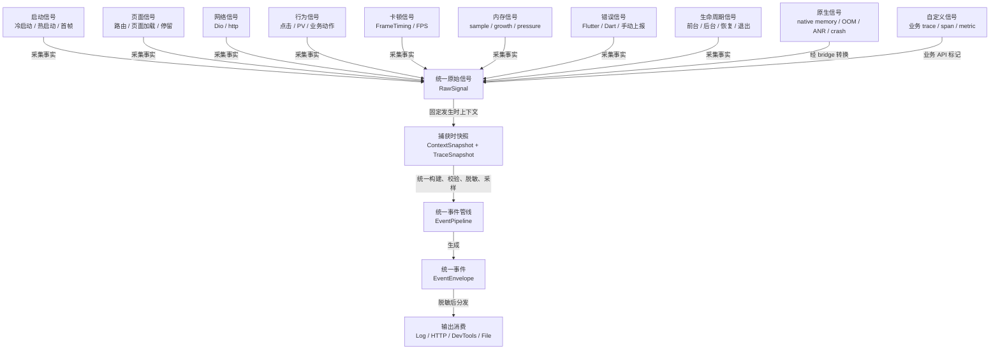

# 信号采集设计

## 目标

本文档定义 Flutter Monitor 各类信号的采集来源、触发时机、链路关联、字段映射、限制和降级策略。

职责边界：

- `docs/architecture.md` 定义代码架构和模块边界。
- `docs/event_model.md` 定义事件 schema 和字段规范。
- 本文档定义信号如何被采集并转换为 raw signal。

采集器只负责捕获事实，不直接构建最终 event envelope，不直接上报，不做采样、重试、隐私过滤和服务端协议适配。最终 envelope 由 pipeline 统一构建。

## 总流程

```text
Flutter / Native source
  -> Collector / NativeBridge
  -> RawSignal
  -> ContextSnapshot
  -> TraceSnapshot
  -> EventPipeline
  -> EventEnvelope
  -> Outputs
```



所有信号都先归一为 raw signal，再由 pipeline 统一补上下文、链路关系和协议字段。采集器不直接上报，也不自行生成最终 envelope。

采集设计必须回答：

- 信号从哪里来？
- 何时触发？
- 生成 trace、span、metric、breadcrumb、error 还是 sdk event？
- 如何关联 `sessionId`、`traceId`、`spanId`、`context.route.*`、`context.module.*` 和 `payload.breadcrumbs`？
- 哪些字段进入 attributes，哪些进入 payload？
- 采不到时如何降级？
- 对性能、隐私和稳定性有什么影响？

## Collector 通用契约

所有 collector 都应遵守：

- 输出 raw signal，不输出最终 event envelope。
- 捕获时记录发生时间和必要原始数据。
- 捕获时请求 context snapshot 和 trace snapshot，避免异步 flush 时上下文漂移。
- 不读取或保存 forbidden 隐私数据。
- 不直接调用 HTTP output。
- 不自行生成第二套 session、trace 或 span ID。
- 采集失败时生成 SDK self-monitoring raw signal。

Raw signal 至少应包含：

```text
source
name
signalType suggestion
timestamp
duration / start / end
level / status
attributes
payload
context snapshot
trace snapshot
priority suggestion
```

`priority suggestion` 不是采集器私有协议；它应由 pipeline 映射为统一 event envelope 的 `priority` 字段，默认值为 `normal`。

## 启动采集

### 采集来源

Flutter 层启动采集来源：

- 调用方传入的 `appStartTime`。
- `WidgetsFlutterBinding.ensureInitialized()` 之后的 SDK 初始化时间。
- `WidgetsBinding.instance.addPostFrameCallback` 观察首帧。
- 可选业务 API 标记页面可交互时间。
- lifecycle resumed 事件用于热启动。

Native 增强来源：

- Android/iOS 进程启动时间。
- native app lifecycle 回调。
- native 首屏或 engine attach 相关时间点，视平台能力而定。

### 触发时机

冷启动：

- App 进程创建到 Flutter 首帧/可交互。
- SDK 应在 `FlutterMonitorSDK.init` 时接收或记录启动起点。
- 首帧在第一个 `addPostFrameCallback` 中标记。

热启动：

- App 从后台恢复到前台。
- 通过 lifecycle paused/resumed 或 native lifecycle 识别。
- `resumed` 是热启动 trace 的开始点，不是结束点。
- 恢复后首帧、可交互、业务手动标记或超时降级是热启动 trace 的结束点。
- 基础 SDK 第一阶段应至少自动采集 `resumed -> next frame`，并用 `app.start.end_reason = first_frame` 标明闭合口径；后续如果业务或 native 能提供可交互点，再升级为 `interactive`。

### 生成事件

- `trace app.cold_start`
- `trace app.hot_start`
- `span sdk.init`
- `span app.interactive`（预留；基础 SDK 当前不自动生成，需业务或 native 明确提供可交互点后再启用）
- `breadcrumb app.lifecycle`

### 链路关联

- 冷启动 trace 应归属于当前 session。
- 热启动 trace 应关联恢复后的 session 或当前 session activity window。
- 启动首帧是 `app.cold_start` / `app.hot_start` trace end 上的观测字段，不再生成独立 `app.first_frame` span。
- 启动期间的 HTTP、错误、卡顿、内存采样应关联 active startup trace。
- 基础 SDK 默认把 RSS 起止值合并到 `app.cold_start` / `app.hot_start` trace end，不再采集启动帧摘要，也不为启动内存额外生成独立 trace。FPS、稳定性和慢帧等帧表现统一由页面 `page.visit` trace end 表达。

### 字段映射

推荐字段：

- `app.start.type`
- `app.start.end_reason`
- `event.phase`
- `app.first_frame_ms`
- `app.interactive_ms`（预留；仅在明确以可交互点闭合启动 trace 时填写）
- `sdk.init.duration_ms`
- `context.lifecycle.previousState`
- `native.start.elapsed_ms`
- `memory.start_rss_mb`
- `memory.end_rss_mb`
- `memory.delta_rss_mb`

### 限制与降级

- Flutter 层无法完整覆盖进程最早 native 阶段。
- 如果业务没有标记 interactive，只能提供 first frame 或 SDK heuristic。
- `app.background_duration.durationMs` 是后台停留间隔；`app.hot_start.durationMs` 是热重启耗时，不能用同一个 duration 值表达二者。
- 如果 `appStartTime` 缺失，应生成 `context.missingReason = app_start_time_missing`。
- Native 启动时间是增强能力，不应成为基础 SDK 必需依赖。

## 页面与路由采集

### 采集来源

- `NavigatorObserver` / `RouteObserver`。
- `Route.settings.name`。
- 页面级 wrapper，例如 `PageRenderMonitor`。
- 未来可支持 GoRouter、AutoRoute、GetX 等 router integration。
- 可选统一上下文入口补充 module/scene；该能力不作为基础接入前置条件。

### 触发时机

- route push / pop / replace。
- 页面首帧。
- 页面可交互（预留增强能力；基础 SDK 当前以页面首帧作为自动闭合点）。
- 页面停留结束。
- app detached 或 SDK dispose 时，尽力结束当前活跃页面。
- route stack 变化。

### 生成事件

- `trace page.visit`
- `span route.push`
- `span page.load`
- `span page.interactive`（预留；基础 SDK 当前不自动生成）
- `metric page.stay`
- `breadcrumb page.view`

### 链路关联

- route push 创建或更新当前 route context。
- `trace page.visit` 表达一次页面实例的生命周期，`span page.load` 表达页面加载阶段。
- 页面性能采集应围绕页面实例维护可见阶段：同一时刻只有一个当前可见页面，但同一页面实例可能被覆盖后再次恢复，因此可能拥有多段可见阶段。
- 页面依赖的 HTTP、jank、error、memory sample 应关联当前 page trace。基础 SDK 把页面可见阶段累计到的帧摘要和进入/退出 RSS 写入 `page.visit` trace end。
- route pop/replace/page stay 应结束被移除的页面实例；route push 会结束旧页面的当前可见阶段并开启新页面实例。
- route pop 返回到已有页面时，不创建新的页面实例，但必须用 `page.active_phase = page.resume` 和 `page.active_trigger = route_pop` 发出导航返回导致的恢复可见事实。Workbench 和 DevTools 可基于该事件把同一 `page.instance_id` 拆成多个用户导航可见区段。
- App 从后台恢复到前台时，可以用 `page.active_phase = page.resume` 和 `page.active_trigger = lifecycle_resumed` 发出当前页面重新可见事实，但它属于 lifecycle / hot start 活动，不应被展示为“返回后继续”页面区段。
- paused/hidden 不结束页面实例，但应闭合当前页面可见阶段并尽力 flush 页面级性能聚合；detached、SDK dispose 或 app exiting flush 应尽力结束活跃页面实例，并通过 payload 标明结束原因。

### 页面实例与可见阶段编排

页面链路使用三类稳定标识：

- `context.route.name`：route 类型，用于查询和聚合，例如 `/detail`。
- `context.route.fullName`：带 route 参数的业务可读完整路由，用于展示和定位，例如 `/detail?id=1`。
- `page.instance_id`：一次 route push 产生的页面实例，用于还原一次打开过程。SDK 推荐使用 route name 加单调时间或 ID，例如 `/detail_1780364621916721`。

`page.instance_id` 不应由 Workbench 或服务端补写；它是 SDK 采集事实的一部分。SDK 内部如果已经生成 `page.instance_id`，页面 trace、加载、停留、页面级内存和帧聚合都应优先围绕该实例 ID 关联。route name 可以作为查找当前栈顶页面的辅助索引，但不应作为同 route 多实例场景下的唯一事实主键。Workbench 和服务端展示应优先使用 `context.route.fullName`，没有完整路由时回退到 `context.route.name`。

以 `A -> B(id=1) -> B(id=2) -> C -> A` 为例：

```text
route 实例:
  A1  = /a_100
  B1  = /b_200
  B2  = /b_300
  C1  = /c_400

可见阶段:
  A1: A 首次可见，直到 B1 push
  B1: B1 可见，直到 B2 push
  B2: B2 可见，直到 C push
  C1: C 可见，直到 C/B2/B1 pop
  A1: A1 恢复可见
```

回到 A 时不应创建新的 A route 实例；它仍然是 `A1`。导航返回恢复阶段通过 `page.active_phase = page.resume` 和 `page.active_trigger = route_pop` 表达，页面级 FPS、慢帧和内存证据仍写回同一个页面实例的 `page.visit`。`page.visit` 的 `durationMs` 是页面实例生命周期，不等同于某一个可见区段的停留时长；调试工具展示用户操作链路时应优先按 `page.enter` / `route_pop` 触发的 `page.resume` 切分页面可见区段。

推荐的内部流转：

| 路由事件 | 页面实例动作 | 可见阶段动作 | 采集动作 |
|---|---|---|---|
| App 首个页面进入 / route push | 创建 `page.instance_id`，启动 `page.visit` | `page.active_phase = page.enter`，`page.active_trigger = route_push` | 记录进入 RSS；页面帧聚合开始；发出 `page.view` 进入足迹 |
| 新 route push | 新建新页面实例 | 旧页面以 `page.covered` 闭合，新页面以 `page.enter` 开启 | 旧页面帧聚合 flush；新页面记录进入 RSS |
| route pop | 结束被 pop 页面实例，生成 `page.stay` | 被 pop 页面以 `page.exit` 闭合；上一个页面以 `page.resume` + `route_pop` 恢复 | 被 pop 页面帧聚合 flush；被 pop 页面记录退出 RSS；发出 `route.pop` 和恢复页 `page.view` 足迹 |
| lifecycle hidden/paused | 页面实例保留 | 当前页面以 `lifecycle.background` + `lifecycle_background` 闭合 | App/page 帧聚合 flush；lifecycle 低频内存采样 |
| resumed | 页面实例保留 | 当前栈顶页面以 `page.resume` + `lifecycle_resumed` 恢复 | App/page 帧聚合重新开始；lifecycle 恢复检查；发出恢复页 `page.view` 足迹；Workbench 不因此新开页面区段 |
| detached/dispose | 尽力结束活跃页面实例 | 当前页面以 `app.dispose` 闭合 | flush 和最终采样尽力执行，不阻塞退出 |

第一阶段不要求完整支持所有 Navigator 复杂操作。`didPush`、`didPop`、`didReplace` 和 SDK dispose 是基础路径；`popUntil`、嵌套路由、tab router、匿名 route 和第三方 router 集成应通过后续适配补充，但不能改变上述 route / page instance / active window 三层语义。

### 字段映射

推荐字段：

- `context.route.name`
- `context.route.fullName`
- `context.route.source`
- `context.module.name`
- `context.module.scene`
- `page.instance_id`
- `page.active_phase`
- `page.active_trigger`
- `page.from`
- `page.from_full_name`
- `page.to`
- `page.to_full_name`
- `page.load_ms`
- `page.first_frame_ms`
- `page.interactive_ms`（预留；仅在明确采集页面可交互点时填写）
- `frame.sample_count`
- `frame.slow_count`
- `frame.dropped_count`
- `frame.refresh_rate`
- `frame.max_ms`
- `frame.avg_ms`
- `frame.budget_ms`
- `frame.fps`
- `frame.stability`
- `frame.p50_ms` / `frame.p90_ms` / `frame.p99_ms`
- `memory.enter_rss_mb`
- `memory.exit_rss_mb`
- `memory.delta_rss_mb`
- `payload.page.end_reason`

页面停留时长使用 `metric page.stay` 的 `durationMs`，不再使用独立 attributes 字段。
`page.first_frame_ms` 只应出现在以首帧闭合的 `page.load` end 事件上，不应出现在 start 事件上。基础 SDK 不再生成独立 `page.first_frame` span；首帧是页面加载阶段的观测点，不是第二条重复阶段事件。
`payload.page.end_reason` 当前标准值包括 `route_pop`、`route_replace`、`lifecycle.detached` 和 `app.dispose`。

### 限制与降级

- 匿名路由可能没有稳定 route name。
- 嵌套路由、tab 页面和业务态可能无法仅靠 route name 区分。
- module/scene 属于可选增强上下文。SDK 不应要求业务方在每个页面或代码模块手动设置 module 才能获得基础链路。
- 如果未来提供 `setContext(module: ..., scene: ...)` 一类能力，应定位为增强检索维度，而不是普通接入必填步骤。
- route stack 不可用时应保留当前 route 和 missing reason。
- 进程被系统直接杀死时，Flutter/Dart 可能没有 detached 或 dispose 回调，最终 `page.stay` 只能尽力生成；native/离线缓存可作为增强补充。

## 网络采集

### 采集来源

- Dio interceptor。
- `http.Client` wrapper。
- 未来可选 native/network plugin。

### 触发时机

- response received。
- error thrown。
- retry / cache 命中，视接入能力而定。

### 生成事件

- `span http.client`，当前基础 SDK 采用 completed single-span envelope：单条事件同时携带 `startTime`、`endTime`、`durationMs`，并固定 `event.phase = instant`。

### 链路关联

- 如果有 active page trace，HTTP span 应作为 page trace 的子 span。
- 如果由用户 action 触发，应优先关联 action trace。
- 冷启动期间请求应关联 startup trace。
- 请求错误可追加 breadcrumb，并与后续 error 关联。

### 字段映射

事实层（attributes，retention hard）：

- `http.method`
- `http.url.normalized`
- `http.status_code`
- `http.success`
- `http.error_type`
- `http.retry_count`
- `http.cache_status`
- `http.request_id`（取自 `x-request-id` 等响应头）
- `request.size_bytes`
- `response.size_bytes`

详情层（payload，retention compressible，可剥离）：

- `payload.url`：不含 query 的完整 URL。
- `payload.http.query`：结构化 query 参数。
- `payload.http.detail.request.*` / `payload.http.detail.response.*`：headers、body、`body_truncated`、`body_original_length`、`body_sha256`。

完整字段契约见 `docs/event_model.md` 的“HTTP 详情分层”。

### 限制与降级

- `http.error_type` 必须由 SDK 归一为 `http_status`、`connection_error`、`timeout`、`cancelled`、`bad_certificate`、`unknown_network` 等 canonical 值，不得透传具体网络库 enum。
- query、headers、body 默认保真采集（由 `MonitorHttpConfig` 控制开关与可选 redactor）；body 截断上限按模式 localLive 64KB / production 16KB，截断保留原始长度与 SHA-256。
- 队列压力下详情层可被剥离（`payload.http.detail_dropped = true`），事实层与 hash 永不剥离。
- 失败请求的原始错误文本必须有界裁剪；payload 可保留短摘要、`error.truncated` 和 `error.original_length`，不能把 Dio/http 的长异常文本完整写入 raw JSON。
- normalized URL 可能需要业务配置 route template。
- `http.Client` 的响应体通过 tee 包装 `StreamedResponse` 流采集（只缓冲前 N 字节），不破坏业务消费；streaming body 大小可能不可得。
- retry/cache 信息依赖具体网络库能力。
- 网络采集不应修改业务请求语义。
- SSE/WebSocket 长链接暂不建模（见 `docs/plan.md` backlog）；Dio stream 响应的耗时语义为“到响应头”。
- 当前基础 SDK 不生成 HTTP start/end 双事件，不展示 in-flight 请求；Workbench 和服务端统计只消费 `name = http.client` 且 `event.phase = instant` 的 completed single-span envelope。

## 错误采集

### 采集来源

- `FlutterError.onError`。
- `PlatformDispatcher.instance.onError`。
- `runZonedGuarded`，如果 SDK 接管或提供建议接入。
- 手动上报 error API。
- Native crash bridge。

### 触发时机

- Flutter framework error。
- Dart uncaught error。
- 手动捕获业务异常。
- native crash / OOM / ANR 信号进入 bridge。

### 生成事件

- `error error.flutter`
- `error error.dart`
- `error native.crash`
- `error native.oom`
- `error native.anr`

### 链路关联

- 错误必须尽量关联当前 `sessionId`、`context.route.*` / `context.module.*`、active `traceId` / `spanId`。
- 错误 payload 应携带 recent breadcrumbs。
- native 异常若无法获取完整上下文，应保留可用 `sessionId` / `context.*` 并标记 missing reason。

### 字段映射

推荐字段：

- `error.type`
- `error.mechanism`
- `error.handled`
- `error.fatal`
- `error.thread`
- `native.crash.type`
- `native.oom.reason`
- `native.anr.duration_ms`

推荐 payload：

- message；
- stack；
- library/framework context；
- breadcrumbs；
- native details，脱敏后可选。

### 限制与降级

- 不能吞掉 Flutter 默认错误输出。
- 同一错误需要去重或限流，避免错误风暴。
- crash 时异步上报不可靠，应优先写离线缓存。
- native crash dump 可能包含敏感信息，默认不上传原始 dump。

## 行为采集

### 采集来源

- 页面访问/PV。
- 业务主动埋点 API：`FlutterMonitorSDK.track(...)`。

### 触发时机

- tap。
- scroll。
- tab switch。
- dialog show/dismiss。
- 业务关键动作，例如 checkout、profile save、search、share。

### 生成事件

- `breadcrumb ui.scroll`
- `breadcrumb business.action`

### 链路关联

- 普通行为进入 breadcrumb store。
- 行为应关联当前 `context.route.*`，并在可用时携带可选 `context.module.*` / `context.module.scene`。
- 后续 HTTP、jank、error 可使用 recent breadcrumbs 还原上下文。
- 普通 breadcrumb 的 payload 不应自动继承用户属性或全局自定义上下文；用户和业务上下文应保留在 `context` 或显式业务字段中。

### 字段映射

推荐字段：

- `ui.target`
- `ui.action`
- `business.action`
- `business.result`

### 限制与降级

- 不应默认全量采集所有点击。
- 控件标识应由业务显式传入，避免从 widget tree 推断敏感文本。
- 普通业务接入不应直接调用 `addBreadcrumb` 或使用 `FieldPaths`；SDK 内部负责将 `track` 参数映射到 canonical fields。
- 高频行为需采样或限流。

## 卡顿与帧采集

### 采集来源

- `SchedulerBinding.instance.addTimingsCallback`。
- `FrameTiming`。
- 设备刷新率 / frame budget。
- 可选 native frame/render 信号。

### 触发时机

- 每批 frame timing 回调。
- 连续慢帧达到阈值。
- FPS 或 stability 低于阈值。
- 页面加载或关键 action 期间出现慢帧。

### 生成事件

- `metric ui.jank.sequence`
- 可选 breadcrumb：`ui.jank.sequence`
- 可选 span：关键 trace 内的 `ui.render_block`

### 链路关联

- 卡顿应关联当前 `sessionId`、`context.route.*` / `context.module.*`、active page trace 或 action trace。
- 卡顿事件应携带裁剪后的相关 breadcrumbs，优先选择同 trace / 同 route 足迹。
- 卡顿前后的 HTTP、memory、native signals 可用于定位原因。
- 页面帧摘要写入 `page.visit` end。启动 trace 不承载 FPS、稳定性或慢帧摘要，启动性能以耗时和 RSS 证据为准。

### 字段映射

推荐字段：

- `jank.count`
- `frame.max_ms`
- `frame.avg_ms`
- `frame.budget_ms`
- `frame.fps`
- `frame.stability`
- `frame.p50_ms`
- `frame.p90_ms`
- `frame.p99_ms`
- `frame.sample_count`
- `frame.slow_count`
- `frame.dropped_count`
- `frame.refresh_rate`
- `page.instance_id`
- `resource.device.deviceTier`

### 限制与降级

- Flutter frame timing 可能无法覆盖所有平台渲染问题。
- 主线程长时间阻塞时，回调可能延后，只能看到阻塞后的超长帧。
- 高频 frame 数据不能全量上报，应聚合为序列或窗口统计。
- 阈值应考虑刷新率和设备等级。

### App 与页面帧聚合策略

帧聚合用于补充正常情况下的 App 和页面帧表现，不替代 `ui.jank.sequence`。推荐通过统一 frame timing 入口同时驱动 jank detector 和 frame collector，避免多个模块各自注册 `addTimingsCallback` 后产生口径差异。基础 SDK 只保留内存聚合状态，并在主链路闭合时把摘要写入对应 trace end。

默认策略应保持低事件量：

- App 前台窗口在 App 进入前台时开始，在 background、detached 或 SDK dispose 时 flush。
- 页面帧聚合在页面进入或恢复可见时开始，在 `page.covered`、`page.exit`、`lifecycle.background` 或 `app.dispose` 时 flush。
- 启动窗口在首帧闭合时把摘要写入 `app.cold_start` / `app.hot_start` trace end；页面窗口在页面实例闭合时把已累计摘要写入 `page.visit` trace end。
- 不按帧上报，也不默认每 10s/30s 周期 flush 页面窗口；长停留页面切片属于后续扩展。
- 不为 App/page 窗口输出独立 envelope。
- callback 内只做低成本聚合，例如 count、sum、max、slow count、dropped count 和有界样本保留；不得构建 envelope、执行 IO 或保存无界逐帧数据。

窗口指标建议使用同一口径：

- `frame.budget_ms = 1000 / refreshRate`，refresh rate 不可用时默认按 60Hz 计算。
- slow frame 表示帧耗时超过窗口预算或配置倍数。
- dropped frame 可按 `floor(frameDuration / frameBudget) - 1` 估算，最小为 0。
- `frame.stability` 可先使用 `1 - slow_count / sample_count`。
- p50/p90/p99 只在样本数达到配置阈值时输出。

## 内存采集

### 采集来源

Flutter/Dart 层：

- Dart/Flutter 可获得的 heap/external 线索，视运行环境能力而定。
- 页面切换、生命周期变化、关键 trace 前后采样。
- SDK 自身队列、缓存和 offline store 状态。

Native 层：

- Android/iOS 进程 RSS。
- native heap / graphics / VM 相关内存，视平台能力而定。
- low memory warning / memory pressure。

### 触发时机

- session start。
- route enter/leave。
- app foreground/background。
- jank sequence 后。
- error/native crash/OOM 前后，尽力采集。
- 固定低频采样窗口。
- memory pressure signal。

### 生成事件

- `metric memory.sample`（session/lifecycle/jank/native 等低频采样）
- `metric memory.growth`
- `metric memory.pressure`
- `metric memory.leak.suspect`
- `metric native.memory.sample`
- `metric native.memory.pressure`

### 链路关联

- memory sample 应关联当前 `sessionId` 和 `context.route.*` / `context.module.*`。
- 页面切换读取进入/退出 RSS 并写入 `page.visit` trace end，不额外输出页面 `memory.sample` envelope。session、lifecycle、jank 和 native 低频采样使用固定 `memory.sample_phase` 表达触发点。
- 页面退出后持续增长可关联上一页面活跃窗口，但缺少足够证据时不得生成确定性泄漏结论。
- memory pressure 应进入统一 metric 或 error 链路，并可被保存到 recent breadcrumbs 快照中帮助解释后续卡顿、错误或 OOM。
- native memory 通过 bridge 进入同一 pipeline。

### 字段映射

推荐字段：

- `memory.rss_mb`
- `memory.start_rss_mb`
- `memory.end_rss_mb`
- `memory.enter_rss_mb`
- `memory.exit_rss_mb`
- `memory.delta_rss_mb`
- `memory.heap_used_mb`
- `memory.heap_capacity_mb`
- `memory.external_mb`
- `memory.native_used_mb`
- `memory.growth_mb`
- `memory.growth_duration_ms`
- `memory.pressure_level`
- `memory.sample_source`
- `memory.sample_phase`
- `page.instance_id`

Native plugin 采集到的内存也使用 `memory.native_used_mb` 和 `memory.pressure_level`，并通过 `memory.sample_source = native`、`name = native.memory.sample` / `native.memory.pressure` 或 `context.native.*` 表明来源。采集器不应新增 `native.memory.*` 平行字段表达同一个数值。

### 限制与降级

- Flutter 层内存能力有限，不能保证跨平台一致。
- 内存泄漏只能表达为 suspect。
- 业务层不得主动上报 `memory.growth`、`memory.pressure` 或 `memory.leak.suspect`；这些事件必须由 SDK collector/native bridge 根据采样、平台 warning 或阈值判断生成。
- example 只能制造真实内存压力、持有、释放或 jank 场景来验证自动采集，不应通过 SDK public API 直接写入 memory 事件；生命周期采集通过真实 App 前后台切换触发。
- 内存采样频率必须克制，避免 SDK 自身增加性能负担。
- native memory 依赖可选 native plugin，基础 SDK 不强依赖。
- OOM 前可能无法完整 flush，应依赖离线缓存和 native bridge 尽力保存。

## 生命周期采集

### 采集来源

- `AppLifecycleListener`。
- `WidgetsBindingObserver`。
- Native lifecycle bridge。

### 触发时机

- resumed。
- inactive。
- paused。
- detached。
- hidden。
- app exit flush。

### 生成事件

- `breadcrumb app.lifecycle`
- `metric app.foreground_duration`
- `metric app.background_duration`
- `trace app.hot_start`
- `sdk.lifecycle.flush`

### 链路关联

- lifecycle 影响 session 切分。
- resumed 可创建 hot start trace，但 trace 必须延后到恢复观测点闭合，不能在 resumed 回调中同步 start/end。
- paused/hidden/detached 应由 SDK lifecycle 主链路统一触发尽力 flush；output 不应各自注册 lifecycle listener，避免重复 flush 和退出语义不一致。detached 还应在 flush 前尽力闭合当前活跃页面。
- lifecycle breadcrumb 应帮助解释请求中断、错误、卡顿和 native 信号。
- 前台/后台持续时间使用 `app.foreground_duration` 和 `app.background_duration` 的 envelope `durationMs` 表达。
- 后台停留间隔可作为 hot start 的上下文，但不得写入 `app.hot_start.durationMs`。
- resumed 后的页面重新可见事实必须用 `page.active_trigger = lifecycle_resumed` 标明来源；它不表示 Navigator 返回，不应被 Workbench、DevTools 或服务端展示为“返回后继续”。

### 字段映射

推荐字段：

- `context.lifecycle.state`
- `context.lifecycle.previousState`
- `durationMs`
- `app.start.type`
- `app.start.end_reason`
- `app.exit_flush.success`

### 限制与降级

- 移动平台退出时机不稳定，exit flush 和活跃页面闭合只能尽力。
- 后台限制可能导致上传失败，应依赖离线缓存。
- native lifecycle 可补充 Flutter lifecycle 缺口。

## Native 信号采集

Native 信号采集是 Flutter-only 链路的增强，不是主 SDK 的基础依赖。完成启动、页面、HTTP、错误、卡顿、行为和基础 lifecycle 后，Flutter 层仍存在一些天然盲区：

- Flutter/Dart 层难以稳定获得进程 RSS、native heap、graphics memory 或 VM 之外的内存。
- Android/iOS low memory warning 和 memory pressure 往往发生在 native 层，Flutter 层可能只能看到后续卡顿、错误或进程退出。
- OOM、ANR 和 native crash 不属于 Dart/Flutter error collector 的稳定捕获范围。
- 一些生命周期线索发生在 Flutter engine 可观测点之前或之外。
- 仅靠 Flutter 层 raw JSON 难以解释“为什么某次卡顿、页面慢或崩溃前设备处于内存压力状态”。

`flutter_monitor_native` 的价值是补充这些线索，并把它们放回同一条 session timeline。native signal 只有进入 SDK pipeline 并补齐统一 context 后，才算完成采集；native 包自身不形成独立监控链路。

### 采集来源

- `flutter_monitor_native` plugin。
- Android platform callbacks。
- iOS platform callbacks。
- MethodChannel / EventChannel / Pigeon 等 bridge 技术。第一阶段优先使用 MethodChannel 请求 snapshot，使用 EventChannel 接收异步 native signal。

### 触发时机

- native memory sample。
- memory pressure / low memory warning。
- native lifecycle change。
- OOM 线索。
- ANR 线索。
- native crash 线索。

### 生成事件

- `metric native.memory.sample`
- `metric native.memory.pressure`
- `breadcrumb native.warning`
- `error native.oom`
- `error native.anr`
- `error native.crash`

### 链路关联

- native signal 应尽量使用 SDK 当前 `sessionId` / `context.*`。
- native bridge 应尽量获取或缓存最近 `sessionId`、`traceId`、`context.route.*` / `context.module.*` 和 `payload.breadcrumbs`。
- 异常生命周期拿不到上下文时，必须标记 missing reason。
- native signal 不得绕过 pipeline 直接 HTTP 上报。
- SDK 接收 native signal 后先映射为 SDK `RawSignal`，再由现有 pipeline 补齐 `sessionId`、`traceId`、`resource`、`context`、breadcrumb 和隐私过滤。
- `native.memory.pressure` 和 `native.warning` 应进入 breadcrumb store，作为后续错误、卡顿、OOM/ANR/crash 的前置上下文。

### 字段映射

标准层推荐字段：

- `context.native.platform`
- `native.signal`
- `native.thread`
- `native.thread_id`
- `native.crash.type`
- `native.anr.duration_ms`
- `native.oom.reason`
- `memory.native_used_mb`
- `memory.pressure_level`

平台原始证据使用 `payload.native`。Android/iOS 原生回调、通知名、原始状态、系统等级、线程线索和平台错误码不得散落为新的 public fields；只有能稳定检索和聚合的语义才进入标准层。

Native lifecycle 映射规则：

- Flutter lifecycle 继续维护主链路 `context.lifecycle.*`。
- native lifecycle 是补充证据，不默认覆盖 Flutter 当前 lifecycle。
- 能确定映射时，native event 可以写标准 `context.lifecycle.*`。
- 不能确定映射时，只写 `native.signal = lifecycle`，完整原始信息放入 `payload.native`。
- Android 第一阶段只把 `onActivityResumed` 明确映射为 `resumed`；其他 activity callback 先保留原始证据，避免误把 stopped/paused/hidden 等状态强行归一。
- iOS 第一阶段只把 `UIApplication.didBecomeActiveNotification` 映射为 `resumed`，把 `UIApplication.willResignActiveNotification` 映射为 `inactive`；`didEnterBackground`、`willEnterForeground`、`willTerminate` 等先保留原始证据。

Native memory pressure 映射规则：

- Android `TRIM_MEMORY_RUNNING_LOW` / `TRIM_MEMORY_RUNNING_MODERATE` 映射为 `memory.pressure_level = moderate`。
- Android `TRIM_MEMORY_RUNNING_CRITICAL` 和 `onLowMemory` 映射为 `memory.pressure_level = critical`。
- Android `TRIM_MEMORY_UI_HIDDEN` 不直接表达 memory pressure，可作为 lifecycle/raw evidence。
- iOS `UIApplication.didReceiveMemoryWarningNotification` 映射为 `memory.pressure_level = critical`，但必须在 `payload.native` 保留原始通知名，不能暗示已经发生 OOM。

### 限制与降级

- native crash/OOM/ANR 的可靠采集复杂，第一阶段可先定义 schema 和 bridge。
- 原始 crash dump 默认不上报。
- 异常生命周期中无法保证完整 envelope，可先持久化 native raw signal，再由下次启动补全和上报。
- native plugin 是可选增强，不应增加主 SDK 基础接入成本。
- 未接入 `flutter_monitor_native` 时，SDK 应继续保留 Flutter-only 能力，并将 `context.native.available` 设为 `false` 或在需要时标记 `context.missingReason = native_bridge_unavailable`。
- 配置 native bridge 时，SDK 应在 bootstrap resource resolve 阶段用短 deadline 解析一次 native resource snapshot；不可用或超时时再降级为 `context.native.available = false`。
- 用户忘记添加 native 包、没有注册 bridge、平台未实现、channel 注册失败、Web/desktop 不支持 native 能力等情况，都应走同一降级路径。
- 如果 bridge 显式启用但不可用，应产生 SDK self-monitoring 事件，不能让业务 App 因 native 监控缺失而崩溃。
- no-op/fake bridge 只用于 SDK 内部降级和测试，不是业务层主动上报 memory/native 事件的 API。
- native memory、pressure、OOM、ANR 和 crash 线索可能不完整。事件必须表达证据来源和 missing reason，不能暗示 SDK 已经拿到完整原始 dump 或确定性根因。

#### 常见场景有这些：

- App 只想做 Flutter 层监控，不想引入 native plugin。
- Web/desktop 项目没有 Android/iOS native 能力。
- 企业项目暂时不允许新增 native 依赖。
- 用户忘了在 pubspec.yaml 加 flutter_monitor_native。
- 用户加了包，但没有在 FlutterMonitorSDK.init 里注册 bridge。
- 插件在某个平台没实现，比如只实现 Android，iOS 返回 no-op。
- native channel 注册失败或运行时不可用。
- OOM/crash 发生得太早，native 也只能下次启动补交线索。

## 业务主动埋点采集

### 采集来源

- 业务 API：`FlutterMonitorSDK.track(...)`。
- `startTrace` / `startSpan` / `addBreadcrumb` 当前不作为 `FlutterMonitorSDK` 公开业务接入 API；后续只有出现明确业务场景时才重新设计高级诊断入口。

普通真实 App 接入的业务面应尽量收敛为：

- `track(...)`：记录一次关键业务动作。
- `measure(...)`：记录一次关键业务交互的性能窗口。
- 未来统一上下文入口，例如 `setContext(...)`：设置后续事件的通用排查上下文。

业务方不应为了常规排查去理解或拼装 `FieldPaths`、`RawSignal`、`EventEnvelope`、trace/span/breadcrumb store、attributes/payload。

### 触发时机

- 用户触发关键业务动作。
- 业务动作成功、失败、取消或开始。
- 业务错误、降级或关键状态变化。
- 用户触发需要观察帧表现的关键交互，例如 Tab 切换、图表缩放、弹层展开、筛选刷新、复杂滚动或页面内组件渲染。

### 生成事件

- `breadcrumb <action>`，其中 `<action>` 来自 `track(action: ...)`。
- `span interaction.measure`，其中业务交互名来自 `measure(action: ...)` 并写入 `business.action`。

### 链路关联

- `track` 事件默认归属当前 session、当前 route context、当前 active trace 和当前 `page.instance_id`；module/scene 仅在上下文已存在时携带。缺失当前页面实例时可以只保留 route/trace，但 Workbench 不应因此把同一页面 trace 下的业务足迹拆成独立页面活动。
- `measure` 事件默认归属当前 session、调用 `measure(...)` 时的 route context、page trace 和 `page.instance_id`；module/scene 仅在上下文已存在时携带。common 自动窗口、stage settle 窗口和 timeout 都可能跨过页面 push/pop，因此 route、trace 和页面实例必须在观测开始时冻结，完成时只写入窗口事实，不能重新绑定到当时的栈顶页面。
- pipeline 会将 `track` 和完成态 `measure` 事件加入 breadcrumb store，使后续 error、jank、failed HTTP 可携带它作为上下文。
- 业务层不需要知道 breadcrumb store，也不需要手动调用 `addBreadcrumb` 来实现常规埋点。

### 字段映射

`track` 参数由 SDK 内部映射：

- `action` -> `name`、`business.action`
- `result` -> `business.result`、`status`
- `target` -> `ui.target`
- 当前页面实例 -> `page.instance_id`
- `level` -> envelope `level`
- `error` -> `payload.error.message`
- `properties` -> payload 中的业务详情

`properties` 是本次业务动作的诊断详情，默认不作为主要聚合索引。业务方需要按用户排查 session 时，应通过统一上下文入口写入 `context.user.userId`，而不是把 userId 放进 `track.properties`。

`measure` 参数由 SDK 内部映射：

- `action` -> `business.action`
- `mode` -> `interaction.mode`
- `target` -> `ui.target`
- 调用时 route context -> envelope `context.route.*`
- 调用时页面 trace -> envelope `traceId`
- 调用时页面实例 -> `page.instance_id`
- `result` -> `business.result`、`status`
- `properties` -> payload 中的业务详情
- `observeFor` -> `interaction.observe_ms`
- `timeout` -> `interaction.timeout_ms`

`measure` 只接受稳定业务动作名，不接受回调函数，不包裹正式业务逻辑。业务代码应保持原有 Provider、GetX、Bloc、Riverpod、动画控制器或平台回调结构，SDK 只在调用点旁路打开性能观测窗口。

`MonitorMeasureMode.common`：

- 调用 `measure(action: ...)` 时以当前时刻为锚点。
- SDK 自动观察后续短窗口，默认约 1200ms。
- 可使用调用前短暂 frame ring buffer 作为 baseline 线索；baseline 只用于诊断 payload，不作为精确归因。
- 自动闭合后输出 `interaction.measure` 完成态 span，`interaction.end_reason = auto_window`。

`MonitorMeasureMode.stage`：

- 调用 `measure(action: ..., mode: stage)` 时打开阶段窗口。
- 业务在明确完成、失败或取消时调用 handle 的 `finish()` 或 `cancel()`。
- `finish()` 后 SDK 继续观察短 settle window，默认约 250ms，捕捉业务认为完成后下一帧、动画尾部、布局或图表重绘带来的真实帧开销。
- 业务忘记结束时 SDK 按 timeout 自动闭合，默认约 5s，并设置 `interaction.end_reason = timeout`、`status = timeout`。

### 限制与降级

- `action` 必须稳定，动态业务 ID 不得进入 action/name。
- `properties` 仍必须经过隐私过滤，不得包含 token、cookie、原始请求体、精确位置等 forbidden 字段。
- `measure` 并发数量必须受配置限制；超限时 SDK 应拒绝新窗口或输出 SDK self-monitoring 事件，不能无限持有状态。
- `measure` 即使没有足够 frame 样本，也应输出可回查的交互 span 和上下文；frame 字段可省略，并通过 payload 说明样本不足。
- `FieldPaths` 是 core/schema 内部契约，不暴露给普通业务接入。

## 通用上下文采集

通用上下文用于帮助 QA 和开发者从人类排查入口找到 session。它不是一次业务动作，也不应该通过 `track.properties` 承担。

### 采集来源

- SDK 自动采集：app、device、runtime、route、network、lifecycle 等。
- 业务可选提供：`userId`、`userType`、`userTags`、`cohort`。
- module/scene 如未来支持，只作为可选增强上下文。

### 推荐 API

API 收敛到统一上下文语义，例如：

```dart
FlutterMonitorSDK.setContext(
  userId: 'user_001',
  userType: 'qa',
  moduleName: 'checkout',
  moduleScene: 'submit',
);
```

清理上下文使用 scope：

```dart
FlutterMonitorSDK.clearContext(
  scopes: {MonitorContextScope.user},
);
```

上下文入口应保持统一语义：用户维度进入 `context.user.*`，模块进入 `context.module.*`，发布进入 `context.release.*`，网络进入 `context.network.*`。业务动作详情进入 `payload.properties`，不得通过任意 custom map 提升为 `attributes` 或服务端索引。

### 查询影响

- 提供 `context.user.userId` 后，Workbench 可以按 `userId + time range` 查找 session。
- 未提供 userId 时，SDK 仍必须能采集基础链路，Workbench 仍可按时间、版本、页面、错误、慢请求、卡顿、启动问题和 session/trace/event ID 查询。
- 不考虑未登录用户的特殊链路推断；没有 userId 就不支持按用户维度查询。

## 隐私、采样与性能开销

采集阶段应遵守：

- 不主动读取 forbidden 字段。
- 高频信号先聚合再进入 pipeline。
- HTTP query/headers/body 按“内部保真采集、可选 redactor”口径进入详情层，截断与 hash 规则见网络采集章节。
- 行为采集不推断用户输入文本。
- 内存、帧、breadcrumb 采集需要限流。
- SDK 自身队列和缓存需要 self-monitoring。

采样和限流由 pipeline 统一执行。collector 可以提供 priority suggestion，由 pipeline 映射为 event envelope 的 `priority`。collector 不自行丢弃 critical/high 事件，除非为保护 App 稳定性必须降级。

### Flutter-only 输出策略

SDK 的 public 接入面收敛为三种模式：`consoleOnly`、`localLive` 和 `production`。普通业务只需要选择模式；queue、batch、flush、retry、sampling、rate limit 和 drop policy 使用 SDK 默认策略。高级使用者可通过单一 production policy 覆盖默认值，但不需要手动组合多个 output。

`production` 默认使用 SDK 自带 SQLite 离线队列。队列只保存已经完成 schema validation 和 privacy filtering 的 `EventEnvelope` JSON，不保存 raw signal，不引入第二套本地缓存协议。队列表至少应能支持按 `eventId` 幂等、按 retention 等级驱逐（sampleable → compressible → hard，同级按 `createdAt`）、按 priority 与 `createdAt` / `nextAttemptAt` 取 batch、ack 删除、retry 计划更新、TTL 清理和大小统计。

所有 production / local live 上报默认 batch。flush 触发包括 batch size、flush interval、background、app exit、critical/high 事件短延迟快速 flush 和业务手动 `FlutterMonitorSDK.flush(...)`。flush 读取队列前必须先等待已经进入 output 的异步入队任务完成；退出时如果已有普通 flush 正在进行，先等待该 flush 完成，再补一次 app exit flush 覆盖期间新入队事件。`isAppExiting = true` 时采用短超时尽力发送，不得阻塞 UI 或明显拖慢退出。

SDK self-monitoring 采用“计数器 + 周期摘要 + 边沿触发”模型：可靠性计数（enqueued、sent、dropped by reason、retry、flush 成败、队列水位）在内存中累计，默认每 60s 聚合为一条 `sdk.health.report`；进入后台或退出前强制补发当前窗口；窗口内无活动时不产生。活动只统计真实业务、采集和 SDK 边沿事件，`sdk.health.report` 自身的入队、发送、重试、flush 成败和丢弃不滚入下一窗口，避免自监控摘要自循环。只有状态跳变才立即发事件：队列首次饱和或 store 降级用 `sdk.queue.state`，首次进入重试状态用 `sdk.retry.schedule`，flush 失败用 `sdk.output.flush`。SDK 不再为每次丢弃、每次成功 flush、每次重试逐条产生事件。

SDK self-monitoring 通过统一 `sdk.*` envelope 表达，至少覆盖：

- output mode、batch size、flush reason、flush duration；
- queue length、queue bytes、queue limit；
- retry count、retry delay、retry reason；
- drop count、drop reason；
- config version、config source、applied/expires time。

采样、限流、队列满、payload 过大、服务端不可重试拒绝、重试超过上限（`retry_exhausted`）、事件超过队列保留时间、SQLite store 损坏或不可用，都必须留下可回查的 SDK self-monitoring 证据；证据默认以 `sdk.health.report` 的计数和 `payload["drops.by_reason"]` 聚合摘要表达。Workbench 和服务端只能消费这些 envelope，不得补写 SDK 字段或另建可靠性协议。

被采样或限流的事件不进入 breadcrumb store 或 output，并通过 `sdk.health.report` 的 `payload["drops.by_reason"]` 留下可回查证据：按事件名、signal type、priority、source、route、module 和 scene 聚合被丢弃事件，不保存完整 envelope。remote config 只修改这些 policy 输入，不改变 pipeline 事件模型。

## 限制与降级策略

通用降级：

- 缺少 route：保留 `sessionId` 和 `context.module.*`，标记 route missing。
- 缺少 session：仅允许 pre-session、sdk self-monitoring 或异常生命周期 native 事件。
- 缺少 native：继续保留 Flutter 层信号。
- 缺少 network size/cache/retry：字段省略，不用伪造。
- payload 过大：裁剪 payload，保留 attributes 和关键上下文。
- 输出失败：进入 retry/offline store，并记录 self-monitoring。

任何降级都应尽量保留：

- `eventId`
- `timestamp`
- `signalType`
- `name`
- `sessionId`，如果可得
- `resource`
- `context.missingReason`
- 关键 attributes

## 输出模式行为与接入配置

本章是接入方视角的行为规则与配置详解。retention 三级映射表以 `docs/event_model.md` 的"证据保留等级"章节为唯一事实源，本章只描述各模式如何消费这些等级，不重复名单。

### 三种模式的采集与处置规则

模式由 `MonitorConfig.mode` 决定，wire 值进入 `attributes["sdk.output.mode"]`：

| 模式 | 工厂 | 适用场景 | 事件去向 |
|---|---|---|---|
| `consoleOnly` | `MonitorMode.consoleOnly()` | 本地开发，只看日志 | console log（compact/pretty） |
| `localLive` | `MonitorMode.localLive()` | QA / 本地 Workbench 调试 | 本机 Monitor Service（默认 `http://localhost:3700/api/monitor/v1/events`） |
| `production` | `MonitorMode.production(endpoint: ...)` | 灰度 / 线上 | 生产监控服务端 |

采集层不区分模式：错误、启动、页面、网络、行为（track）、交互性能（measure）、卡顿、内存、生命周期在三种模式下按同一套规则采集，生成同一种 `EventEnvelope`。模式只影响采集之后的处置与上送。唯一与模式相关的采集差异是 HTTP body 截断默认值（localLive/consoleOnly 64KB，production 16KB）。

pipeline 的采样与限流**只在 `production` 模式生效**；`consoleOnly` 和 `localLive` 下所有事件原样保留。production 下按以下顺序处置：

1. `sdk.*` 自监控事件直接保留（自身已是有界摘要）。
2. track 限流：单 action 超过 `maxTrackEventsPerMinute`（默认 120/分钟）的部分聚合进 `business.action.summary`，不丢弃。限流先于 hard 豁免，防止业务死循环打爆队列。
3. hard 证据豁免：retention 为 `hard` 或 priority 为 critical/high 的事件永不参与采样。
4. 采样（只剩非 hard 事件）：`memory.sample` 按 `memorySampleRate`（默认 0.1）；low priority 按 `lowPrioritySampleRate`（默认 0.2）；其余按 `defaultSampleRate`（默认 1.0，即不丢）。

被采样丢弃的事件全部进入 `sdk.health.report` 的 `payload["drops.by_reason"]` 审计计数，不会无声消失。

### 上送路径与策略预设

`consoleOnly` 没有上送。`localLive` 与 `production` 共用同一条可靠投递链路（批量 + SQLite 离线队列 + 指数退避重试，协议语义见 `docs/server_protocol.md`），区别只是 `MonitorProductionPolicy` 预设参数。队列压力下的降级阶梯（剥离 HTTP 详情 → 聚合 summary → 审计丢弃）见 `docs/event_model.md` 的"压力降级与聚合 summary 事件"章节。

### 接入配置详解

总入口是 `MonitorConfig`：

```dart
final config = MonitorConfig(
  appInfo: await AppInfo.fromPackageInfo(
    appKey: 'my_app',
    environment: 'production',
    channel: 'appstore',
  ),
  mode: MonitorMode.production(endpoint: Uri.parse(serverUrl)),
  // 以下全部可选，不传走默认值：
  session: MonitorSessionConfig(...),
  performance: MonitorPerformanceConfig.lenient(),
  memory: MonitorMemoryConfig(...),
  http: MonitorHttpConfig(...),
  nativeBridge: FlutterMonitorNativeBridge(), // 可选 native 增强
);

await FlutterMonitorSDK.init(config: config, appStartTime: appStartTime);
```

#### 模式与可靠性策略：`MonitorMode` + `MonitorProductionPolicy`

```dart
// 本地开发
MonitorMode.consoleOnly(logMode: LogMonitorOutputMode.pretty);

// QA / Workbench（endpoint 默认本机 3700）
MonitorMode.localLive(endpoint: Uri.parse('http://localhost:3700/api/monitor/v1/events'));

// 生产（endpoint 必填，authToken 可选）
MonitorMode.production(
  endpoint: Uri.parse('https://monitor.example.com/api/monitor/v1/events'),
  authToken: () async => await fetchToken(), // 每次发送前调用，注入 Authorization
  policy: MonitorProductionPolicy.conservative(), // 不传用 defaultPolicy
);
```

默认策略遵循三条规则：

- 证据优先：`hard` 证据默认不采样，短期离线、弱网或服务端暂不可用时优先保留在 SQLite 队列；队列上限显式有界，接入方可完全自定义。
- 磁盘有界：默认队列容量按现代移动设备可接受的端侧缓存设计；物理极限触发前按 retention 降级，避免普通高频事件挤掉 HTTP、错误、关键交互等复现证据。
- 网络批量有界：batch 默认控制在 1MB 以内，避免一次 flush 对前台体验造成明显影响；单 envelope 超限时先剥离 HTTP 详情层，仍超限才审计为 `payload_too_large`。

`MonitorProductionPolicy` 全部字段及三种预设取值：

- maxQueueBytes 解决“晚点上报但别丢”。
- maxBatchBytes 解决“单次请求不要太大”。
- maxEventBytes 解决过大时“怎么截断”。

| 字段 | 含义 | defaultPolicy | localLive | conservative() |
|---|---|---|---|---|
| `maxQueueEvents` | 离线队列条数上限 | 20000 | 10000 | 10000 |
| `maxQueueBytes` | 离线队列字节上限 | 64MB | 64MB | 32MB |
| `maxEventBytes` | 单 envelope 上限 | 256KB | 512KB | 256KB |
| `maxBatchEvents` | 单批条数 | 50 | 20 | 30 |
| `maxBatchBytes` | 单批字节 | 1MB | 1MB | 512KB |
| `flushInterval` | 常规 flush 间隔 | 15s | 3s | 30s |
| `quickFlushDelay` | 新事件快速 flush | 2s | 500ms | 3s |
| `requestTimeout` | 单次上报超时 | 8s | 5s | 8s |
| `maxRetryAttempts` | 单事件最大重试 | 8 | 8 | 8 |
| `retryBaseDelay` / `retryMaxDelay` | 退避区间 | 2s / 5min | 同左 | 同左 |
| `maxEventAge` | 队列最长保留 | 3 天 | 12 小时 | 3 天 |
| `defaultSampleRate` | 普通事件采样率 | 1.0 | 1.0 | 1.0 |
| `lowPrioritySampleRate` | 低优先级采样率 | 0.2 | 1.0 | 0.1 |
| `memorySampleRate` | memory.sample 采样率 | 0.1 | 1.0 | 0.05 |
| `successfulHttpSampleRate` | 预留降级开关位，当前不参与采样（HTTP 是 hard） | 1.0 | 1.0 | 1.0 |
| `maxTrackEventsPerMinute` | 单 action 每分钟 track 上限，超限聚合 | 120 | 120 | 60 |
| `flushOnBackground` | 进后台/退出触发 flush | true | true | true |

自定义示例（压测/内部 dogfood，全量采集 + 更激进上送）：

```dart
MonitorMode.production(
  endpoint: endpoint,
  policy: const MonitorProductionPolicy(
    maxQueueEvents: 30000,
    maxQueueBytes: 96 * 1024 * 1024,
    maxEventBytes: 512 * 1024,
    flushInterval: Duration(seconds: 5),
    maxBatchBytes: 1024 * 1024,
    lowPrioritySampleRate: 1,
    memorySampleRate: 1,
    maxTrackEventsPerMinute: 600,
  ),
);
```

#### HTTP 详情采集：`MonitorHttpConfig`

事实层（去 query 的 `payload.url`、method、状态码、耗时、字节数等 attributes）始终采集，不受此配置控制。此配置只管详情层（`payload.http.query`、`payload.http.detail`）：

| 字段 | 默认 | 含义 |
|---|---|---|
| `captureQuery` | `true` | 结构化 query 参数进 `payload.http.query` |
| `captureHeaders` | `true` | 双向 headers 进 `payload.http.detail.*.headers` |
| `captureRequestBody` | `true` | 请求 body |
| `captureResponseBody` | `true` | 响应 body（成功与失败统一采集） |
| `maxBodyBytes` | null（按模式：localLive/consoleOnly 64KB，production 16KB） | body 截断上限；截断时保留 `body_original_length` 与全文 `body_sha256` |
| `redactor` | null（保真采集，不脱敏） | 可选脱敏回调 |

```dart
MonitorConfig(
  // ...
  http: MonitorHttpConfig(
    captureResponseBody: false,   // 例：关闭响应体
    maxBodyBytes: 8 * 1024,       // 例：收紧截断上限
    redactor: (detail) {
      // 输入是即将写入 payload 的详情 section（http.query + http.detail），
      // 返回修改后的版本；返回 null 表示丢弃整个详情层。
      final headers = (detail['http.detail'] as Map?)?['request']?['headers'] as Map?;
      headers?.remove('authorization');
      return detail;
    },
  ),
);
```

采集入口两种，按 App 使用的网络库选择（可同时用）：

```dart
dio.interceptors.add(FlutterMonitorSDK.createDioInterceptor());
final client = FlutterMonitorSDK.createHttpClient(); // 包装 package:http
```

#### 性能 / 内存 / Session 配置

- `MonitorPerformanceConfig`：卡顿阈值（`jankFrameTimeMultiplier` 默认 2.5、`consecutiveJankThreshold` 默认 4）、页面 frame 摘要开关、`measure(...)` 交互窗口参数。预设 `strict()`（更敏感）与 `lenient()`（低端机/噪声环境）。
- `MonitorMemoryConfig`：`sampleInterval` 默认 30s、`growthThresholdMb` 默认 16、`suspectLeakThresholdMb` 默认 64。
- `MonitorSessionConfig`：`backgroundSessionTimeout` 默认 30 分钟——后台超过该时长再回前台切新 session，短暂切后台仍归属同一 session。

#### 运行时上下文：userId 从哪里来

`userId` 不在初始化配置里，而是登录后通过运行时上下文写入，之后所有事件的 `context.user.userId` 自动携带：

```dart
// 登录成功后
FlutterMonitorSDK.setContext(
  userId: '333',
  userType: 'vip',
  userTags: ['beta'],
  cohort: 'experiment_a',
);

// 登出时
FlutterMonitorSDK.clearContext(scopes: {MonitorContextScope.user});
```

这是服务端按 `userId` 检索用户会话链路的前提：不调用 `setContext(userId: ...)`，服务端只能按 sessionId/设备维度查询（查询路径见 `platform/docs/README.md`）。
